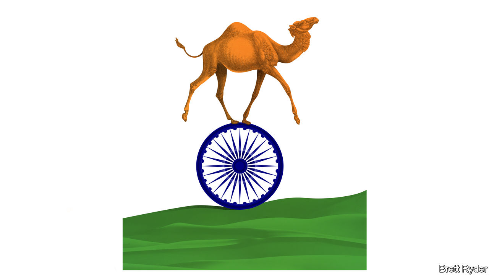

###### Schumpeter

# Lessons from frugal businesses minting money in India 

##### Forget unicorns. To thrive in the subcontinent’s tricky market you are better off with a camel 

 

> Oct 26th 2023 

For foreign investors, India is a puzzle. On the plus side, it is a potentially huge market, recently passing China as the world’s most populous. The IMF predicts that India will be the fastest-growing of the world’s 20 biggest economies this year. By 2028 its GDP is expected to be the third-largest, moving past Japan and Germany. The stockmarket is pricing in heady growth. Over the past five years Indian stocks have beaten those elsewhere in the world, including America’s. 

The minuses can seem equally formidable. Just 8% of Indian households own a car. Last year the number of individual investors in Indian public markets was a paltry 35m. The smartphone revolution unleashed 850m netizens, but most scroll free apps like WhatsApp (500m users) and YouTube (460m). Blume, a venture-capital (VC) firm, estimates that only 45m Indians are responsible for over half of all online spending. Netflix, the video-streaming giant, which entered India in 2016 and charges Indians less than almost anyone else, has attracted just 6m subscribers.

The tension between tomorrow’s promise and today’s reality is reflected in India’s tech scene. Over the past decade giddy projections of spending by hundreds of millions of consumers led investors to pour money into young tech firms. According to Bain, a consultancy, between 2013 and 2021 total annual VC funding ballooned from $3bn to $38.5bn. Now the easy money is running out. In 2022 startups received $25.7bn. In the first half of this year they got a measly $5.5bn. 

Some of India’s brightest tech stars have fallen to earth. The valuation of Byju’s, an ed-tech darling, has plummeted from $22bn to $5.1bn in less than a year. Oyo, an online hotel aggregator, has delayed its public listing even as investors slashed its value by three-quarters, to $2.7bn. Moneycontrol, an online publication, estimates that since 2022 Indian startups have shed more than 30,000 jobs. Investors now worry that companies in their portfolio will never make money. Heavy losses by Indian “unicorns” (unlisted companies worth $1bn or more) bear this out. According to Tracxn, a data firm, of the 83 that have filed financial results for 2022, 63 are in the red, collectively losing over $8bn. 

Yet some Indian tech firms manage to prosper. Rather than promise mythical future riches, they are practical and boring, but profitable. Call them camels. Zerodha, a 13-year-old discount brokerage, clocked $830m in revenue and $350m in net profits in 2022. In 2021, the latest year for which data are available, Zoho, a Chennai-based business-software firm founded in the dotcom boom of the late 1990s, made a net $450m on sales of $840m. Info Edge, a collection of online businesses that span hiring, marrying and property-buying, has been largely profitable throughout its 20-year existence. Their success is built on an idea that seems exotic to a generation of Indian founders pampered by indulgent investors: focus on paying customers while keeping a lid on costs. 

Consider revenue first. Some founders privately grumble that getting the Indian user to pay for anything is hard. But Nithin Kamath, founder of Zerodha, disagrees. He believes that though the wallet size of Indian consumers is small, they are willing to pay for products that offer value. Zerodha charges 200 rupees (around $2.50) to open a new account when most of its competitors do so for nothing. Mr Kamath believes that even this small amount forces the company to ensure that its users find its platform useful enough to pay that extra fee. 

India’s technology dromedaries are also ruthlessly capital-efficient. Zerodha and Zoho have not raised any money from investors. Info Edge was self-funded for five years before raising a small amount, its only outside financing before going public in 2006. Sanjeev Bikhchandani, who founded Info Edge, advises founders to treat each funding round “as if it is your last”. 

One way to extend the runway (as VC types call the time before a firm needs fresh funds) is by keeping costs down. Take employee salaries. Richly funded startups throw money at pedigreed developers from top-ranked universities. Zoho enlists graduates of little-known colleges and rigorously trains recruits before bringing them into the fold. The company says that its approach results in a wider talent pool and more loyal employees.

Zerodha, meanwhile, in another contrast to profligate unicorns, does not spend any money on advertising, discounts and other freebies to lure customers. It also uses free open-source alternatives to paid software for its technology infrastructure. The company’s tech-support system for its more than 1,000 employees costs just a few hundred dollars a month to run; an external tool would set it back a few million. Despite being a technology-heavy trading platform, it spends just 2% of revenues on software. Keeping overheads low has the added bonus of allowing companies like it to sell their products profitably at bargain prices, reaching many more customers in the price-sensitive subcontinent.

Reboot, not copy-paste

The slow, measured approach taken by the camels is the opposite of the Silicon Valley playbook of capturing market share first and worrying about profits later. Karthik Reddy of Blume argues that such a model may be better suited for India, where businesses can take many years to find their feet. 

One hurdle for companies choosing steady profits over blitzscaling growth remains: the investors themselves. Venture capitalists typically operate on a ten-year clock, bankrolling startups in the first five and cashing out their stakes in the second. This gives investors an incentive to push portfolio firms to pursue growth at all cost. Sridhar Vembu, Zoho’s boss, likens venture capital to steroids—it can boost short-term performance but damage the business in the long run. His may be an extreme view. Still, if investors want big returns on their Indian bets, they are better off backing sturdy camels over sexy unicorns. ■


