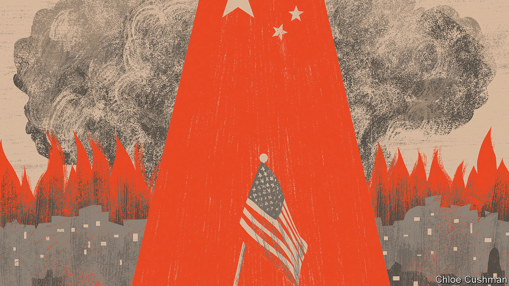

###### Chaguan

# How China sees Gaza 

##### A blow to Chinese hubris in the Middle East, but a chance to bash America 

 

> Oct 26th 2023 

A little more than a month before Hamas attacked Israel, China’s foreign-policy chief, Wang Yi, hailed a “wave of reconciliation” sweeping the Middle East, and gave the credit to his own country. By way of evidence, Mr Wang cited a Chinese-brokered deal, struck earlier this year, to restore diplomatic relations between the region’s great sectarian rivals, Iran and Saudi Arabia. 

In a call to Iran’s foreign minister on August 20th, Mr Wang explained why China’s pragmatism makes it an ideal peacemaker. To help the region achieve “good neighbourliness and friendship”, Mr Wang pledged, China would continue to pursue a non-judgmental, trade-led approach to international relations. Or, as he put it, China would help Middle Eastern countries find “a development path that suits their own national conditions”.

This self-confidence had been building for some time. Once the Iran-Saudi compact was delivered in March, proud Chinese officials informed Middle Eastern governments that they were ready to tackle the Israeli-Palestinian conflict, diplomats relate—though the plans lacked detail. 

Two scholars with institutional ties to China’s intelligence services published a paper with a government think-tank in late July, arguing that a taste for foreign interventions had led America, Britain, France and the Soviet Union all to fail in the Middle East. In happy contrast, China is able to play mediator by emphasising “dialogue” and “mutual respect”, wrote the professors.

A still more boosterish line was taken in August by Wu Bingbing, director of the Institute of Arab &amp; Islamic Culture at Peking University, in an article for the . His essay has been widely read in Beijing’s foreign embassies after being spotted and translated by , a newsletter. It praised China’s focus on development and security, and its refusal to pick sides. Such “positive balancing” can overcome supposedly intractable enmities, as such rivals as Iran and Saudi Arabia compete for China’s commercial favours, wrote Mr Wu.

It would be unfair to single out China for failing to spot October’s looming horrors. Just eight days before the Hamas attacks, Jake Sullivan, America’s national security adviser, called the Middle East “quieter” than it had been for two decades. But it is fair to ask how much of China’s pre-invasion swagger can survive this dark and blood-soaked Middle Eastern moment. More Chinese confidence survives than might be supposed, though not always for very uplifting reasons, is Chaguan’s tentative answer. That is based on public Chinese responses to the crisis and on private conversations with foreign diplomats. 

There are constructive reasons why China has no interest in a regional conflagration. It is the largest trade partner of many Middle Eastern countries and is believed to be the largest single buyer of both Iranian and Saudi oil (Iranian oil sales are a murky business). Its economic ties are strongest with rich Gulf states, but it is eager to help rebuild war-shattered countries, investing billions of dollars in Iraq, for instance. Many governments, both in the West and in the Middle East, have asked China to urge Iran to avoid stoking the conflict. China is willing to reason with Iran, diplomats believe. China has leverage, too. But at the end of the day, they add, it is not China but America that has what Iran most desires: a deal to end nuclear-related sanctions and Iran’s isolation. 

Less happily, the war in Gaza has not dented the appeal of China’s autocratic worldview to many Middle Eastern rulers. They appreciate that China does not lecture them about human rights. In turn, the six Gulf Co-operation Council countries have endorsed China’s “legitimate” actions in its far-western region of Xinjiang, Mr Wang announced in 2022. Those policies include demolishing mosques, jailing imams and sending as many as a million Muslims from the Uyghur ethnic minority through re-education camps in the name of eradicating Islamic extremism. Many Arab governments fear and loathe grassroots “political Islam”—the sort of piety that leads to anti-government sermons in backstreet mosques—and believe that is precisely what China is fighting in Xinjiang. Moreover, Uyghurs are a Turkic people, and Arab-Turkish rivalries run deep.

Politicians in America and Israel have challenged China’s refusal to call Hamas a terrorist organisation and its downplaying of Hamas atrocities in state media, even as graphic images of Israeli air strikes on Gaza are reported each evening on China’s main news programme. In part, China’s position on Hamas reflects its long-standing view that the root cause of Palestinian violence is the lack of a state. It also reflects a preference for a world order that seeks to resolve crises by balancing the interests of nation states, rather than by making abstract appeals to universal values, which China calls a Western invention. In effect, China treats Hamas as the political entity it would like the group to be, it is said.

Biden gets the blame

Least happily, the Gaza conflict is a fresh chance to depict America as a bullying warmonger. Rather than credit President Joe Biden with hugging Israel close in order to restrain it, selfish motives are assigned to him. Wu Sike, China’s former special envoy to the Middle East, is one of countless Chinese voices to insist that Mr Biden backs Israel because he faces an election in 2024 and fears the “influence” of Jewish Americans. Pondering Gaza spillover effects, Chinese scholars hail the derailing of American-brokered Israel-Saudi talks as a “heavy blow” to Mr Biden’s re-election.

Bashing America will not bring a wave of reconciliation to the Middle East. But China is playing a long game. Opinion polls already show publics favouring China over America in many Arab countries. Across the developing world, distrust of America is being deepened by the war. An American return to the Middle East is not what China hoped to see only a short while ago. But if this crisis distracts and weakens its great rival, China will take that. ■


