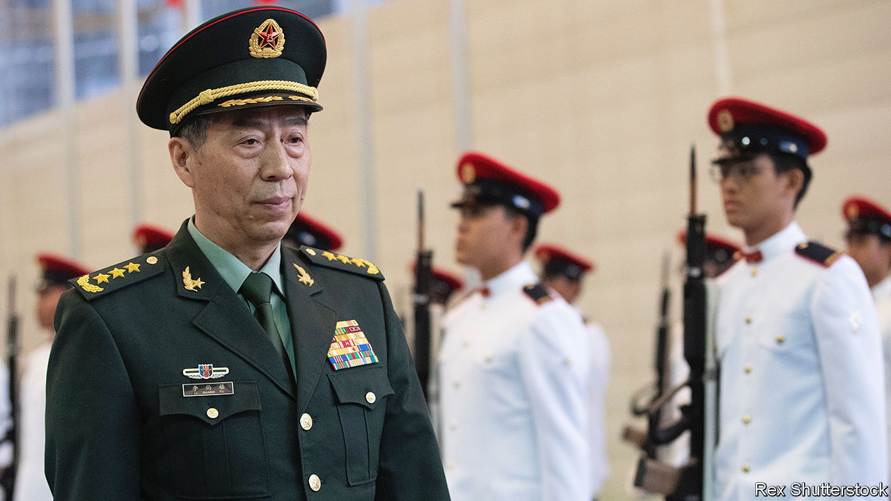

###### In the dark

# Rumours swirl after China’s defence minister, Li Shangfu, is sacked 

##### The government is trickling out news of a political bombshell 

 

> Oct 26th 2023 

Among the biggest cyber-threats to China, said the country’s spy chief, Chen Yixin, last month, is online rumour. As he put it: “A small incident can turn into a maelstrom of public opinion.” Yet the Communist Party’s penchant for secrecy keeps the rumour mill whirring. After weeks of speculation that he was in political trouble, the government announced on October 24th that the defence minister, Li Shangfu, had been dismissed. It gave no reason but, as many netizens correctly surmised, this was far from routine. 

General Li’s troubles coincide with rumoured scandal surrounding Qin Gang, who lost his job as foreign minister in July. According to the announcement, both men have also been stripped of their additional titles as state councillors: a senior position in China’s cabinet that is now held by only three people. General Li, who has not been seen in public since August 29th, has also been booted out of the state’s Central Military Commission, a notional body that replicates another one with real power controlled by the party. The final touches to this purge are expected at an annual meeting of the party’s Central Committee. This gathering of about 370 grandees is all but certain to strip the two men of their committee memberships and, in General Li’s case, of his post in the party’s military commission. No date has been set for the meeting, but it is probably imminent.

For two officials of such prominence to fall from grace in such rapid succession, so soon after their elevation (both had been ministers for less than a year), is remarkable enough. What makes their departure all the more striking is that both had been seen as protégés of China’s leader, Xi Jinping. There is no sign that Mr Xi himself is in serious political trouble. Mr Qin’s successor as foreign minister, Wang Yi (who is also Mr Qin’s predecessor), is due to visit America from October 26th to 28th. He is expected to discuss a possible meeting in November between Mr Xi and President Joe Biden. News of Mr Xi’s activities still saturate official media. On state television’s evening news, the brief item relating to General Li and Mr Qin was preceded by a much longer one about a message from Mr Xi to businesspeople. The importance of obedience to the party was a central theme. 

After the latest news broke, some users of Weibo, a microblog platform, hinted at the unconfirmed stories that have been circulating abroad and in offline conversations in China: that Mr Qin had an extramarital affair while serving as ambassador in Washington and that General Li was involved in corruption during a previous post as head of military procurement. Some netizens asked whether there might be more hidden reasons for the two men’s downfall. “At this level, it can’t simply be a case of corruption,” said one Weibo user. 

They are right to wonder. Also on October 24th, charges were formally laid against a former police chief of Guangdong province, Li Chunsheng. He has been accused of corruption, but , a magazine in Beijing, said his career had “crossed paths” with that of Sun Lijun, a former deputy minister of public security who last year was given a suspended death sentence for various offences, including taking more than $90m in bribes. State media said Mr Sun had also formed a “political clique”, made “groundless criticisms” of party policy and spread political rumours. With its purges and censorship, the party is spreading more of them. ■

