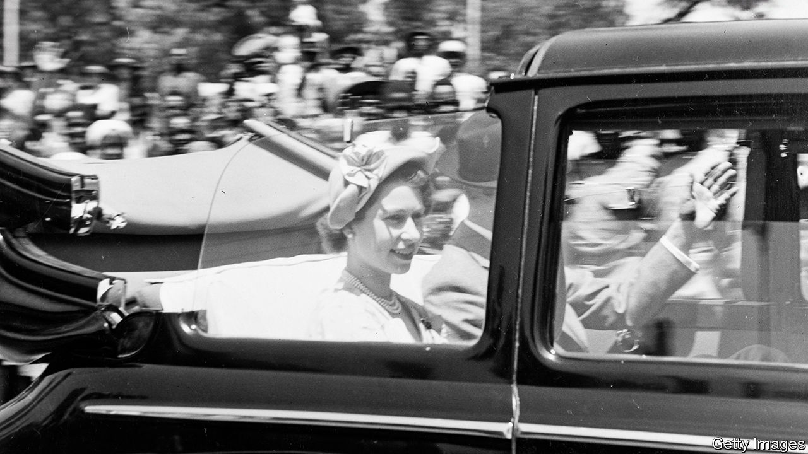

###### A king who stoops not to conquer

# History will complicate King Charles’s visit to Kenya 

##### Yet the British monarch may also be able to heal some wounds 

 

> Oct 26th 2023 

The late Queen Elizabeth could count on a warm reception when she visited Africa. Wherever she went, crowds sang and danced. Though the union flag had long since been lowered from official buildings, hordes of cheering children still waved it. Such scenes were replicated across most of the 20 African states she visited in her 70-year reign.

But the queen was popular in a way that Britain, as the former colonial power, often was not. The British ruled in the name of the crown yet many Africans did not seem to resent its embodiment. Indeed, she was a valuable British asset in Africa, dazzling some of its most truculent leaders. Tanzania’s Julius Nyerere and Zimbabwe’s Robert Mugabe admired her despite their socialism. “Whatever else is blown into the limbo of history, the personal regard and affection which we have for your majesty will remain unaffected,” Kwame Nkrumah, Ghana’s first president, told her when she visited his country in 1961.

Charles III, who arrives in Kenya next week on his first visit as monarch to Africa, may find the wind set less fair. Rows over slavery, colonialism and the legacy of the Black Lives Matter movement mean that royal visits can now draw angry protesters as much as jovial admirers. Britain’s newly minted Foreign, Commonwealth and Development Office is anxious to ensure the trip passes smoothly. Kenya is a strategic ally in a troubled region. Britain carries some heft as a big donor and investor. Its army trains there. The visit may project some oomph as Britain struggles to maintain its stature in a continent where America, China and Russia all bid for influence. 

But Britain can no longer waft away its past. A Caribbean tour last year by Prince William, now the Prince of Wales, shows what can go wrong, with angry demands for apologies for slavery and calls for reparations. In Kenya the king is sure to puff up shared interests in tech, defence and conservation. But he is also set to acknowledge “wrongs suffered” by Kenyans under British rule. Most acute is the suppression of the Mau Mau uprising in the 1950s. 

Striking the right note will be tricky. A formal apology could open Britain up to more strident demands for compensation, notes Nic Cheeseman of the University of Birmingham. Yet anything too mealy-mouthed could be damned as obfuscation. The subjugation of the Mau Mau was exceptionally harsh. More than 1,000 rebels were hanged after summary trials. Thousands more were killed in the forests or died in squalid detention camps. 

Yet for decades after independence in 1963, the image of Mau Mau as sullen and savage was as prevalent in official Kenyan circles as it was in British colonial ones. “Mau Mau was a disease which has been eradicated, and must never be remembered again,” declared Jomo Kenyatta, who was locked up by the British on the dubious charge of leading the Mau Mau. He went on to become Kenya’s first president (and was the father of president Uhuru Kenyatta, who stepped down last year).

Kenyatta’s antipathy towards the Mau Mau is not hard to understand. The rebellion was not just an uprising against the British. It was also a civil war among the Kikuyu, Kenya’s largest ethnic group. Those rendered landless by white farmers were more likely to join the rebels, while Christian converts and the better-off often gravitated towards the colonial government. After independence Kenyatta’s government ensured that Kikuyus who got the farms vacated by British settlers were often those who had sided with the crown. Many Mau Mau veterans got nothing.

On Queen Elizabeth’s last formal trip to Kenya, in 1983, Mau Mau was not mentioned. Her host, Daniel arap Moi, Jomo Kenyatta’s successor, was from an ethnic group that had not been involved with Mau Mau. He thought it wise to keep a ban imposed on the movement by the British. A man so enamoured of the queen and her husband that he named two of his children after them would hardly rock the boat.

Today’s mood has changed. Mau Mau has long been rehabilitated. The ban was at last lifted in 2003. But time has proved no great healer. Anger over Britain’s past rule, especially among aggrieved Kikuyus, has not diminished. In 2013, seeking to assuage the anger, Britain coughed up £19.9m ($24m) in costs and compensation to 5,000 Kenyans who had suffered in detention. It also paid for a Mau Mau memorial.

Awfully sorry

Britain’s government hopes that this show of contrition has blunted calls by the family of Dedan Kimathi, a Mau Mau general the British hanged in 1957, and others for a formal apology—and a bigger payout. The clamour is louder in civil-society and veteran circles than in Kenyan government ones. William Ruto, Kenya’s president, will be keener to burnish his image on the world stage than to nag King Charles about history, says Patrick Gathara, a Kenyan commentator. Besides, making too much of a fuss risks exposing the Kenyan elite. “Lots of those in government are from families who came out on top because they were colonial collaborators,” he adds. “There is a real reluctance by the Kenyan elite to go back and look at where they got their wealth and power.”

Some ordinary Kikuyus take a similar view. “It is a complicated business,” sighs Wachira Mwangi, a Nairobi tailor. Some of his kin went into the forest and joined Mau Mau. Others, horrified by atrocities by the rebels, including the massacre of dozens of women and children in the loyalist village of Lari, joined the Home Guard and fought on the colonial side. Don’t apologise, he advises the king. “It will just stir things up again. Better to leave it all in the past.” ■

