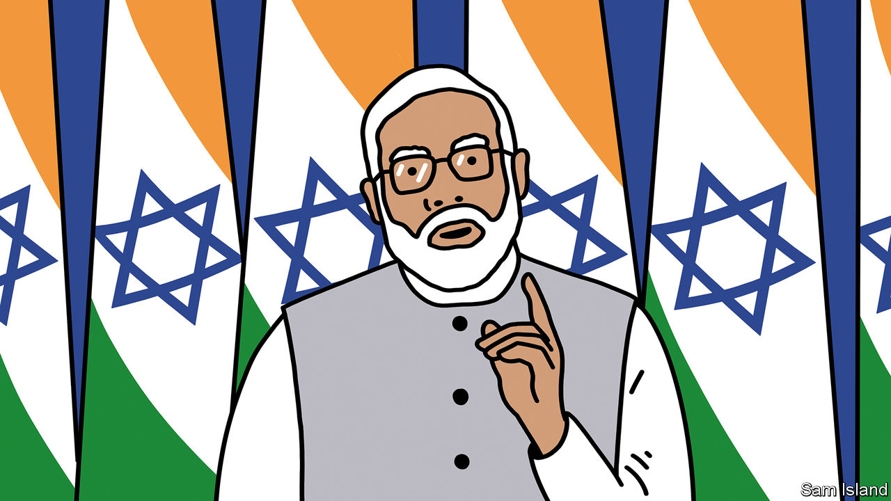

###### Banyan

# Narendra Modi has shifted India from the Palestinians to Israel 

##### The pivot reflects Indian domestic politics and new interests in the Middle East 

 

> Nov 2nd 2023 

FOREIGN NEWS usually gets short shrift in India. Yet for the past month the country’s television channels have been dominated by wall-to-wall coverage of events in Israel and Gaza, mostly from Israel’s perspective. News anchors in bulletproof vests stand in the desert delivering breathless reports on the aftermath of Hamas’s atrocities in Israel on October 7th. Talk-show hosts restage the Palestinian terrorist group’s attack from Gaza with toy soldiers and miniature bulldozers. Weeks into the war, coverage remains intense. 


The media’s fascination with Israel’s plight and retribution coincides with a marked shift in the Indian government’s stance on the conflict between Israel and the Palestinians. It has moved from backing the Palestinians to more or less unqualified support for Israel. The pivot is based on a realist reappraisal of Indian interests in the Middle East. It has also met with strong public backing from Narendra Modi’s domestic supporters, which is gratifying for Mr Modi’s government ahead of state elections this month and a general election next year.

In the past, like many countries in the global south, India tempered any expression of support for Israel with expressions of concern for the Palestinians’ plight. No more. Mr Modi took to X (formerly Twitter) within hours of Hamas’s assault to express his horror at the “terrorist attacks” and declare that “we stand in solidarity with Israel”. It took five days for India’s Ministry of External Affairs to reiterate, in response to questions from reporters, that India continued to support a two-state solution to the conflict. On October 27th, in a departure from its usual voting record, India abstained as the UN General Assembly adopted a resolution calling for a humanitarian ceasefire in Gaza; it objected that the text did not condemn Hamas’s assault. 

The shift reflects India’s growing defence and commercial ties to Israel. Co-operation between the two countries has been deepening ever since Israel provided India with military help during the Kargil war against Pakistan in 1999. That was long before America took a serious interest in military co-operation with India. Over the past decade India has bought missiles, drones and border-security equipment (and probably surveillance software, though it has not admitted this) from Israel, making it the Israeli defence industry’s biggest foreign customer. 

A bromance between Mr Modi and Binyamin Netanyahu, Israel’s prime minister, has deepened the relationship. So has the two countries’ shared preoccupation with fighting terrorism, especially the Islamist variant. Explaining the abstention in the UN vote, Subrahmanyam Jaishankar, India’s foreign minister, said in a speech on October 29th that India took a strong position on terrorism “because we are big victims of terrorism”. 

India has also been increasing its ties with Gulf Arab countries, especially Saudi Arabia and the United Arab Emirates. And it can ill afford to alienate them; it depends on them for much of its oil and goodwill towards an estimated 9m expatriate Indian workers. Yet the fact that both countries have recently moved closer to Israel has allowed Mr Modi to effect his shift with alacrity. Even in the current crisis, the Saudis and Emiratis appear reluctant to allow the events in Gaza to cause a rupture in their long-term rapprochement with Israel.

Domestically, the Modi government’s pivot is essentially all upside. The Congress-led opposition has condemned it; leaders of India’s 200m Muslims have heavily criticised Israel’s military response. Yet the Indian middle-class that mostly backs Mr Modi is especially concerned about Islamist terrorism. Its members look on Hamas’s attack and recall the tragedy Mumbai suffered in 2008, when Pakistani Islamists killed 175 people and wounded more than 300 during a four-day rampage. It included an attack on a Jewish community centre in the city, where the terrorists murdered the rabbi and his pregnant wife. 

There is a small risk the government will overplay its hand. As the civilian death toll in Gaza rises, India’s Arab partners might turn against the Israelis and their backers more aggressively. Mr Modi has latterly hedged against that possibility. He has reached out to Palestinian leaders, offering Indian condolences and humanitarian aid. Meanwhile, his Hindu-nationalist henchmen are unrestrained in using the conflict to stoke the Islamophobia that has propelled their party’s rise. Even if Mr Modi’s pivot becomes difficult abroad, it will probably help him win elections.■


