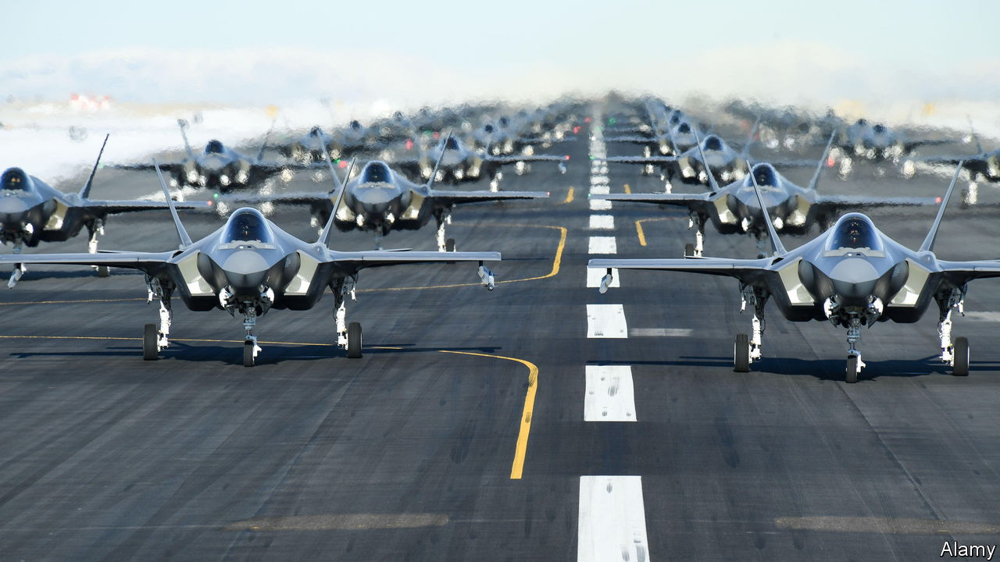
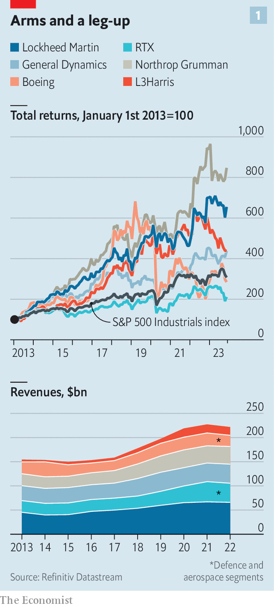

###### Bangs for bucks

# Can America’s weapons-makers adapt to 21st-century warfare? 

##### Arming Uncle Sam isn’t what it used to be 

 

> Nov 1st 2023 

ARMING UNCLE SAM is a great business. America’s latest defence budget earmarks $170bn for procurement and $145bn for research and development (R&amp;D), most of which ends up with the handful of “prime” contractors, which deal directly with the Department of Defence (DoD). So will some of the $44bn in American military aid to Ukraine and a chunk of the extra defence spending by America’s European allies, which account for 5-10% of the primes’ sales. Although those sums do not increase at the same rate as, say, corporate IT expenditure, leaving less room for spectacular gains, arms manufacturers are also shielded from eye-watering losses by huge, decades-long contracts. 

 


Thanks to a big shake-up at the end of the cold war, the industry is also highly concentrated. At a meeting in 1993, dubbed the “last supper”, William Perry, then President Bill Clinton’s deputy defence secretary, told industry bosses that excess capacity was no longer appropriate and that consolidation was in order. As a result, the ranks of the primes have thinned from more than 50 in 1950s America to six. The number of suppliers of satellites has declined from eight to four, of fixed-wing aircraft from eight to three and of tactical missiles from 13 to three. 

Guaranteed custom and weak competition have helped American armsmakers’ shares comfortably outperform the broader stockmarket over the past 50 years. A paper published by the DoD in April found that between 2000 and 2019 defence contractors did better than civilian ones in terms of shareholder returns, return on assets and return on equity, among other financial measures. An increasingly unstable world means more money going to the armed forces—and to their suppliers. Total shareholder returns, including dividends, at primes such as General Dynamics, Lockheed Martin and Northrop Grumman rose when Russia invaded Ukraine in February 2022 and when Hamas attacked Israel on October 7th (see chart 1).

This cosy oligopoly is now being challenged on two fronts. One is technological. As the tank battles on Ukrainian plains and in Gazan streets show, “metal on the ground” remains important. So do missiles, artillery shells and fighter jets. But both conflicts also illustrate that modern combat relies increasingly on smaller and simpler tactical kit, as well as communications, sensors, software and data. The second challenge is the Pentagon’s efforts to extract greater value for money from the military-industrial complex.

Both developments undercut the primes’ big competitive advantages: their ability to build bulky kit and to navigate the mind-boggling procurement process. Cost-effective innovations, such as the Pentagon’s recently announced project “Replicator”, which aims to get swarms of small drones in the air, ASAP, require agile engineering for which the defence giants “are not innately organised”, as Kearney, a consultancy, delicately puts it. If they are to thrive in the new era, they will have to rediscover some of the innovative ways that helped them shape Silicon Valley in the decades after the second world war. So far, though, they are finding this difficult.

It is easy to see why the primes (and their investors) like the current setup. The DoD reimburses the primes’ R&amp;D expenses, and adds 10-15% on top of that. This “cost plus” approach spares the companies from funnelling lots of their own capital into risky projects, which offers security but reduces the incentive to deliver things on time and on budget. The project to build the F-35 fighter jet, which has accounted for more than a quarter of Lockheed’s revenues in the past three years, started life in the 1990s. It is running around a decade late and will cost American taxpayers up to $2trn over the lifetime of the aircraft. 

Once in production, newly developed large kit is sold at a fixed price, often for decades. The B-21 stealth bomber currently in development by Northrop Grumman will cost the Pentagon more than $200bn for 100 planes delivered over 30 years. The Columbia Class nuclear-submarine programme made by a subsidiary of General Dynamics will sail from the early 2030s until at least 2085.

Past their prime

The Pentagon’s patience with this time-honoured business model is wearing thin. Last year’s national-defence strategy summed it up succinctly: “too slow and too focused on acquiring systems not designed to address the most critical challenges we now face”. Instead, it wants to “reward rapid experimentation, acquisition and fielding”. This is forcing the primes to think about how they could build fresh functionality atop their existing platforms, by adding new software, modules, payloads and the like, and to create production processes which can be modified to accommodate innovations. 

As Lockheed Martin’s chief executive, Jim Taiclet, recently acknowledged, soldiers expect seamless integration of sensors, weapons and systems for battle management such as joint all-domain command and control (JADC2), a new concept for sharing data between platforms, services and theatres. Contracting, building and continuously updating such systems will be a struggle for firms that have hitherto produced huge bits of hardware slowly and which, in the words of Steve Grundman of the Atlantic Council, a think-tank, are not “digital natives”. 

The primes face another problem. The technology the Pentagon has in mind is not inherently military, observes Mikhail Grinberg of Renaissance Strategic Advisors, a consultancy. Most of the defence giants do have civilian divisions—large ones in the case of Boeing, General Dynamics and Raytheon. But the Pentagon’s growing appetite for dual-use technologies means more competition from civilian industry, which is constantly devising new equipment, materials, manufacturing processes and software that could be used for military as well as peaceful ends. 

In 2020 General Motors won a contract to supply infantry vehicles. The carmaker has now teamed up with the American arm of Rheinmetall, a German weapons firm, in a deal to furnish military trucks. Other challengers are trying to muscle their way into the military-industrial complex, drawn by the DoD’s appetite for more diverse systems. Palantir, founded in 2003 to help avert more attacks like that of September 11th 2001, makes civilian and military software that processes the vast amounts of data that modern life and warfare throw up. Elon Musk’s SpaceX sends payloads, including military ones, into orbit and is being paid by the DoD to provide internet access to Ukrainian forces in their fight against Russian invaders.

 


Big tech is getting in on the action, too. Amazon, Google and Microsoft have targeted defence and security as promising markets, says Mr Grundman. Military procurement is a rare business large enough to make a difference to the tech titans’ top lines, which are counted in the hundreds of billions of dollars. The trio, along with Oracle, a smaller maker of business software, are already sharing a $9bn cloud-computing contract with the Pentagon. Microsoft also supplies the army with augmented-reality goggles in a deal that could eventually be worth $22bn.

The Pentagon’s new approach is also attracting upstart rivals. Anduril, a firm founded in 2017 solely to serve military needs, has developed Lattice, a general-purpose software platform that can be swiftly updated and adapted to solve new problems. The company also makes a short-range drone called the Ghost, which can be operated by a couple of soldiers. Recognising that to win business quickly it needs to be vertically integrated, it has acquired a manufacturer of rocket engines and is developing an underwater autonomous vessel for the Australian navy. 

The wannabe primes and their financial backers still bemoan the barriers to new entrants. Brian Schimpf, Anduril’s boss, says that when working with the DoD you get “punched in the face every day”. SpaceX and Palantir both had to fight court battles just to be able to contest military contracts. In June Palantir signed an open letter with 11 other companies, including Anduril, and investors, imploring the Pentagon to remove obstacles to smaller contractors. The letter, which drew on proposals from the Atlantic Council, condemned “antiquated methods” that “drastically limited” access to commercial innovation. 

As the national-security strategy shows, the DoD seems keen to move away from procurement antiquity, for example by shifting more risk onto contractors through fixed-price, rather than cost-plus, development contracts. Such developments are causing palpitations among the primes. Boeing’s recent financial travails are partly a result of catastrophically underbidding in fixed-price contracts for the KC-46 tanker and Air Force One, which ferries around American presidents. 

In contrast, Anduril has dispensed with the crutch of cost-plus of its own accord, and is investing its own capital to make what it thinks the DoD will need. By clinging on to the old model, the primes may be depriving America of the 21st-century defence industry it needs. ■

The Economist‘s

