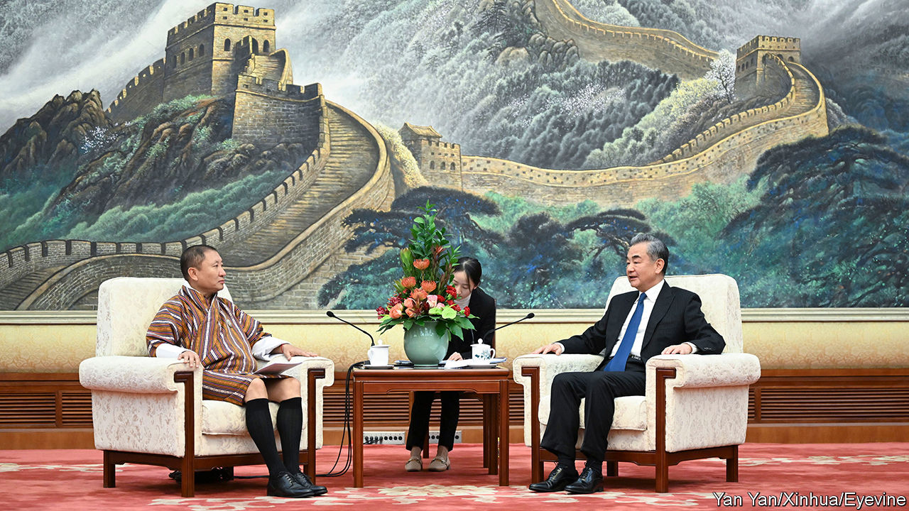
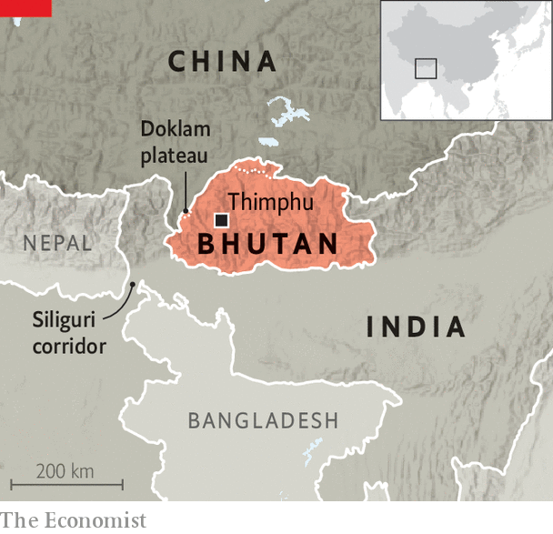

###### Progress on one front

# China and Bhutan aim to resolve a long-running border dispute 

##### That has caused India to worry about its own territory and a loss of influence 

 

> Nov 2nd 2023 

Chinese diplomats have had a rough ride in South Asia for most of the past four years. Relations with India took a nosedive after a deadly border clash in 2020. Debt problems, political instability and militant attacks on Chinese nationals have strained an “ironclad” friendship with Pakistan. Mass unrest toppled a China-friendly president in Sri Lanka last year after it plunged into a debt crisis linked to Chinese lending. Bangladesh also shelved several infrastructure projects tied to China’s Belt and Road Initiative. 

 


Lately, though, China has bounced back in some of the region—to India’s dismay. The most recent Chinese success came with Bhutan, a Himalayan kingdom of 770,000 people wedged between China and India. It is the only Asian country without formal diplomatic ties to China. Along with India, it is also one of only two countries whose land borders with China are officially disputed. And to complicate matters further, the disagreement covers an area, known as the Doklam plateau, where the Indian, Chinese and Bhutanese borders meet (see map). 

The breakthrough was the first ever visit to Beijing by a Bhutanese foreign minister. Tandi Dorji met his Chinese counterpart, Wang Yi, on October 23rd (see picture) and China’s vice-president, Han Zheng, the following day. He also participated in the two countries’ first talks on the frontier dispute since a stand-off between Chinese and Indian troops in Doklam in 2017. 

In his meeting, Mr Wang said China was ready to complete the border talks as soon as possible and to establish formal ties with Bhutan, describing it as a “historic opportunity”. China’s readout quoted Mr Dorji saying he too was keen for an early border settlement and progress towards establishing formal ties. A joint press release was less forthright, saying just that the two sides agreed to continue pushing forward with the border negotiations. 

But Bhutan’s prime minister, Lotay Tshering, suggested to an Indian newspaper earlier in October that the end goal was formal ties with China. “Theoretically, how can Bhutan not have any bilateral relations with China? The question is when, and in what manner,” he said. He also mentioned that a possible land swap involving Doklam had been proposed. 

The rapprochement is geopolitically important for several reasons. Bhutan does not have formal diplomatic ties with any of the five permanent members (or P5) of the UN Security Council—America, Britain, China, France and Russia—largely owing to its history of isolationism and non-alignment in the cold war. Opening formal ties with China could lead Bhutan to do the same with other P5 members, drawing it into the ongoing tussle for diplomatic influence around China’s borders. 

But it is most significant for India. Under a treaty signed in 1949, India gained a formal right to guide Bhutan’s foreign policy in exchange for free trade and security guarantees. The foreign-policy provision was scrapped in 2007, but India has remained Bhutan’s most important diplomatic and economic partner.

Indian officials’ chief concern is Doklam because it is near the Siliguri corridor (also known as “the chicken’s neck”) which connects India’s north-eastern states to the rest of the country. Indian authorities have long feared that China, which won a brief border war with India over a nearby part of the disputed frontier in 1962, might try to sever the Siliguri corridor.

India may now have accepted that diplomatic ties between China and Bhutan are inevitable, given the lure of Chinese trade and investment. But it wants a role in the border talks and is sceptical about a land swap. Progress might still be possible, given that China and India both seem keen to stabilise their border dispute. Since the deadly clash in 2020, they have pulled back troops from several flashpoints, creating buffer zones where neither side patrols. 

But Indian officials also have concerns about China’s renewed efforts to enhance its clout in a region that India considers its backyard. Several South Asian states are indebted to China. The Maldives, where India had recently reasserted its influence, elected a new pro-China president, Mohamed Muizzu, in September. He has since asked India to remove the roughly 70 Indian troops stationed there to maintain radar stations and other military assets.

In Sri Lanka, too, India has pushed back against China’s influence in recent years, but the island nation has lately indicated that it seeks strong relations with both of Asia’s giants. On October 25th Sri Lanka’s government allowed a Chinese scientific-research vessel to dock in Colombo, its biggest city, despite American and Indian security concerns. Sri Lanka’s president, Ranil Wickremesinghe, also attended the Belt and Road Forum in Beijing in October. The geopolitical jockeying is sure to continue. But China is still very much in the game. ■


