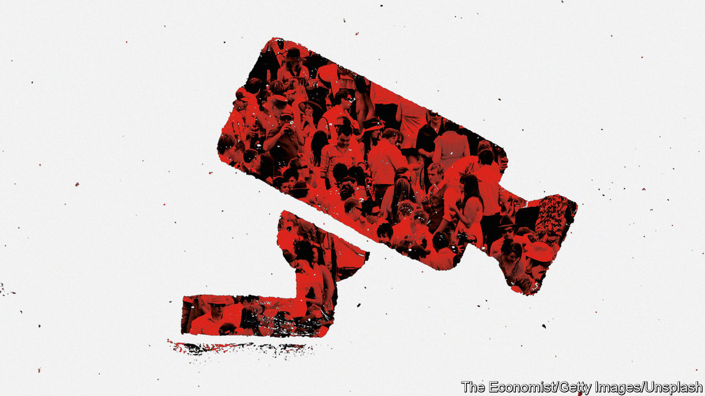

###### Surveillance, Inc.

# Inside the secretive startup selling facial-recognition software 

##### In “Your Face Belongs to Us” Kashmir Hill profiles Clearview AI 

 

> Nov 2nd 2023 

By Kashmir Hill.

Most people expect to walk down a street anonymously. Passersby do not know fellow pedestrians’ names, jobs or what they just posted online. But owing to the , norms around privacy are being eroded, Kashmir Hill, a journalist for the , argues in a new book. Software enables people’s photos to be instantly matched to online images and digital profiles. This type of technology is now popular among . 

The technology began in the 1960s. With funding from the CIA, researchers built a system to match faces photographed at different angles. By the 1980s, experts could configure a face as a mathematical calculation based on how it differed from the average face. As computers became more powerful, the technology grew more useful. In 2001 police scanned Super Bowl attendees’ faces in Tampa and compared them to a database of known criminals. (The event was nicknamed .) Big tech firms, including Google and Facebook, developed face-scanning systems but stopped short of releasing tools to others for fear of abuse.

Hoan Ton-That, co-founder of Clearview AI, a secretive startup, had no such qualms. At the age of 19 the Australian university drop-out moved to Silicon Valley. He built a video-streaming site, which automatically emailed marketing material to users’ contacts. He then moved to New York, where he met Richard Schwartz, who had worked as an adviser to Rudy Giuliani, the former mayor of New York. The pair hit it off and founded Clearview AI. Along the way they were helped by a cast of right-wing characters, such as Peter Thiel, who put money in Clearview. 

While Mr Schwartz provided connections, Mr Ton-That built the app. With the help of a friend, he designed an advanced face-matching algorithm. Relying on a database of harvested images of people’s faces from popular websites, such as Facebook, the app managed to link people’s photos to their personal details. Much of the web scraping was done by contractors, some of whom used fake names and were paid in cryptocurrency. Eventually Clearview’s database grew to 30bn photos.

Venture capitalists were given free trials, as Clearview wooed them. (Some used it as a party trick, others to recognise acquaintances at conferences.) But Clearview found most success with law enforcement. Police teams often had databases of mugshots, which only contained people who had been arrested. The app helped investigators match faces from surveillance footage with online profiles. By mid-2019, more than 200 law-enforcement agencies had used the tool, including the FBI and counterparts abroad. Among police, the app became a verb. “We Clearviewed the guy and then passed the information along to the right unit,” one officer told Ms Hill.

Mostly the app is highly accurate. But misidentification has also led to wrongful arrests. This problem is most prevalent , who are underrepresented in the databases used to teach the algorithm how to match faces.

Much of Clearview’s rise went on in secret. That changed when Ms Hill received a tip-off and doggedly investigated the company, publishing a front-page story in 2020. The press coverage triggered lawsuits and , which concluded that the firm must obtain consent from people whose images it uses. Clearview’s app was banned in at least six countries. As part of one legal settlement, the firm agreed not to sell its software to individuals and private companies in America, though it still sells to law enforcement.

One shortcoming of this gripping book is that it only lightly touches on  and Russia, where the abuses of facial-recognition technology are most abhorrent. Another is that the author makes little effort to try to weigh the benefits of facial recognition (catching more criminals) against the disadvantages (an erosion of privacy).

Nevertheless, the book is illuminating. The scope and sophistication of the technology is striking. So, too, is the way in which the building blocks needed to make it are so readily available, from open-source code to public databases of faces. A walk down the street will not feel quite the same again. ■


