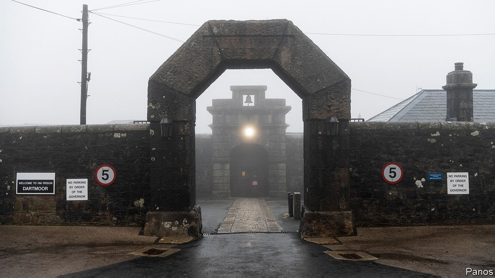

###### Trials and errors

# Britain’s prisons show up wider flaws in government 

##### The entire criminal-justice system is under strain 

 

> Nov 2nd 2023 

No long-term planning. Disjointed decision-making. Tension between expert advice and political calculation. The covid-19 inquiry has been the best place this week to see the flaws in Britain’s government laid bare. Largely hidden from public view lies another: a crisis in the country’s prisons. Those same factors have left some parts of the criminal-justice system .

Start with the lack of long-term planning. In October it was revealed that the number of inmates in English and Welsh prisons is just a few hundred short of their maximum capacity. This should surprise no one. A long-standing push to be tough on crime has coincided with a more recent imposition of spending cuts. His Majesty’s Inspectorate of Prisons has repeatedly reported that jails are overcrowded, squalid and unsafe. The number of people in jail is nearly double what it was three decades ago; prison-building has not kept pace. 

Alarmed by suggestions that judges may have to stop sending down dangerous criminals, the Ministry of Justice (MoJ) has announced a number of emergency measures. Some of these are sensible. But they will not come close to tackling the crisis. That is partly because of its scale. But it is also because decision-making in Britain’s government is often contradictory and incoherent. Efforts to ease one source of pressure exacerbate difficulties elsewhere in the justice system. 

Take the most sensible emergency measure—limiting the use of short prison sentences in favour of community ones. This has myriad benefits beyond reducing prison numbers. Community sentences result in lower re-offending rates than the brief jail sentences given to petty offenders. They are cheaper, too. 

But more community sentences means more strain on the probation service, which is in terrible shape. Its part-privatisation in 2014, designed to save money, was so disastrous that it was reversed in 2021. By then, however, many experienced probation officers had left; the service is now recruiting hard to try to replace them. The restructuring also reduced the number of probation trusts, each run by a chief probation officer, from 35 to 12, accelerating a longer-term trend towards centralised control of the service. It worked much better before; the MoJ should restore localised control.

Prison overcrowding has also been exacerbated by backlogs in the courts. In recent years there has been a huge increase in the number of prisoners awaiting trial on remand. This number surged during the pandemic, but the backlogs have been worsened by problems of the government’s own making. Between 2010 and 2019 the MoJ’s budget was reduced by 25% in real terms. The results are fewer courts, fewer judges and longer delays. 

Yet even if the probation service is restored to health and court backlogs are unblocked, prisons will remain overcrowded. The MoJ predicts their population will keep rising, from around 88,000 now to 98,700 by 2026. That is in large part because of the way that Britain’s politicians choose to treat convicted criminals. Since the mid-1990s the length of the average prison sentence has increased. It is right to lock up those who commit serious and especially dangerous crimes, and tough-on-crime policies are popular with voters. But ever-longer sentences have unwelcome consequences. 

The worst of these are endured by prisoners themselves. Overcrowding and understaffing mean that inmates are locked up in their cells for most of the day, unable to do any of the things, such as job training and cognitive behavioural therapy, that would help them live productive rather than predatory lives on release. Grim conditions lead to more assaults and suicides behind bars. And the strains in the criminal-justice system have wider effects, too. Jam-packed jails make it even harder to recruit prison workers, who are already in short supply. And poorly run services compromise public safety: when assessing the risk that criminals pose, probation officers are making domestic-abuse inquiries in less than half the cases they should be. The criminal-justice system has been trying to spend less and punish more for years. The circle can no longer be squared. ■ 

