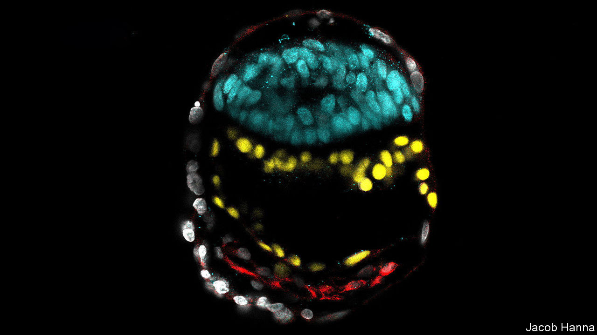

###### Coming of age

# Why the rules on embryo experiments should be loosened 

##### Lifting the 14-day rule would help researchers understand how organs develop 

 

> Nov 2nd 2023 

When Louise Brown, the first child created through in-vitro fertilisation, was born in 1978, the idea of creating an embryo in a dish was very controversial. More than 12m IVF babies later, all bar some of the devoutly religious treat the technique as routine. Yet a rule invented in Britain in the 1980s still determines the sorts of research that can be done in the world’s embryology labs. The 14-day rule says that embryos must not be grown in a dish for longer than two weeks after fertilisation. 

First suggested in 1984, the rule tries to balance the benefits of research with the disquiet about experimenting on things that could potentially develop into human beings. It is law in several countries, including Britain and Canada, and followed voluntarily by researchers elsewhere. By reassuring doubters that scientists would not be allowed to act recklessly, the rule has made human-embryo research less controversial than it might otherwise have been.

But 1984 was a long time ago and later this month Britain’s fertility regulator will seek more flexibility. However, it will not go so far as to scrap the rule. We think that is a mistake, both in Britain and elsewhere. Four decades of research have shifted the balance of benefits and drawbacks. Regulation should change to reflect this new reality. 

Part of this is that the 14-day limit creates a black box in embryonic development into which scientists cannot peer. The box opens up again after about 28 days, when scientists can study aborted embryos; four weeks is roughly how long it takes most women to realise they are pregnant and seek abortions.

It is during this unobserved two-week period that the earliest organs begin to develop. Congenital heart disease, the most common birth defect in Britain, affects around one in 150 babies. It is caused by abnormal development of the heart, much of which takes place in the black box. The ability to study embryos at this stage could lead to new treatments. It might also shed light on what leads to recurrent miscarriages, a heartbreak facing one in 100 British couples trying for a baby.

Loosening the rules might also help the development of a technology that could in time reduce the need to experiment on embryos at all. As we  in our Science &amp; technology section, one of the biggest innovations in embryology in recent years is the invention of “embryoids”. These are made not from a sperm and egg but from protean stem cells, which can be persuaded to transform into almost any type of tissue. 

The technology holds great promise, especially for those who still regard research on real embryos as wrong. Embryoids can be mass-produced in a way that embryos cannot. They lack the ability to develop into humans, making them more ethically straightforward. The problem is that, to check that they are accurate stand-ins, scientists need to compare embryoids with the real thing. The 14-day rule limits their ability to do that. 

If the rule were scrapped, what might replace it? In 2021 the International Society for Stem Cell Research recommended that, if the public agreed, countries should switch to a case-by-case review, in which scientists seek approval for every study they wish to run. Unlike a time-based ban, this would be flexible. Regulators could grant permission based on the likely benefits of each proposal, public opinion and developments in the field. 

This system could be analogous to that for animal research, in which the more human-like an animal is, the more protection it is given (mice therefore receive less protection than monkeys). Similar distinctions could hold for embryos and embryoids, too. Given the availability of aborted embryos, researchers wanting to culture live embryos beyond 28 days might have to work harder to convince regulators that their study should go ahead. 

Although today it is not possible to produce embryoids that can develop into live humans, some scientists worry that might not be the case for ever. If they are right, then a case-by-case system could apply strict limits to research involving such creations without the need for new laws. 

One objection to such a system is that researchers may eventually capture their regulators. But strong feelings around the ethics of embryo research make it unlikely that an overly liberal regulator could remain out of step with public opinion for long. Another worry is that such a system sets off a race to the bottom, with unscrupulous researchers decamping to the country with the most pliant approval committee. Something similar could have happened with the 14-day rule—but it did not.

The 14-day rule is a good example of how sensible regulations can make the world safe for valuable but controversial research. After four decades it has reached the end of its usefulness. Just as a generation of test-tube babies now have children of their own, so it is time to let embryo research grow up. ■

