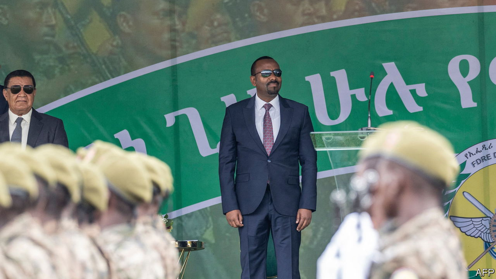
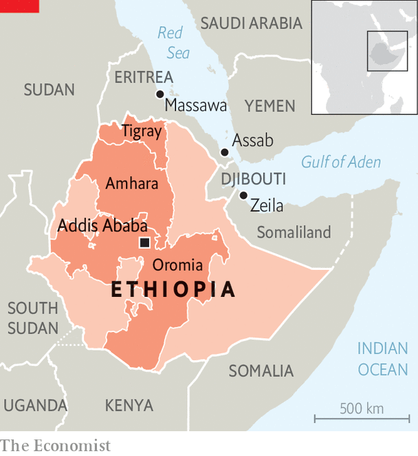

###### Ports in a storm

# Ethiopia’s prime minister wants a Red Sea harbour 

##### Abiy Ahmed’s push for access to the sea has rattled his neighbours 

 

> Nov 2nd 2023 

Nerves are jangling once again in the Horn of Africa, just a year after the end of a brutal civil war in Ethiopia that led to the deaths of perhaps 385,000-600,000 people. Now foreign diplomats and analysts fear that in his bid to get a port on the Red Sea, Abiy Ahmed, Ethiopia’s prime minister, risks sparking another conflict, this time next to one of the world’s busiest shipping routes (see map). 

 


In a jingoistic documentary aired on state television on October 13th, Abiy argued that landlocked Ethiopia must acquire a port on the Red Sea to break its roughly 120m people out of a “geographic prison”. Turning to history, he quoted a 19th-century Ethiopian warrior who had proclaimed that the Red Sea was the country’s “natural boundary”. 

Ethiopia, Abiy noted, had indeed been a sea power with a navy and two ports, Massawa and Assab. It lost these along with the rest of its coastline in 1993, when Eritrea seceded to form a new country. Now, Abiy suggested, the moment was nigh to right a historic wrong. “It’s not a matter of luxury,” he insisted, “but an existential one.” Foreign diplomats say this reflects what Abiy has been declaring in private for months.

Ethiopia’s neighbours are rattled, particularly because Abiy had not raised the issue with them before making his threats. “The whole country thinks the man is mad,” says an adviser to Somalia’s president. A fight over ports would further destabilise a region already in turmoil. Sudan, Ethiopia’s neighbour to the west, has been plunged into what the UN calls “one of the worst humanitarian crises in recent history”. Fighting between two warlords there has forced almost 7m people from their homes. And Ethiopia itself faces simmering rebellions in Oromia, its largest and most populous region, and Amhara.

Abiy says that Ethiopia’s demands can be met through peaceful negotiations with its neighbours. Better to discuss the matter now, he argues, than to risk an armed conflict in the future. But Abiy has reportedly said in private that he is ready to use force if talks fail. “If it is not achieved by other means, war is the way,” says an Ethiopian official. A few days after the broadcast Abiy flexed his muscles with a military parade in the capital, Addis Ababa, in which the army displayed its new weapons including a Russian-made electronic-warfare system. Troop movements have been detected along both sides of Ethiopia’s border with Eritrea in recent weeks. A well-connected source in Addis Ababa says that the armed forces are exercising in preparation for another conflict. On October 22nd the head of the air force warned his troops to ready themselves for war.

Ethiopia’s Red Sea conundrum dates back to at least the start of its bloody border war with Eritrea in 1998. Though a ceasefire was reached in 2000, the two countries remained at loggerheads. Ethiopia could not ship goods through Assab and Massawa. Now 90-95% of its external trade flows through Djibouti, to which it pays some $1.5bn a year in port fees. 

In 2018, soon after Abiy came to power, he ended the nearly two decades-long stand-off with Eritrea by signing a peace deal with its dictator, Issaias Afwerki. Though the contents of the deal were never made public, it was generally understood that Ethiopia would regain tax-free access to Eritrea’s ports in exchange for returning disputed territories it had occupied since the end of the war. The following year Abiy was awarded the Nobel peace prize.

But plans for Ethiopia to use Eritrea’s ports never materialised. Instead, two years later, a power struggle between Abiy and Tigray’s ruling party, the Tigrayan People’s Liberation Front (TPLF), sparked civil war. Eritrean troops joined in on Abiy’s side to fight against the TPLF, which Issaias has long hated. 

The two leaders have fallen out since then, possibly because Ethiopia signed a peace deal with the TPLF in late 2022. Each sees the other as a threat to their influence over the region. “Abiy and Issaias cannot co-exist in this region,” says an Ethiopian opposition leader. “War is inevitable.” 

Increased tensions with Eritrea could exacerbate Ethiopia’s existing internal conflicts. Under the peace deal Abiy struck with the TPLF last year, it was supposed to disarm and demobilise its fighters while Eritrea was meant to withdraw its forces from Tigray. But Eritrea remains in control of at least 52 districts of northern Tigray, according to the region’s interim administrators. In recent weeks, Eritrean troops have expanded their presence along the border areas, reports a visiting foreign researcher. Tigrayan forces have handed over most of their heavy weaponry to the Ethiopian army. But they still have some 200,000 men and women under arms. 

Another party in the multi-sided civil war in Tigray was Ethiopia’s Amhara regional government, which sent its own militias and troops to fight alongside Abiy’s federal forces. These troops were also supposed to have withdrawn from disputed territories inside Tigray that they occupied at the start of the war. But they have yet to do so. Instead, they have turned on Abiy’s government, accusing it of betraying Amhara’s interests. In August they fought federal forces for control of several towns. 

Shifting alliances

With so much bad blood and so many armed groups jostling for influence within Ethiopia, Abiy’s threats are extremely reckless when it comes to his own country’s security. They are damaging to Ethiopia’s relations in the wider region. Djibouti, which now provides Ethiopia’s main access to the sea, has furiously responded that its “territorial integrity cannot be disputed”. Somalia, similarly, insisted its territorial integrity and sovereignty are “sacrosanct and not open for discussion”.

Some Ethiopian officials play down Abiy’s fighting talk. “It’s about diverting attention from domestic issues,” says an ally of the prime minister. Although the Eritrean port of Assab, which was once part of the former Ethiopian Empire, has particular symbolic value for Ethiopians, Abiy has also floated the possibility of negotiating for a strip of land around the ancient port of Zeila in the breakaway Somali region of Somaliland. In exchange, Ethiopia might offer to recognise Somaliland statehood. “Abiy has no interest in being part of another conflict for the moment,” says an analyst in Addis Ababa.

But the Ethiopian prime minister is notoriously unpredictable. “Nobody except himself can be certain if he is serious or not,” says a TPLF official. Little more than three years ago Abiy insisted he would not go to war in Tigray. Many diplomats and regional leaders took him at his word, which he soon broke. They would be wise not to make the same mistake again. ■

