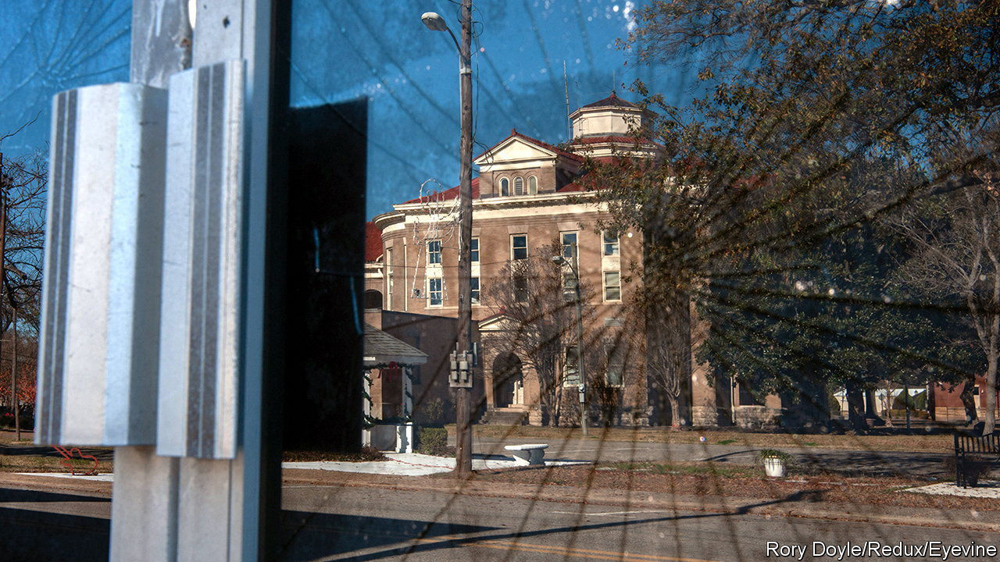

###### All shook up

# Can a Presley win Mississippi? 

##### Elvis’s cousin, health and tax cuts are on the ballot in America’s poorest state 

 

> Nov 2nd 2023 

Downtown Jackson, Mississippi’s capital, is a ghost town with storefronts boarded up since the civil-rights era and a crime rate that scares locals into staying in after sunset. More people in Mississippi are out of a job and more children live in fatherless homes than anywhere else in the country. Well over half the black residents of the Delta live below the poverty line. Some of those in the state’s richer parts are glum. “When you’re the poorest, sickest, fattest state in America, who wants to bring their family here?” says a retiree in Oxford, a pretty college town. 

It is perplexing then that Tate Reeves, the Republican governor, is running for re-election on November 7th on a message of prosperity. He is campaigning on what he calls “Mississippi momentum”, touting the state’s schools and economy. His best selling-point is a statistic released earlier this year: in the decade to 2022 Mississippi rose from ranking second-worst on 4th-grade reading-test scores to 21st-best nationally, a feat that the governor deserves some credit for. He reminds voters that he reopened the state after covid-19, pumped money into coastal industries and cut taxes. (Less is said about the biggest corruption scandal in state history that took place while he was lieutenant governor.)

That could be enough to get his base to the polls. After all, Republicans usually win here. But his opponent, Brandon Presley (a second cousin of The King) is a pro-life, pro-gun Democrat and is trailing by just one point in the latest poll. He outraised the governor four to one in the last quarter (largely thanks to money from out of state). “As your side mirror says in your car, things are closer than they appear,” he told a crowd two weeks from election day. 

One of the key issues is health care—or lack thereof. One in six people in the state do not have insurance and nearly half the rural hospitals are at risk of closing. For every 4,000 children in the Delta there is just one paediatrician. Five years ago the inpatient ward in Greenwood, a rural town tucked between cotton fields, had 160 beds; today it can finance only 12. Most of its patients can’t pay and skilled nurses have been sacked to save money. “The bleeding is profuse,” says Harold Wheeler, a doctor who left the hospital after working shift after shift without backup. 

For every patient who shows up there are many more who stay home. Jahcoby Edwards, a 27-year-old mechanic who lives in the projects and sends child-support checks to seven women, craves a check-up but makes too much to qualify for Medicaid and too little to pay his way. He has high blood pressure and last year his father died of a stroke. He fears he is destined for the same, but hopes he can live to see his toddlers become teens. The oldest person he knows is 65.

Mr Reeves takes pride in Mississippi being one of ten states that still refuses to expand Medicaid, passing up $1bn a year in federal funds so as not to partake in Barack Obama’s signature project. But polling shows that 70% of Republicans in the state disagree with him on it. So does Cary Stockett, the governor’s pastor. “He and I don’t see eye-to-eye on that,” he says from his office overlooking the state capitol. “We have the highest infant-mortality rate in the country, I just kind of believe the Lord would like to see that addressed.” 

At the end of September the governor announced a plan to ask the feds for a higher Medicaid-reimbursement rate. If granted, it would keep hospitals afloat but would do little to help people like Mr Edwards afford care. Democrats mocked the scheme, calling it “too little, too Tate”.

Mr Presley wants all the cash the state can get. The New Deal sped up electrification in Mississippi by decades, he says. He is touring every county, arguing that federal money could be just as transformative for health. His unlikely path to victory runs through black voters, who make up 35% of the electorate and most of the state’s Democrats. At a historically black college in Jackson, Mr Presley’s words were echoed by so many “that’s right”s and “amen”s that it sounded like a Baptist church on a Sunday morning. “Let’s go Brandon,” one student said with a smirk. ■


