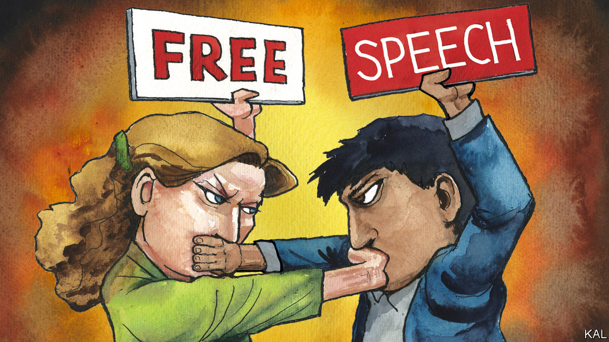

###### Lexington

# The Gaza war could help set speech free again 

##### Campus protesters for Palestine are lowering the bar for “hate speech” 

 

> Nov 2nd 2023 

It’s always seemed a bit self-sabotaging: The leftist ideology rippling out from American college campuses this century has on the one hand favoured restricting speech, yet on the other posited that the implacable forces of capitalism and white privilege entrench right-wing power. Whose speech did these ideologues imagine would wind up getting suppressed?


This tension has not surfaced often on college campuses, at least not at the most exclusive schools. There, the forces of capitalism and white privilege—if not of tolerance and curiosity—were mostly routed. A dwindling minority of faculty members, as few as a tenth, identify as conservative. Administrators, whose ranks have ballooned and who oversee the “bias-response teams” that police speech, are even more likely to identify with the left.

Yet off campus, the forces of reaction began responding with strikingly symmetrical concerns about speech: conservative governors and legislatures across America have embraced the theory that certain ideas are too dangerous for all minds and certain views are too hurtful for particular ears. Bills proposed in states such as Texas seek to protect children from material that might cause “discomfort, guilt, anguish, or any other form of psychological distress on account of his or her race or sex”. But rather than aiming to safeguard the feelings of people from historically marginalised groups, such bills are meant to protect white children from the very ideas the left wants to promulgate. 

Now a hard yet potentially constructive moment in America’s battle over speech has arrived. On prestigious campuses, the war in Gaza has shaken the prevailing power relationships, for the moment. Students attacking Israel for its response to the terrorism of Hamas have come under withering criticism, and worse: some have seen job offers rescinded or had their names and photos flashed on billboards paraded by trucks around their campuses. 

Some right-leaning advocates of free speech are relishing the spectacle. For years, leading lights of the left insisted there was no such thing as a glibly censorious “cancel culture”. They liked to speak instead of an “accountability culture”, or a “culture of consequence” that justly punished offensive speakers. Now, as the cancellers wring their hands about being cancelled, hangs heavy in the air. 

Rather than try to punish or silence students, a wiser choice would be to pocket the permissive standard they are setting, for when the bias response team next comes knocking. A recent Harvard/Harris poll showed 51% of Americans between 18 and 24 believed Hamas’s rampage could be “justified” by Palestinians’ grievances. Still, some may not realise, when they chant for a Palestine “from the river to the sea”, that they are advocating ethnic cleansing. But that is the message received by many Jews and others, and an argument of leftists uneasy with debate has been that the impact on the listener, rather than the intent of the speaker, should guide judgment of offensiveness. By that measure alone, it should be harder now for those sympathetic to pro-Palestine students to argue that any “hate speech” is off limits. University presidents are in effect embracing this standard by defending the right of these protesters to speak up. (They seem unlikely to advance the foul position that Jews are “white” and thus un-offendable.)

Some presidents are in trouble over their own speech. Donors to Harvard and the University of Pennsylvania have closed their chequebooks because they thought the presidents temporised on antisemitism. Again, this could prove constructive: after years of taking positions on matters of moment—positions that happily aligned with those of staff and students—leaders may acquire an appreciation for promoting debate rather than prejudging it.

“My hope is that the rediscovery of freedom of speech, and the discovery of political neutrality or political restraint—not commenting on every event of the day—will be something schools adopt, and they’ll stick with it,” says Greg Lukianoff, co-author of a new book, “The Cancelling of the American Mind”. “My fear is that this will be just like 9/11.” Mr Lukianoff, who is president of the Foundation for Individual Rights and Expression, a non-profit organisation, says that after the attacks by al-Qaeda universities rallied around professors vilified for criticising America. “When the threat is perceived as coming from off campus, they always rediscover freedom of speech and circle the wagons,” he says. “The test is going to be if they still feel that way when the threat comes from on campus, when it’s students demanding a professor be fired.” 

What Dartmouth can teach

Amid the uproar—because of the uproar—there are signs of hope. Despite some vile acts, protests have generally been peaceful, even when students with opposed positions have gathered near one another. Faculty views have not been homogeneous. Not all speech has taken the form of shouting, and there have even been instances reported of listening. Within hours of the Hamas massacre, professors at Dartmouth from Israel, Lebanon and Egypt decided to jointly host two public forums on the crisis, according to the , a Jewish publication. They expected a dozen or so but drew hundreds; searching questions were asked. 

At the second session, Susannah Heschel, a professor of Jewish Studies, observed that scholars learn “never to be satisfied with a simple narrative”. A fellow panellist, Ezzedine Fishere, an Egyptian novelist and former diplomat, then suggested the members of the audience ask themselves, “Are you trying to understand what is happening, or are you trying to find someone to blame?” People had a right to be indignant, he continued, but students also had a chance “to understand the complexity, which is often unpleasant because we come across things that we don’t like”.

“You don’t have to go to an Ivy League university in order to be indignant,” he continued in the same kindly yet firm tone. “The opportunity you have here is to learn.” ■


