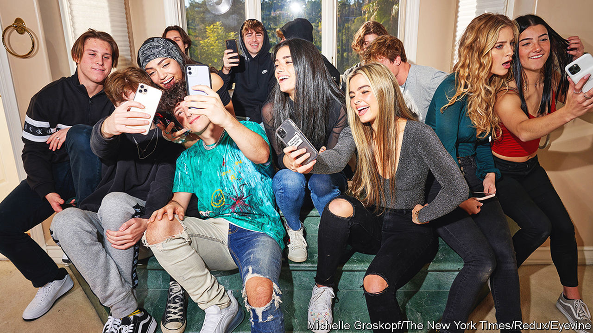

###### Bizzy bees

# Are influencers shrewd businesspeople or fame-hungry narcissists? 

##### A new group of books shows how digital creators have turned attention into profits 

 

> Nov 9th 2023 

By Taylor Lorenz. 

 By Oenone Forbat. 

By Symeon Brown. 

The internet and its cultural impact are most often viewed through the lens of the “tech bro”, the (usually male) geniuses and fraudsters behind the corporations reshaping the world. , memoirs and salacious tell-alls about these big-tech bosses have shaped readers’ understanding of how the online world changes the offline one. But these books rarely mention the principal figures who have shaped the experience of being online: . 

Influencers—the (usually female) people behind the most popular accounts on , TikTok and YouTube—have large followings, often in the hundreds of thousands or millions. People like Jackie Aina, Matilda Djerf and  earn a living from a combination of sponsored posts (#sponcon), commissions made through affiliate links and by creating their own brands, from fake tan to eyeshadows to loungewear lines. According to , more than 50m people globally describe themselves as influencers; Goldman Sachs predicts the industry will double to nearly $500bn by 2027. 

Though they shape digital culture, influencers are too often dismissed as fame-hungry pseudo-celebrities, who post about the minutiae of their lives and mindlessly promote branded products for eye-watering sums. But a new crop of books takes the influencer industry more seriously by exploring the way social media’s most popular users are reshaping the global economy and changing what the average person views online. 

Taylor Lorenz, a technology writer for the  is a leading voice on social-media trends and internet culture. Her book, “Extremely Online”, argues that influencers hold huge power: “Tech founders may control the source code, but users shape the product.” Charting the history of the influencer (once called “e-celebs” or “ceWEBrities”) from the 1990s to today, Ms Lorenz argues influencers rose by making fame and luxury less “sealed off”. 

Like reality-TV stars, early influencers created a new, niche sort of celebrity, popular enough to draw scrutiny but still unrecognisable to most. Ms Lorenz makes the case that, despite its bad rap, influencing has “given more people the chance to benefit directly from their labour than at any other time in history”, regaling readers with stories about “mommy bloggers” turning the pain of parenthood into six-figure businesses and teens becoming multi-millionaires off short comedy skits. 

Influencing has also spilled into politics, with the rise of social-media activism and influencers gaining followers by posting about social issues and news. (This sometimes leads to political candidates courting them in order to sway younger voters.) She also examines influencers’ new role in traditional media, with TV and film studios harvesting stars and storylines from the content on these accounts. Some TikTokers, such as Addison Rae, have starred in films, as well as reality television. Take “The D’Amelio Show”, about teen TikTokers Charli and Dixie D’Amelio, now in its third season on Hulu. 

Ms Lorenz’s take on influencing is optimistic. She is not alone. “Bad Influence” reflects on a decade of influencing, and also paints a honeyed picture of influencers’ function in culture. “We are photographers, videographers, copywriters, directors, editors, models and marketing team all rolled into one,” Oenone Forbat, an influencer, writes in her memoir, which offers intimate details about the haphazard quality of influencers’ fame. However, despite its Panglossian sheen, the strength of “Bad Influence” is its meditation on the deep-seated paranoia that comes with being constantly exposed to so many people.

And there are plenty of reasons to be anxious: for every fan, there is a critic. A vehement one is Symeon Brown, who looks at the industry’s underbelly, full of scammers, surgeries, racism and exploitation, in his entertaining “Get Rich or Lie Trying”. Mr Brown, a journalist, tells gory stories of influencers who took part in scams. Sometimes people who get tricked end up becoming “influencer scammers” themselves. He chronicles the experience of one woman losing tens of thousands to the now-defunct Trump University, which ran real-estate training programmes; she then launched a similar scheme. He argues that this is influencers’ real impact: making exploitation more accessible, widespread and far wilier than it was in its pre-internet days. 

The argument that runs through these very different books is that influencers have changed the rhythm of our culture, as well as who in society holds power. How long influencers will stay top of their game, however, is not something any of the books try to answer. 

Some experts estimate as much as 90% of online content could be  by 2026. As the number of believable posts and photos produced by AI soars, influencers will face significantly more competition for internet users’ attention. No influencer, regardless of how skilled they have proved to be at leveraging the internet into popularity and profits in the past, is guaranteed to retain any kind of influence in the next technological transformation. ■


.

