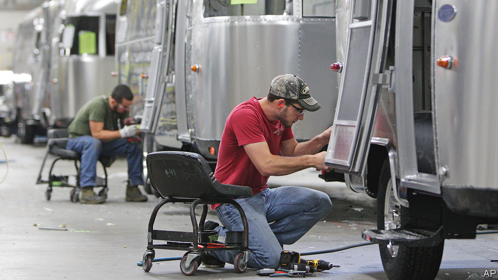

###### About that renaissance

# Why American manufacturing is becoming less efficient 

##### The unfortunate reversal of a long-standing trend 

 

> Nov 9th 2023 

Advocates of industrial policy have long argued that manufacturing possesses special powers. Industry’s demands lead to technological progress; the goods it produces must pass the muster of global markets, which drives up efficiency. Some then take things further. When countries grow richer, manufacturing moves overseas as firms seek to reduce labour costs. This, they say, justifies tariffs and subsidies to protect manufacturing and boost growth. “Making things matters,” argued a recent column in the by Oren Cass, who runs American Compass, a think-tank at the vanguard of the Republican Party’s new-found protectionism.

The problem is that, of late, manufacturing’s powers seem to have vanished. Figures published on October 26th show that America’s gdp jumped by 4.9% at an annualised rate in the third quarter of the year. Nearly 80% of output is now made up of services, but one might expect manufacturing at least to pull its weight, given its supposed powers. In fact, labour productivity in manufacturing fell by 0.2% at an annualised rate, meaning that the boost to growth was driven by services. To make matters worse, productivity in the manufacturing sector has been in secular decline since 2011—the first decade-long fall in the available data (see chart 1). Some economists think it is probably also the first such fall in American history. 

 


What has prompted the reversal? Mr Cass’s favourite explanation, trade policy, can be dismissed. American manufacturing employment fell sharply in the early 2000s, in part owing to the integration of China into global trade. Some think that this “China shock”, which led to a wave of outsourcing, also caused productivity to decline by reducing the incentive for American firms to invest. Yet productivity grew until 2011. Moreover, it also subsequently declined in sub-sectors that are mostly domestic and immune to trade, including cement and concrete production. 

A better clue is provided by what went well in earlier decades. During the 1990s and 2000s manufacturing productivity soared, with the production of computers and electronics, especially semiconductor chips, leading the way. Gains seem to have topped out at around the time things went wrong more broadly, in the early 2010s. All told, more than a third of the overall slowdown in manufacturing since 2011 is accounted for by computers and electronics. 

Yet problems with computers are not the whole story. Productivity has fallen in both durable manufacturing, which includes most tech, and the non-durable sort, which includes items like cigarettes and clothes. Fourteen out of 19 manufacturing sub-sectors, from machinery to textiles, saw declines during the 2010s. 

Perhaps all those computers have been put to poor use. America may be a technology superpower, but when it comes to using tech in the physical world it lags behind others. It ranks seventh out of 15 countries in the adoption of robots per worker, according to the Information Technology and Innovation Foundation, a think-tank. South Korea, the world leader, uses over three times more robots per worker. And after adjusting for average wages—richer countries tend to be more advanced—America ranks 11th. 

But it is not clear whether there was a big change in American manufacturers’ adoption of tech, compared with other sectors, in the early 2010s. Indeed, the evidence points in the opposite direction. As Chad Syverson of the University of Chicago notes, the ratio of capital to labour has actually grown slightly faster in manufacturing than in the private sector as a whole.

If investment has not plummeted, it must then be paying fewer dividends. Low-hanging fruit might have been plucked more eagerly in manufacturing. This idea is supported by the fact that industrial productivity growth has slowed across the rich world, even if not by as much as in America (see chart 2). The extra bit of American underperformance is trickier to explain. Economists throw out a boatload of hypotheses. America is known to have laxer antitrust enforcement than its peers; perhaps scrutiny was especially needed in the manufacturing sector. Maybe American manufacturing was more advanced when robots arrived on the scene, so had less to gain. Some have even argued that because America’s software and internet sectors have been so lucrative, talent has been diverted away from older industries. 

Could things change? Industrial-policy advocates hope that America’s subsidies for chip production and green tech will lead to a manufacturing renaissance. The idea is to boost productivity by enticing companies and investment to cluster in a given region, much as Shenzhen in China used its status as a special economic zone to become an impressive manufacturing hub. A breakthrough in robotics or artificial intelligence could push things along, just as information technology led to a surge in productivity from 1995 to 2004. For the moment, though, this is just speculation. And American manufacturing needs all the help it can get. ■


