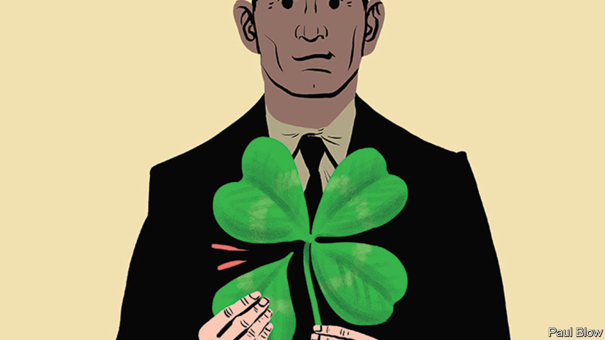

###### On leaders and managers, Colombia, health-care costs, the British pint, being rich

# Letters to the editor 

##### A selection of correspondence 

 

> Nov 9th 2023 


The importance of leadership

The difference between “” (October 28th) is that one is a role and the other is a way that someone behaves. The highest-performing organisations build cultures where everyone sees themselves as a leader and behaves as such. That means, for example, being prepared to be held accountable, taking decisions, inspiring others, but also asking for help when you need it. 

Managers, on the other hand, are critical in organisations to perform the specific role of ensuring that all team members have what they need to be successful in their role. The best corporate cultures will recognise that progression should not have to mean becoming a manager. There should always be two paths for progression, in management roles and in individual contributor ones.

Equally, the best cultures won’t see managers as being where the “authority” should sit. Organisations will instead look to devolve authority to where decisions are best made, which is generally with the people and teams involved in the work. “Turn the Ship Around” by David Marquet is a fantastic story of a nuclear submarine that went from worst to best in the fleet by pushing down decision-making, and moving from a leader-follower culture to a leader-leader one. As for chief executives, we must be both managers and leaders, but it is the style of leadership we adopt that will determine how successful our organisations are. 

Michael Nabarro

Chief executive

Spektrix


The essence of management and leadership is easily found in the writings of notable thinkers like Peter Drucker, Tom Peters and Warren Bennis. But if people actually studied them, the business-advice industry would grind to a halt. Columnists, writers, publishers and, by a large margin, expensive consulting firms have a huge existential interest in keeping leaders and managers feeling a bit inadequate. I say stay away from the yearly fads and study the masters.

Steve Tarr

Fellow

Drucker School of Management


I am generally wary of leaders, and will take the most uninspiring but efficient manager over any visionary leader. As I see it, those who have visions are more likely to need medication than be given the mantle of leadership.

Rodrigo CALVO DE NO 


 


Bartleby may be on to something when he talks about luck (). Of course, there was that manager who threw job applications into the air and randomly picked up half of them to consider, because he wanted any new recruit “to be lucky”. But there is perhaps more in this maxim, often inaccurately credited to Gary Player: “Yes, I’m lucky, but you know, the harder I practise, the luckier I get.” 

David Scott


 


The pol on polls

Gustavo Petro, Colombia’s left-wing president, is deeply unpopular, you say (“”, October 28th). Mr Petro lost no time in reacting to your article. In separate tweets on X he argued that your prestigious publication used a flawed poll commissioned by the opposition. He countered that among the young his popularity grew from 46% in May to 52% in October. The president failed to mention that in this other poll, his popularity was 61% late last year, which suggests he was misreading a declining trend.

Asked if they would vote for a candidate close to Mr Petro’s government in the recent regional elections, 57% answered no. The definitive test came on ballot day. The president’s party took a trashing, as you predicted. His party and allies won only a few of the most important cities. In Bogotá, Colombia’s capital, the government’s candidate came a distant third. 

Dr Carlos Brando


 


Health-care costs, and costs

I was surprised that your excellent article about how market failures drive up the cost of health care in America did not allude to one of the largest components of cost: doctors’ salaries (“”, October 14th). Doctors in America regulate themselves, limiting the supply of practitioners, much like a medieval guild. They extract rents as they increase their own incomes far beyond those of physicians in any other country. This results in inflated costs up and down the system.

Eric Evans

Senior fellow

Mossavar-Rahmani Centre for Business and Government

Harvard Kennedy School


“” (October 21st), described those who don’t support the National Health Service’s forthcoming project to integrate data across health trusts as “laggards”. This is unfair. Many people within the NHS support the idea of making better use of patient data. However, they are uneasy about the cost—£480m ($585m) over seven years—and the implications for privacy. Although there has been much focus on Palantir, the American firm in the running for this IT contract, there has been less recognition of a cheaper alternative that safeguards patient confidentiality.

OpenSAFELY has been developed by a small team of clinicians and software engineers, and has earned the support of privacy campaigners for a fraction of the price. To date, it has resulted in over 150 approved projects and over 80 research publications. If more were written about the alternatives to Palantir, then perhaps those so-called “laggards” would quicken their pace.

Dr Iain Dillingham

Software developer

Bennett Institute for Applied Data Science

Nuffield Department of Primary Care Health Sciences

University of Oxford

 


Measure for measure

Your October 21st issue made the inflammatory claim that the British pint, and not the American one, is the “true pint” (“”, October 21st). Although I appreciate four extra fluid ounces of beer as much as anyone, I must point out that antiquity is on the side of the colonies. The American pint is derived from the historic English wine gallon, standardised by statute under Queen Anne in the early 18th century. By contrast, the imperial gallon (from which the imperial pint is derived) was not adopted in Britain until 1824. 

One might suggest, therefore, that it is the British who should return to their roots and re-adopt the ancient, American pint.

William Thomson


When $5m isn’t enough

Bagehot’s column on class dysphoria () makes a valid point about a world with an ever-widening wealth gap dominated by billionaires, irrespective of their political leanings and class roots. Let’s remind ourselves of Connor’s advice to Greg in “Succession” that the $5m he would inherit was a “nightmare” figure: “Can’t retire. Not worth it to work. Five will drive you  my fine feathered friend.”

Jeff Coelho


