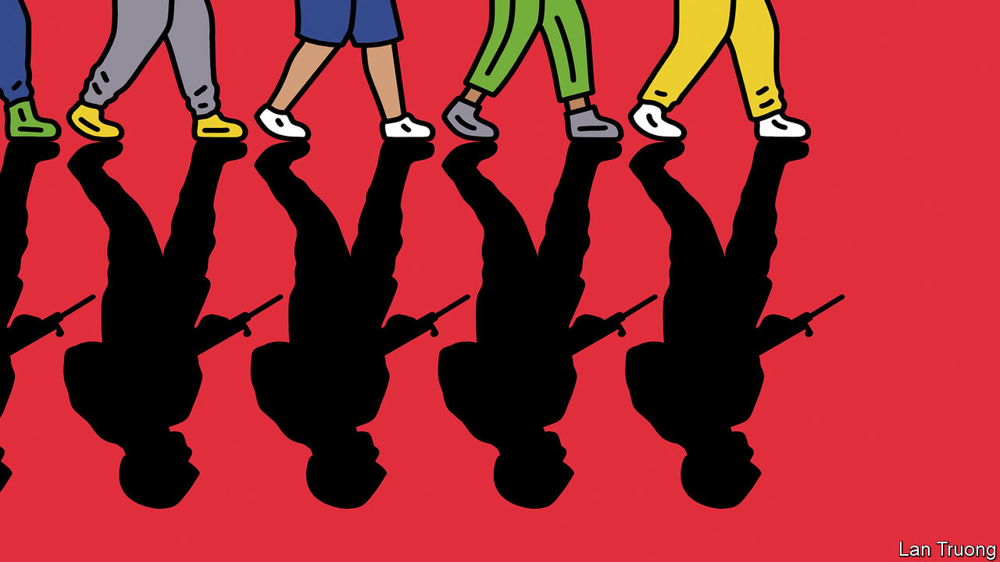

###### Banyan

# Myanmar’s junta suffers startling defeats 

##### The armed opposition is growing more unified. The West should help it. 

 

> Nov 16th 2023 

IT DID NOT take long before the world’s gaze drifted from Myanmar after, in February 2021, its army chief, Min Aung Hlaing, carried out a brutal coup. Western hopes for Myanmar’s democratic future had been vested in the figure of Aung San Suu Kyi and her National League for Democracy. When the general threw her and her recently re-elected government into jail, those hopes appeared to be conclusively snuffed out.

To be sure, fugitive members of the elected government promptly formed an administration-in-exile. And, back in Myanmar, even Burmese who had never lifted a gun flocked to join resistance militias known as people’s defence forces (PDFs). Yet for many Myanmar-watchers these efforts seemed too feeble and disparate to promise much. Raggle-taggle bands were surely no match for Myanmar’s powerful armed forces—witness the long struggles of the many ethnic militias scattered around the country’s rugged periphery.

It is time to revise that view. Since late last month Myanmar’s armed forces have suffered astonishing setbacks. On October 27th, in an operation now known as the 1027 offensive, a coalition of ethnic armies, the Three Brotherhood Alliance, launched attacks on the junta and its allies in northern Shan state, bordering China. The alliance has overrun over 100 outposts and seized towns that are key to the regime’s lucrative trade with China. The biggest prize, Laukkai, the administrative centre of the Kokang region, may soon fall to the alliance. Laukkai is the base of notorious Chinese crime kingpins and junta allies who run huge online gambling and internet scams out of the town (much to the annoyance of the Chinese authorities).

These successes are mirrored by opposition fighters elsewhere. In Chin state, in the west, a rebel army has overcome outposts on Myanmar’s mountainous border with India. In Kayin state, in the south-east, the Karen National Liberation Front has attacked the local military headquarters. A new front has also re-opened in Rakhine state. Its main rebel group, the Arakan Army, has been fighting as a member of the Three Brotherhood Alliance way to the north, but has also now breached a ceasefire to resume attacks on the Burmese army in Rakhine.

These ethnic armies appear to be thinking strategically and acting in concert. Several have also made common cause with the PDFs, whom they both train and involve in their campaigns. The armed opposition is looking less raggle-taggle; the Burmese armed forces appear overstretched and demoralised. With little in reserve, they may conceivably not have the strength to recover.

The junta has only itself to blame for the concerted nature of this assault. Since the coup it has helped bring violence to 315 of the country’s 330 townships, calculates Shona Loong of the International Institute for Strategic Studies (IISS), a think-tank in Singapore. For the first time since independence in 1948, even the majority-Bamar (and Buddhist) heartlands from which the army is largely recruited have risen in revolt against it. Hatred of the armed forces is evident across the country. Rising numbers of army conscripts are defecting or surrendering to the militias.

Repelled by the junta’s violence, Myanmar appears to be uniting in opposition. A new and diverse generation of leaders is coming together to “break with past social and political patterns”, as Priscilla Clapp of the United States Institute for Peace, a think-tank, writes. Huge numbers of Burmese, across ethnic divisions, want to stake out a more inclusive, federal future—or at least one not governed by their bullying generals.

It is high time the Western powers re-engaged with Myanmar’s struggle. In a forthcoming book for the IISS, “New Answers to Old Questions”, Aaron Connelly and Ms Loong argue that the mistaken Western hopes pinned on the often illiberal and controlling Ms Suu Kyi are now more likely to be realised by the new emerging leaders. The West should help and encourage them. Even if supplying arms to the Burmese opposition is out of the question, providing it with satellite internet access would help both its operations and delivery of humanitarian aid to non-junta areas.

Meanwhile, the West’s near-absence in back-channel diplomacy is leaving the field open to outside powers, including China, which care little about democracy and rights. Much is at stake in Myanmar, and not only for its 50m inhabitants. Democracy is also on the line. The West should come to its aid. ■


