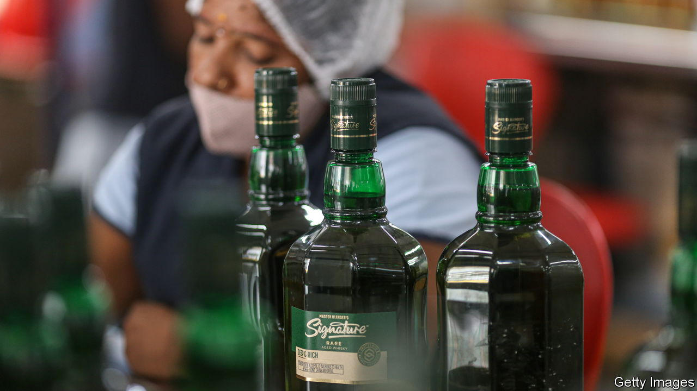

###### Swadeshi spirits

# Premium Indian whisky is booming 

##### A crop of new distillers is winning fans at home and prizes abroad 

 

> Nov 16th 2023 

TWENTY-FIVE thousand barrels of whisky are stacked high at the Paul John Distillery in Goa, treating workers and visitors to the seductive aroma of grain and spirit. Mostly imported Bourbon barrels, the caskets each contain 200 litres of single malt. The drink is made with Indian barley and distilled and aged in conditions most unlike those in foggy Scotland. Goa is a tropical beach paradise on India’s western coast. The whisky, which Paul John has been producing in India since 2008, is nonetheless award-winning and delicious. It is “as good as a Scotch”, pronounces a Dutch visitor to the distillery, Marco Nigholt, a whisky aficionado.

Many Indians like hard liquor. Spirits and the so-called “ready-to-drink” category, which includes things like pre-mixed gin and tonic, account for 40% of the Indian alcoholic-beverage market by volume. Most of that is whisky, reckons Nita Kapoor of the International Spirits and Wines Association of India, an industry body. In fact, most of what passes for whisky in India is nothing of the sort, but rather a molasses-based spirit with whisky-like flavouring, colouring and branding. Yellow-tinted spirits such as Bagpiper and Officers’ Choice are among the country’s most popular tipples. Scotch, by contrast, is subject to a 150% import duty and traditionally reserved for the wealthy. 

Yet Indian demand for booze of all kinds is growing with the country’s economy. Already the world’s fifth-biggest alcohol market, India accounted for a third of global growth in the industry in 2021-22, according to International Wine &amp; Spirit Research (IWSR), a market-analysis firm. The industry expects India’s alcohol sales to grow by around 6% a year, not least because half of Indians are under 25, the (often disregarded) legal drinking age in many states. Among premium drinks, consumption of Scottish single malts doubled by volume between 2020 and 2022, according to iWSR. Despite the tiny proportion of Indians who drink Scotch, India is now its biggest export market.

The combination of soaring demand and high import costs has created an opportunity for home-made premium products. The first Indian single malt, Amrut (or “nectar of immortality”), was launched in 2004 and now has several competitors. Paul John’s parent company, John Distilleries, set up its single-malt distillery in Goa in 2008, and began selling its first bottles in India in 2015. It has since won over 300 international awards. Indri, a newer distiller based in the northern state of Haryana, won “double gold best in show” at the Whiskies of the World Awards in America in October. A barman at the Whisky Bar in the Radisson Blu hotel in Bangalore, India’s tech capital, reckons that four out of every ten whisky orders he fields are for Indian brands. None is cheap. Indian single malts sell for as much as, and often more than, imported Scotch. 

Three factors are driving the boom. The first, beyond India’s overall growth, is the fact that its services-led model has disproportionately benefited members of the country’s educated middle class. That is manifest not only in booming premium-booze sales but also the high-end bars mushrooming around the country. A second, related reason is that alcohol, long frowned on in polite society, is growing more socially acceptable.

Last, Indians’ growing confidence in their country’s progress is increasing enthusiasm for home-made products. (Some have no choice: as part of India’s “self-reliance” policy, the network of 4,000-odd shops run by the army for service members and veterans has not been allowed to sell imported liquor since 2020.)

Booze firms are gearing up to meet the rising demand. The Paul John distillery plans to double its capacity of 25,000 barrels a year. Global firms, too, are angling for a piece of the action. Last year Diageo, a multinational liquor behemoth, launched its own Indian single malt, Godawan. Sazerac, an American whisky-maker and investor in John Distilleries, has nearly doubled its stake in the firm. Spirits are soaring. ■


