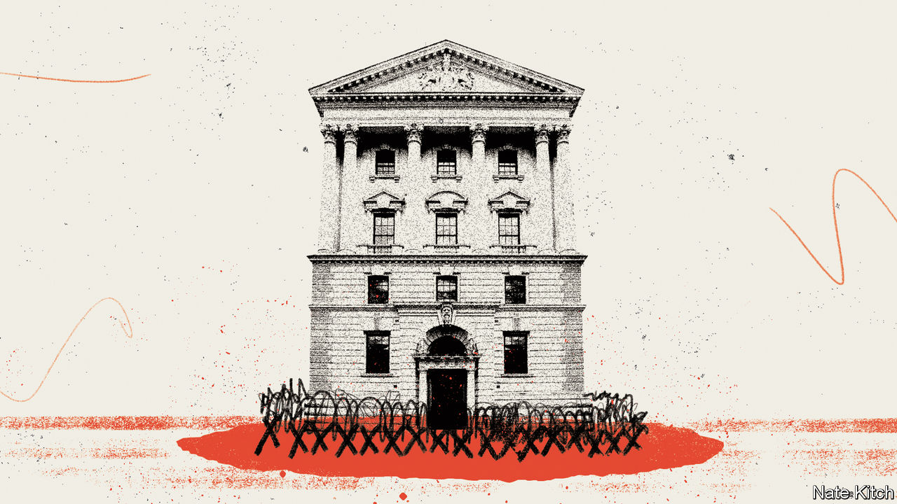
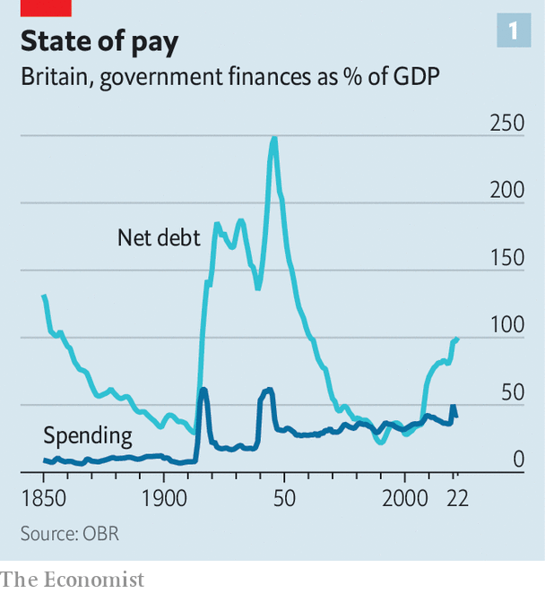
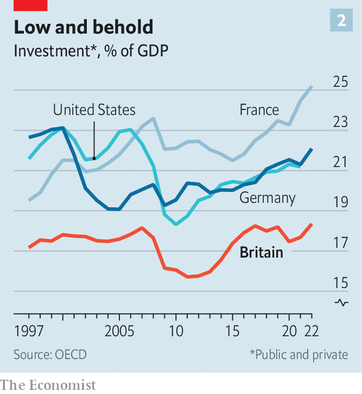

###### Treasury island

# Why Britain’s Treasury must change its ways 

##### The problems with the most powerful department in Whitehall 

 

> Nov 16th 2023 

On September 28th 1976 Denis Healey was at Heathrow airport waiting to fly to a meeting of the IMF when news reached him that the pound was tumbling. The chancellor rushed back to Whitehall to announce that he would ask the fund for a £1.9bn ($3.9bn) loan, around 5% of the government’s budget. Britain is bust, was the blunt verdict of . The Treasury was blamed for the loss of fiscal credibility that might have reassured the markets. 

This was no isolated trauma. From devaluations to bank bail-outs, economic crises have helped shape the psyche of Britain’s finance ministry. “The disasters of 1967, 1976, 1992, 2008 and September 2022 are etched in the collective consciousness,” said Lord Macpherson, the department’s top official in 2005-16, last year. 

It is the Treasury’s job to steer Britain from the rocks. Its officials obsess over designing ways to “save the government from itself”. In a lecture in 2014 that has become canon among officials, Lord Macpherson set down the tenets of the department’s “orthodoxy”. It includes support for markets and free trade and scepticism of government intervention. Above all is adherence to “sound money” (controlling inflation) and disciplined spending.

There is much to like about this set of beliefs. The last entry in Lord Macpherson’s list of “disasters” refers to Liz Truss’s brief and shambolic administration. Before becoming prime minister last year, Ms Truss railed against “failed Treasury orthodoxy” and its “abacus economics’‘, promising instead to “unleash growth”. . Few doubt the department’s competence; its power attracts Whitehall’s brightest minds. Some who criticise it simply want higher spending and are too sanguine about ballooning debt. As Ms Truss proved, every government needs a department that says “no”.

But critics of the Treasury are not entirely wrong. The Treasury’s strengths are weaknesses, too. In Britain’s centralised system, the department wields huge power over the vast sweep of activities undertaken by the state. Its means of controlling spending can be penny-wise but pound-foolish. The department often cannot see the merits of schemes needed to raise long-run prosperity. Its officials grip the purse strings so tightly that other parts of government are infantilised. 

Drum Court doctrine

The Treasury is 800 years old but owes its modern form to William Gladstone. During four spells as chancellor (sometimes combined with terms as prime minister), the Victorian statesman waged a war on debt, earning a reputation for “saving the candle-ends”. Pricey ships were the biggest worry then—Gladstone could bore the Commons for hours on naval-spending estimates.) Public spending still accounted for less than a tenth of GDP.

 


In the 20th century the role of the state—and of the Treasury—swelled (see chart 1). Children were to be taught, the sick treated, the elderly cared for. In many other countries, power was dispersed as the state expanded. Spending was devolved to regional tiers of government or managed by a budget office separate from the finance ministry. Some countries created the counterweight of an economics ministry, responsible for fostering long-term growth. In Britain, barring the odd short-lived challenge, the Treasury has reigned supreme. It controls the best part of £1trn-worth of public spending in Britain each year.

The Treasury organises itself around two annual set pieces—the spring budget and autumn statement—at which the chancellor announces tax-and-spending decisions.  will present the next autumn statement on November 22nd. As well as these events, triennial spending reviews are used to set departmental budgets. Since 1997 chancellors have embraced fiscal rules to signal their credibility to taxpayers and lenders. Although the precise words change, the rules typically target debt and the deficit falling as a share of GDP over a fixed period. 

The Treasury’s adherence to disciplined spending looks particularly apposite now given strains on the public finances. Earlier this year public debt exceeded GDP for the first time since 1960. Treasury officials are fretting about rising servicing costs, says Torsten Bell of the Resolution Foundation, a think-tank. By 2026-27 those costs could exceed £108bn (or 4% of GDP), almost as much as Britain’s education budget. 

 


Yet the Treasury must grapple with another profound worry. Since 2008 Britain’s economy has grown at about 1% per year. , increasing by just 1.7% since 2007, compared with 27% in the previous 16 years. Investment is too low (see chart 2). Subdued growth means lower wages and tax receipts. The Treasury cannot be blamed for all of these problems. But its power means that its institutional flaws have a disproportionate effect. On three counts, the way the Treasury works makes Britain’s problems worse. 

The first problem is that the Treasury puts too much value on short-term savings over long-term outcomes. Take infrastructure. In March Mr Hunt decided to delay by two years the Birmingham-to-Crewe leg and the last London bit of HS2, a high-speed rail project, as well as several road projects. In the Treasury’s calculus, that meant Mr Hunt could meet nearer-term spending limits and stick to his fiscal rules. In the real world, it pushed up the overall cost of the scheme and deferred the benefits. (The northern leg of HS2 was  in October.)

Other areas get similar treatment. In 2021 a target for raising public R&amp;D spending was pushed back by two years, forcing projects to be abandoned. A core problem for the National Health Service is low capital investment. Britain has the fifth-lowest number of CT scanners and MRI units per person in the OECD, a club of 38 mostly rich countries. Leaky roofs sap morale and productivity in hospitals. Yet sharp cuts to capital spending are pencilled in for after the election. And even after capital budgets have been allocated, they are raided to plug gaps in day-to-day spending. A total of £4.3bn was siphoned off between 2015 and 2019; in the coming budget another £600m will be moved, reckons the . In theory that is banned; in practice the Treasury turns a blind eye. 

A stopgap approach extends to tax policy. In their budget statements, chancellors like to “pull a rabbit out of the hat”. Capital allowances, an element of business taxation, have been changed on average every other year for the past four decades. In March Mr Hunt fiddled again, this time introducing “full expensing”, which allows businesses to deduct investments in machinery. That was welcome, except that the change was temporary (lasting only three years), negating much of the benefit. 

Some argue that all of this can be blamed on the myopia of ministers. To a point. But such decisions also emerge from an institution geared around near-term spending targets. That is the rhythm to which the machine hums. Teams working on long-term goals, like improving public-sector productivity, get little say in budgets. The way to get promoted is to show that you can kill spending bids, says one official. Meeting the fiscal rules often involves unhelpful short-term wheezes.

Problems also arise from the way rules are applied. In 2018 Diane Coyle and Marianne Sensier, two economists, concluded that the Treasury’s “Green Book” process for evaluating projects resulted in a bias against some parts of the country. Using local land values and productivity measures skews expected benefits towards London and the south-east. Projects elsewhere with a relatively high benefit-cost ratio—like electrifying railways in Leeds or the Midlands—are less likely to get funding. The value of creating clusters by joining up transport networks is missed. The department reviewed the Green Book in 2020; Ms Coyle thinks little has changed. 

Even in London and the south-east, the Treasury has long been sceptical of schemes that promise transformation. In the 1980s Treasury officials argued that the M25, the orbital motorway around London, only needed to be two lanes wide. In the 1990s they strenuously opposed the extension of the Jubilee Line, part of the London Underground, to Canary Wharf. They later acknowledged that they were mistaken on both counts. 

Healthy scepticism about “spend-to-save” bids can bleed into an instinctive distrust of any preventive programmes. The public-health grant, which local authorities use for schemes focused on drug use, drinking and smoking, has been cut by a fifth in real terms since 2015, despite being three to four times cheaper than other interventions with the same health benefits. The department should care more about “save now, spend more later” decisions says Paul Kissack, a former official. 

The second, connected problem is that the Treasury does not prioritise economic growth. Ms Truss was wrong to style the department as anti-growth (officials simply doubted her tax cuts would “unleash” much). Behind closed doors the Treasury argues for causes that could boost growth without costing money, like planning reform and a pragmatic relationship with the European Union, says Tim Leunig, a former adviser to two chancellors. But the Treasury treats its role as an economics ministry as subordinate to its finance one. 

Several chancellors have tried to tilt the balance. But over the past 15 years, it is hard to point to a strong record of pro-growth policies. George Osborne, who took charge in 2010, hoped to be a radical pro-growth chancellor but that aim was undermined by his “fiscal machismo” in cutting budgets more steeply than was needed, says Paul Johnson, who heads the Institute for Fiscal Studies, a think-tank. The Treasury was also slow to acknowledge that low public and private investment would be disastrous for productivity. “With hindsight, we probably could have borrowed more and invested more,“ Lord Macpherson said in October. 

This would all matter less if not for the third problem: how jealously the Treasury guards its power. Its grip on Whitehall owes much to Gordon Brown, who ruled it as chancellor for a decade from 1997. The department “lost one empire” through his decision to cede operational control of monetary policy to the Bank of England, Mr Brown wrote in his memoir. But it assumed an “even bigger” one, extending its tentacles across government. 

Mr Osborne handed responsibility for forecasting to the Office for Budget Responsibility, an independent watchdog, and declared that “the micromanagement would stop”. Few think it has. The Treasury’s 2,000-or-so officials exert huge influence over an array of complex activities. However bright, many lack experience. A third are under 30, and a quarter leave their jobs each year. Departments complain of old hands being bossed around by recent graduates in the Treasury. 

Overzealous control manifests itself in several ways. Once spending is allocated, approval is needed for “novel” and “contentious” changes. Moving as little as £5m between programmes can require lengthy negotiations. In one case during the pandemic, the Department for the Environment, Food and Rural Affairs needed Treasury approval to roll over a subsidy programme to help abattoirs slaughter pigs. The scheme was worth less than £1m. 

Despite saying it wants to let go, the Treasury always tends to “snap back to the old Gladstonian model of ‘we’ll give you thruppence and see how you get on’”, says Ms Coyle. Such bureaucracy is not only a huge waste of time. It limits departments’ ability to deal with actual problems. 

And not just departments. The Treasury is slowly moving towards block grants for some , which then get to decide how to spend the cash. But the default remains a begging-bowl culture in which councils submit lengthy bids for tiny sums of money. In the past seven years English councils have been asked to compete for 36 separate pots for pedestrian and cycling schemes. Other departments also micromanage funding as it moves down the chain, but the Treasury sets the culture. A review of research funding found that it insists on stifling levels of bureaucracy, putting British innovators at a disadvantage.

Trusting individual departments to make decisions works better, according to an OECD study. Dutch ministries, for example, follow a rigorous collective process for agreeing on budgets and setting goals. They then have more freedom to decide how to meet those goals, with an in-house finance function keeping track. Elsewhere in Europe, the cabinet often gets more say on fiscal decisions than in Britain. 

The easy answer to these three problems is to break the mighty department up. That would bring Britain into line with other countries, and is an idea that has advocates on the left and the right. In a forthcoming review of the civil service, Lord Maude, a Tory grandee, suggests moving control over spending to the Cabinet Office, a department he once ran. 

Yet it is not obvious that countries with other models do any better. Mergers and splits tend to absorb an absurd amount of attention in Whitehall, and often don’t last. Labour, which has a comfortable lead of around 20 points in the polls, in any case appears uninterested in such a radical break. Rachel Reeves, the shadow chancellor, is pushing an agenda of supply-side and public-service reform while retaining “iron discipline” on spending. 

Money and bunnies 

However, to raise Britain’s economic-growth rate, which she wants to be the fastest in the G7, Ms Reeves would need to change the institution she aspires to lead. Several ideas come to mind. First, chancellors could accept more constraints on their power, in order to give taxpayers and investors more certainty. The consensus on funding HS2 survived 15 years before it was unceremoniously shredded in October. Changes to the scope and budget of big projects could require parliamentary approval, says JP Spencer, a former Treasury official who advises Labour. 

Capital budgets could be set for the whole five-year parliament, and properly ring-fenced. Plans could be changed—for example, if managing the business cycle required more active fiscal policy. But vital investment would not be raided every time things got tough. Nor is there a good reason for chancellors to tinker with the tax system at every spring budget and autumn statement. They could set out a tax strategy at the start of each parliament, with changes scheduled only once a year, and taxes could be automatically indexed to inflation. Britain needs fewer rabbits. 

 


Second, the Treasury could relax its grip on spending. Britain owes much to Gladstone’s efforts to establish control. But departments, agencies and councils—not only bright graduates in the Treasury—should be able to manage programmes. Once a budget and outcomes are agreed, ministries should take more decisions. 

Third, the Treasury needs to change the way it assesses proposals. David Gauke, who served as chief secretary to the Treasury in Theresa May’s government, suggests creating a new independent body, alongside the OBR, to evaluate the likely impact of policies on long-term goals like reducing demand for public services or boosting growth. Scrutiny would happen on an annual basis before a decision is made, with policies scored from one to five. Currently no external body does this. Studies have found the standard of evaluation by departments and the Treasury to be poor. 

Andy Haldane and Jim O’Neill, two economists courted by Tory and Labour politicians, have separately argued that adherence to today’s rules is unhelpfully constraining investment and growth. Although borrowing is already high, Lord O’Neill says there is a case for carve-outs from the fiscal rules for investments proven to have the biggest effect on long-run growth. This approach could go alongside tighter control of current spending.

The Treasury prides itself on stopping bad things from happening—“God’s work”, as a former official calls it. It has often protected Britain from disaster. It also needs to set a course for long-term prosperity. ■


