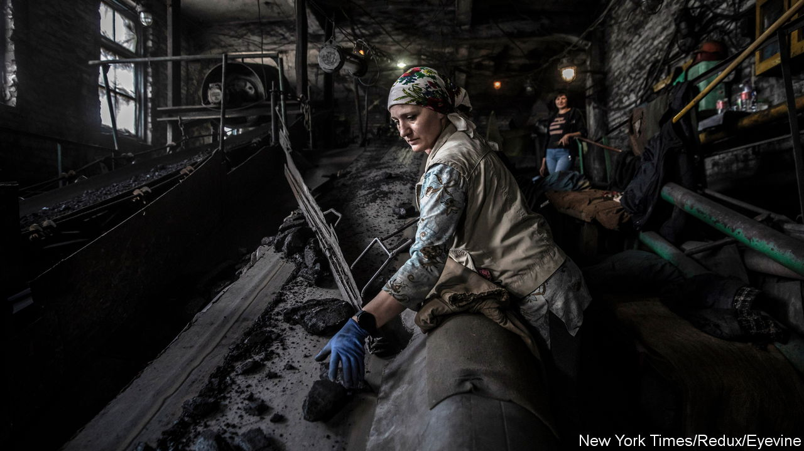

###### Dancer in the dark

# As Ukrainian men head off to fight, women take up their jobs 

##### Mining is one big example 

 

> Nov 12th 2023 

OKSANA SAYS she has placed her life on hold. Covid-19 took her mother and her husband two years ago. Russian artillery took her father and her oldest son this spring. “I’ve immersed myself in my work,” she says, 480 metres under the outskirts of Ternivka, a town in eastern Ukraine. The whites of her eyes glow in the surrounding darkness. Back in Bakhmut, the site of one of the war’s most vicious battles, Oksana, aged 49, was a dance teacher at a boarding school for impoverished children. Today, with her former house and hometown destroyed, her school closed, and her closest relatives dead, she is a coal miner. 

After the Russians invaded in February 2022, Oksana (her mine’s management asked that the surnames of its workers not be used) escaped to Poland, where she worked as a dishwasher and a cook at a restaurant. But she missed Ukraine. Friends told her the Ternivka mines were looking for new workers, and she signed up. Her new job pays better than most, Oksana says, and offers a good pension. The work also helps her block out the memories, she says, taking a break from shovelling coal. “I want to forget everything.”


The war has upended the lives of countless Ukrainians, as well as the country’s labour market. Some 4.8m people lost their jobs almost overnight when Russia attacked. Unemployment is estimated to have eased to 18.4% in October this year, from more than 30% in the spring of 2022, but remains well above pre-war levels. According to one survey, 17% of Ukrainian workers have changed professions since the start of the war. Hundreds of thousands have been conscripted. American officials estimate that at least 70,000 Ukrainian soldiers have died in the war, and that up to 120,000 more have been wounded. As more Ukrainians are called up, demand for workers in sectors traditionally dominated by men is growing.

Enter Ukraine’s women. War and occupation have made collecting good data impossible. But there are signs that women are increasingly powering Ukraine’s hobbled economy. Of the 36,000 small- and medium-sized companies registered in Ukraine so far this year, 51% are run by women, says Yulia Svyrydenko, the country’s economy minister. More women are starting to work in industry, construction, and mining. “We will see this on a larger scale once we start reconstruction,” she says.

In the coming years Ukraine will need an army of doctors and psychologists to look after its , including thousands of amputees and traumatised soldiers. Many if not most of those care-givers will be women. The energy, transport and defence sectors, which are expected to play an outsize role in the economy after the war, are also bound to attract more female workers.

At the mining complex near Ternivka the army has conscripted 600 men, about a tenth of its total workforce, says the director, Dmytro Zabielin. To make up for the shortage, about 300 women have joined. The mine had employed women before the war, but none worked underground. More than 100 of the new workers are now doing just that. Oksana operates and maintains a conveyor belt that carries coal to the surface. Other women are working as safety inspectors and electricians. More are coming on board. Olena, whose husband, a former miner, commands a platoon near Luhansk, is training to operate the trains that connect sections of the mine. Anna, who recently turned 18, will look after the cages that carry the miners between levels. Ternivka is well behind the front lines, but the area has been struck by Russian cruise missiles. “It’s very scary,” says Anna. “But as long as I’m underground I can’t hear it.”

Coal-mining is dangerous, backbreaking work. The war has made it even more so. During blackouts caused by Russian attacks on Ukrainian  last winter, the Ternivka miners had to walk as far as 7km, and then climb 680 metres using escape ladders, to resurface. Thanks to new generators, the mines can now keep the trains and the elevators running long enough to ensure a less harrowing exit. 

Ukraine has a way to go when it comes to gender equality. The participation rate of women in the labour force has been in decline. It fell from 54% in 1990 to 48% on the eve of the invasion. Women are over-represented in education, domestic work, and tourism, professions in which salaries tend to be low. The gender pay gap has narrowed from 26% seven years ago to 18.6% today, but remains well above the EU average (12.7% in 2021). Until as late as 2017, when it was finally repealed, a law dating from the Soviet era had banned women from 450 professions, ranging from lorry driver to welder. The following year, Ukraine gave women in the armed forces the same rights as those of male soldiers. Around 43,000 women are currently serving in the armed forces, including 5,000 in combat positions. 

Stereotypes persist. “Women should pursue their ambitions in other areas,” muses Mr Zabielin, the mine director, in his office. “A woman is the keeper of the home and the family.” But he concedes that the mine will probably have no choice but to hire more of them. Many men will never come back from the front, and Ukraine will have to maintain a large army even after the war ends. “Our neighbour,” he says, referring to Russia, “is not going anywhere.” 

Oksana misses her former life and her old job, but she has no intention of leaving the new one. She has become used to the noise, the darkness, and the dust and to the long descent underground, she says. “It’s no longer as scary as war.” ■

