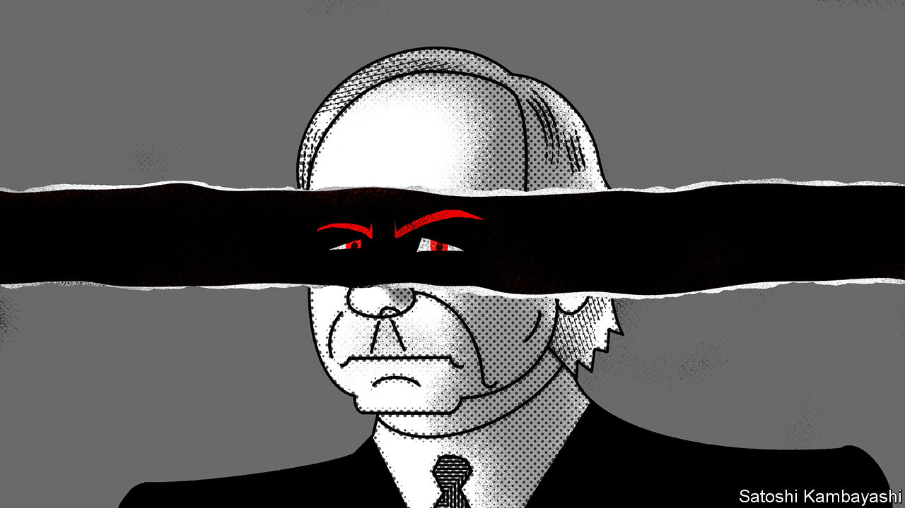

###### Buttonwood

# Ray Dalio is a monster, suggests a new book. Is it fair? 

##### The founder of the world’s largest hedge fund comes under scrutiny 

 

> Nov 16th 2023 

The tome opens with Ray Dalio laying into an employee he apparently knew to be pregnant. He calls her an “idiot” over and over, until she runs from the room sobbing. The founder of Bridgewater Associates, the world’s largest hedge fund, was supposedly “delighted”. His “probing” of this woman was evidence of his commitment to “truth-seeking” at any cost. The meltdown, which had been recorded, was uploaded to a library of firm meetings. He had it edited into a clip to be shown to future employees.

This is just the first of many damaging titbits in “The Fund”, a new book about Mr Dalio by Rob Copeland, a reporter at the The book’s narrative builds to two points. One is that Mr Dalio’s “principles”, a philosophy he described as being centred on “radical transparency”, are really little more than time-wasting tools which he uses to bully employees. The system requires meetings to be recorded, for employees to rank one another and for them to upload complaints onto a platform. This is supposed to foster an “ideas meritocracy” but instead leads, at best, to petty gripes about how the peas in the cafeteria are too “wrinkled” and, at worst, to a culture of fear. Mr Dalio is supposed to have manipulated this system so that his opinion always mattered most.

The second is that there is “no secret” to Bridgewater’s success. Mr Dalio’s hundreds of research staff write reports he does not even read. Mr Copeland claims Mr Dalio made all the investing decisions himself, or with some input from lieutenants. Far from having a codified set of rules, as he tells clients, he uses hunches and simple “if then” statements such as: if interest rates fall in a country then you should sell its currency. These worked, the story goes, for a while, but the rise of high-frequency traders and quantitative funds, which often follow market “momentum”, eroded his edge. Returns for Bridgewater’s flagship “Pure Alpha” fund have been pretty paltry for the past 10 or 15 years. 

The conclusions of the two intertwine: the cult of Bridgewater is pointless. Bridgewater’s employees have time to waste on nonsense because the investing process is simple, really. Mr Dalio might have been a gifted investor—since 1991 he has earned $58bn for those who have bought into his funds—but his efforts to codify investment rules and culture were a waste of time. His legacy will fade.

Mr Copeland’s deep reporting unearthed damning tales, but they seem to have been told so as to place Mr Dalio in the worst possible light. Take, for example, a passage where Mr Dalio invites Niall Ferguson, a celebrated historian, to Bridgewater. Mr Dalio supplied Mr Ferguson with a copy of his book, which offers a sweeping theory of economic history and a model of “the economic machine”—only for Mr Ferguson to tell the assembled staff that there was no way of modelling history since models could not account for the “caprices of decision-makers”. Mr Dalio began shouting at Mr Ferguson, who soon left. Mr Copeland writes that Mr Dalio then sent round a poll asking who won the debate (Mr Dalio triumphed).

It is one of many anecdotes that are supposed to reveal that Mr Dalio is unprincipled. Far from listening to unfiltered criticism he uses his power to silence others. But apparently Mr Dalio later solicited advice asking whether he had behaved inappropriately. His employees implored him not to invite people to Bridgewater just to shout at them—advice to which he is said to have listened. Mr Dalio’s radical transparency might be strange and misguided, but perhaps he is not a hypocrite.

The book’s arguments about Mr Dalio’s investment process are harder still to swallow. Macro funds that follow trends are a dime a dozen, and few come close to touching Bridgewater’s record. As for the erosion of his edge, the earliest momentum funds were established in the 1980s, before Bridgewater set up its first funds. They grew in the 1990s and 2000s, when his edge was as sharp as ever. How Mr Dalio achieved what he did is something of a mystery. Perhaps some of the magic could have been codified or captured. It was worth trying, anyway.

Mr Dalio dismisses Mr Copeland’s book out of hand. He has written that it is “another one of those sensational and inaccurate tabloid books written to sell books to people who like gossip”. The hagiography of Mr Dalio already exists: he penned his own tale in 2017. Mr Copeland seems to have written its foil, which can find only the ill in Bridgewater’s founder. The book is worth a read—but only with that in mind.■


