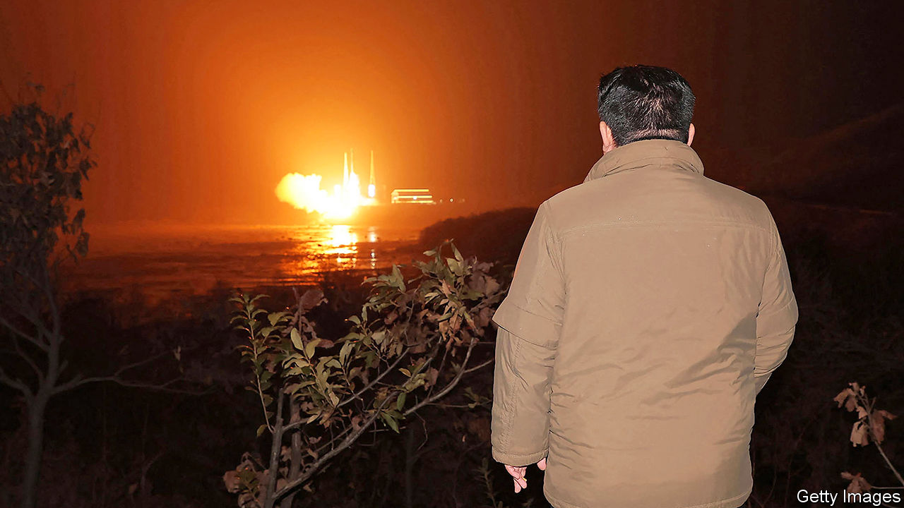

###### Spy satellites

# Will North Korea’s new spy satellite make the region safer? 

##### The Korean space race has big implications for the peninsula’s security 

 

> Nov 22nd 2023 

The two bitterly opposed parts of the Korean peninsula have something in common: stratospheric ambition. After trying and failing twice to put its first military spy satellite into orbit earlier this year, North Korea claimed to have succeeded on November 21st. South Korea plans to put its first spy satellite into orbit on November 30th. This emerging space race has big implications for regional security. 

Possessing reconnaissance satellites would improve both Koreas’ ability to defend against, or attack, the other. Up-to-date information is crucial to South Korea’s “Kill Chain”, the pre-emptive strike system it is developing to deter the North from using its nuclear arsenal. Being able to pinpoint the whereabouts of North Korea’s leaders would also lend credibility to the South’s threat to eliminate them if they ever threaten it. The North, deeply fearful of an American invasion, would for its part get early warning of troop movements against its frontier. If war broke out, satellites could help both sides locate and destroy each other’s forces.

A lone satellite would be of limited use, however. Anything resembling real-time monitoring requires a network. South Korea therefore plans to launch five satellites by 2025. Kim Jong Un, North Korea’s dictator, said last year he had tasked his scientists with launching “a large number of reconnaissance satellites”. Such a constellation would have more resilience against technical failure or attack.

Both Koreas have been developing satellites for decades. Yet they have followed different paths, explains Daniel Pinkston of Troy University in Alabama. Fearing an arms race on the peninsula, America convinced South Korea in 1979 to accept limits on its rocketry technology, which can be used for both satellites and ballistic missiles. South Korea instead focused on satellite and imaging technology. As a result its first spy satellite will probably be more sophisticated than North Korea’s, with better capability to see through cloud cover and at night. South Korea’s launch capability is relatively rudimentary, even though America began easing the restrictions in 2001 and scrapped them in 2021. SpaceX, an American rocketry firm, will put the South’s satellite into orbit.

North Korea’s satellite programme was in essence a spin-off from its ballistic-missiles one. The country has now put three satellites into orbit in all. There is scant evidence that the first two are capable of much. But a promise of help from Vladimir Putin, made when Mr Kim went to Russia to visit the country’s president in September, may have helped. South Korea’s government says Russia is giving the North technical assistance on satellites in return for arms to wage war on Ukraine. If that is right, the North Koreans may have missed an earlier launch deadline, set for October, because they were making Russian-inspired improvements to their latest satellite and its launch vehicle.

How much Russian assistance North Korea can expect for its programme is unclear—and a military space programme is a long-term project. The South has more reliable friends, primarily America. Over the past two years space-based co-operation between the two countries has taken on an increasingly military dimension. In 2022 America deployed a unit of its Space Force service to South Korea. After the defence ministers of America, Japan and South Korea held a rare trilateral meeting on November 12th, South Korea’s defence ministry said the three countries would start sharing data on missile launches in real time from December.

The space race seems certain to improve North Korea’s military capabilities. Yet it could also increase stability on the peninsula, says Ankit Panda of the Carnegie Endowment for International Peace, a think-tank in Washington. If the North had a better understanding of America’s and South Korea’s military movements, including frequent training exercises, it might be less likely to mistake innocuous activity for a potential threat. “Given that North Korea has nuclear weapons”, says Mr Panda, “I would prefer it to have better eyes and ears than the opposite.”■

