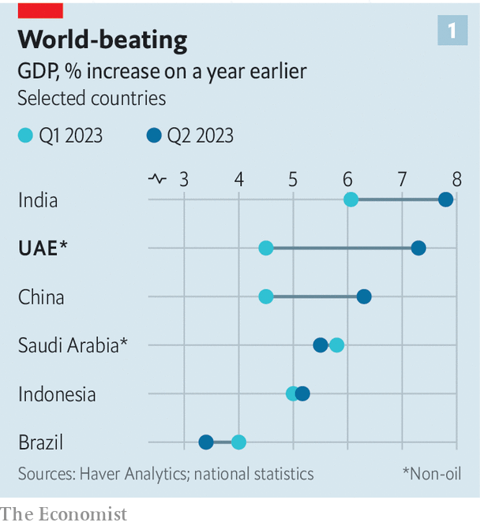
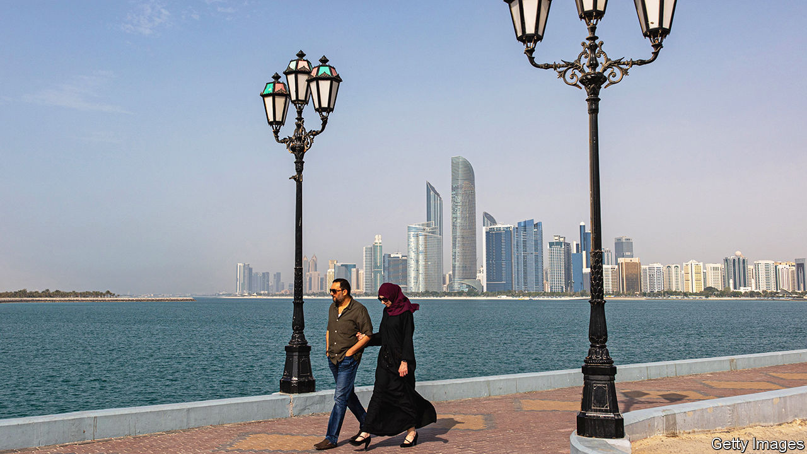
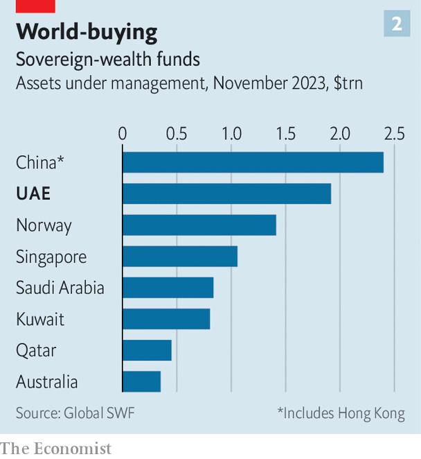

###### Port in a storm

# The messier the world gets, the more the UAE seems to thrive 

##### For a tiny country, it has outsize influence 

 

> Nov 23rd 2023 

FROM NOVEMBER 30th fully 70,000 people from around the world will descend on Dubai for the UN’s annual climate summit. The cop, as it is known, is a 12-day jamboree that draws diplomats, businessfolk and activists. Should they have time to escape the crush at Expo City and travel towards the glitzy skyscrapers dotting the coast, they will find a city, and a country, in the middle of an astonishing boom. 

One giveaway is the crowds of golden-visa-toting Russian billionaires, Indian businessmen and Western financiers. Another is a property frenzy. In September buyers queued in the wee hours to snap up villas in Dubai’s latest ritzy land-reclamation scheme, Palm Jebel Ali, that start at $5m. The properties have yet to be built. 

 


Last year’s energy-price spike brought the United Arab Emirates, one of the world’s largest producers of oil, over $100bn in revenue. That is about $100,000 for every Emirati citizen. But oil is not the only reason the country is prospering. In a time of war and economic fragmentation, the UAE seems to be a port in a storm. Multinationals are setting up factories and offices at a rate not previously seen in the UAE’s five decades of independence. Oil and gas now account for just a third of GDP, and the oily bits of the economy are growing more slowly than the rest of it. The economy as a whole grew by 3.7% in the first half of the year compared with the same period in 2022. Excluding oil and related industries, it grew by 5.9% (see chart 1).

The UAE’s standing in the world seems to be growing rapidly, too. Hosting COP28 is one indication. The country is home to just 10m people, of whom only 1m are citizens. But through both its embrace of global business and its foreign investments, including in clean energy and logistics, it is binding itself to other countries around the world. Its economic openness and its apolitical approach to business give it broad appeal: it is one of the few places where Americans, Chinese, Iranians, Israelis and Russians all rub shoulders.

Yet the UAE is not without its challenges. As oil becomes less central to the economy, the social contract is changing. The government does not simply rake in petrodollars and distribute them to citizens in the form of cushy jobs and subsidised goods; it has begun levying taxes and prodding locals to seek more demanding work in the private sector. Since the UAE is an absolute monarchy (or rather, seven of them combined in a federation dominated by the richest, Abu Dhabi), there is little outlet for popular discontent. The lack of checks on the rulers’ authority can lead to arbitrary and ill-considered policymaking, especially in foreign relations. 

Can-dhow spirit

The country is no stranger to economic transformation. Pearl-diving, the previous mainstay of the sleepy trading outposts along the shores of the Gulf, collapsed in the early 20th century after Japanese researchers worked out how to farm pearls. Oil was discovered in the 1950s; by 1971, when the UAE gained independence from Britain, it was well on its way to becoming a petrostate. It sits atop more oil than Russia, and is the world’s seventh-biggest producer, pumping more than 3m barrels a day. Only Guyana and Kuwait have more oil relative to their population. 

Despite this bounty, the UAE’s rulers were among the first in the Gulf to try to diversify their economy. Dubai, which has little oil of its own, led the way, creating lightly regulated, low-tax economic zones designed to attract multinationals. Although it needed bailing out by Abu Dhabi after a spectacular property crash in 2009, its basic economic formula, of turning itself into a trading entrepot, transport hub and financial centre, remains successful. At the same time, the UAE has invested its oil wealth in strategically important industries and strategically important parts of the world. The intention is to make itself a force in global trade, finance and geopolitics. Much of this approach, locals note with condescension, is being copied by Muhammad bin Salman, the crown prince of neighbouring Saudi Arabia.

Start with the Emirates’ role as an entrepot. The fact that it is within easy flying and shipping distance of most of Africa, Europe and Asia makes it a natural hub. DP World, a firm owned by the government of Dubai, runs Jebel Ali, one of the world’s biggest container ports. Dubai airport is the busiest in the world for international travel. Logistics have grown to account for nearly 8% of the country’s GDP.

But the business climate is as important as geography. In an index of economic freedom compiled by the Heritage Foundation, an American think-tank, the UAE ranks 24th out of 176 countries—one notch above America. Foreigners laud the ease with which offices can be set up, flats rented, visas approved. “Everyone thinks commercially, and no one thinks politically,” notes an Israeli entrepreneur with a big office in Dubai. On a trip to the country a few weeks after the war between Israel and Hamas began, he found the UAE just as welcoming as ever. Local governments run “customer happiness centres”. The name is cringeworthy, and local services can be expensive, but they work. 

In recent years, businesses have set up in Dubai at a frenetic pace: the number of new businesses joining the city’s chamber of commerce rose by more than 40% in the first half of the year, compared with 2022. A fifth went to Indian firms; the numbers of companies from China and elsewhere in the Middle East also grew rapidly. Abu Dhabi, meanwhile, has had some success luring financial firms. 

The influx reflects the varied roles the UAE can play for firms from different countries. For Chinese ones, it has become an offshore trading hub. One example is Dragon Mart, a wholesale and retail complex in Dubai that bills itself as the biggest trading hub for Chinese goods outside China. Last year DP World helped set up Yiwu Market, which hopes to eclipse it. For Indian firms, the UAE offers what Hong Kong and Singapore do for China and South-East Asia: an easier place to do business internationally, with more efficient courts, better infrastructure and access to capital and talent. It is also becoming a second home of sorts. Mukesh Ambani, India’s richest man, has twice broken Dubai’s record for the most expensive residential property, most recently for a $163m beach villa. 

Indifference towards Western sanctions has made the UAE a haven for businesses from shunned places. Iranian oil is often exchanged at sea off the emirate of Fujairah, blended with other crude and sold on. After traders in Geneva began shunning Russian crude, Dubai became the place to finance and trade shipments. Russian businessmen, no longer able to live in America or Europe, have relocated to waterfront villas in Dubai. Hong Kong’s seemingly never-ending lockdowns during the pandemic, meanwhile, sent some of its professionals fleeing to Dubai, where covid restrictions lasted only three months. Last year more millionaires moved to the UAE than anywhere else in the world, in net terms. 

 


The welcome for foreign business has become warmer still in recent years—most probably to ensure the UAE retains its edge over Saudi Arabia, which is now also chasing foreign firms. Outsiders once needed to team up with an Emirati to set up shop in the country, providing locals with fat rents and slowing business formation. That “agency” rule has been relaxed. The weekend has been shifted from Friday and Saturday to Saturday and Sunday, to align with most of the rest of the world (the emirate of Sharjah, keen to ensure Friday remains a holiday, has plumped for a four-day week). Personal freedoms have increased a little too: unmarried couples can now live together, for instance.

 


But a small country can attract only so much business, which is why the UAE also ventures abroad. Its various sovereign-wealth funds have assets of more than $1.5trn in all manner of businesses (see chart 2). The varied holdings of Mubadala, one of them, include stakes in Chime, an American fintech firm, XPeng, a Chinese electric-vehicle maker, and Jio, Mr Ambani’s telecom network, among other things.

Many of the investments are in logistics. DP World runs ports everywhere from London to Sydney. All told, no less than a tenth of the world’s container-shipping passes through the firm’s hands. 

There is also a focus on developing countries. The UAE is one of the largest investors in capital-starved Africa, albeit mainly in North Africa. “We are replicating Dubai’s success in African countries,” said Sultan Ahmed bin Sulayem, DP World’s boss, in 2020. In 2022 an Emirati consortium including Abu Dhabi Ports signed an agreement to invest $6bn in a port and agricultural project in Sudan. DP World operates on dry land, too: in Rwanda it has invested in a Road Transport Centre that has, according to a report by Knight Frank, a consultancy, reduced domestic shipping times from weeks to days. In India it has invested in railway lines; in southern Africa, in a logistics firm. 

Another niche is clean energy. In 2006 the UAE made a prescient bet, setting up a firm called Masdar to diversify its energy supply and build on its energy expertise by investing in renewables (the firm was initially run by Sultan al-Jaber, who now heads Abu Dhabi’s national oil company and is the president of COP28). Masdar is now one of the world’s biggest developers of wind farms and solar power. 

Emirati officials hope to pull off a similar feat in another emerging industry: artificial intelligence. Abu Dhabi was quick to try to seize on the technology’s potential, setting up a research institute, making available vast amounts of capital and recruiting talented Western and Chinese researchers. The result was Falcon, an open-source large language model which some technologists consider better than Meta’s offering, Llama 2. The government now wants to use this as the basis for a layer of proprietary models in specific fields, such as health care, which it hopes to sell. It is still too soon to say whether Falcon will take flight, but unlike most governments that blather on about their AI strategy, the UAE actually seems to have one. 

The UAE has also tried to advance its commercial interests through a string of bilateral economic and investment agreements. It was one of the first signatories of the Abraham accords, under which several Arab states have established relations with Israel. That was followed by a trade deal with Israel earlier this year. Even as Western carriers suspended flights to Tel Aviv after Hamas’s attacks on October 7th, Flydubai and Etihad, two Emirati carriers, have maintained regular services. 

India signed a free-trade pact with the UAE last year, its first in a decade. Bilateral trade has since risen by 16% in nominal terms. A similar deal has been agreed with Indonesia; talks with Thailand and Malaysia are under way. Negotiations move much faster than the equivalent efforts of the Gulf Co-operation Council, a grouping of all the oil-rich Gulf states, allowing the UAE to steal a march on its neighbours. 

Sometimes, however, it appears to be diplomatic imperatives that dictate commercial decisions, rather than the other way around. The UAE is eager to build influence in its region. Earlier this month it signed a deal with Jordan to jointly invest $2bn in infrastructure and development projects. It has plied Recep Tayyip Erdogan, Turkey’s president, with promises of trade and investment. It has also energetically backed Abiy Ahmed, Ethiopia’s embattled prime minister, including by initiating big projects involving DP World and Masdar.

 


Indeed, it is in foreign policy that the absolute and sometimes unpredictable power of the UAE’s president and Abu Dhabi’s ruler, Muhammad bin Zayed, is most evident. Sheikh Muhammad is hostile to political expressions of Islam and is keen to reshape the region to increase the UAE’s influence. To those ends he has meddled in civil wars in Libya, Sudan and Yemen.

In all three places, however, war rages on inconclusively. What is more, in all three places the UAE finds itself at odds with close allies such as America or Saudi Arabia. Worse, although in each country the UAE has backed the side that seems less inclined to merge mosque and state, its allies are unsavoury in other ways. In Sudan, for instance, the militia backed by the UAE is accused of a genocidal campaign against Black Africans in the province of Darfur. 

It does not help that the UAE’s disreputable allies often advance its commercial interests. In Sudan they fund themselves in part through their control of gold mines, whose output is sold largely in Dubai. The UAE is also naturally eager to protect Abu Dhabi’s big investments in Sudan. At best, however, this is short-sighted: it is hard to imagine that any commercial benefit the UAE gains from such foreign-policy adventures could outweigh the potential damage to its reputation.

It is not just in foreign policy that the Emirates is occasionally let down by ill-judged decisions by its rulers. It has made prescient economic bets, but reckless ones, too. Drive from Dubai to Abu Dhabi, and you pass by desolate stretches of land once meant to house theme parks that were never built. In 2018 the federal government promised to do half of its transactions on the blockchain by 2021; Dubai’s officials once promised to become “fully powered by blockchain by 2020”. By the same token, the business climate is not perfect. The regime can be arbitrary and harsh, with foreign businessmen sometimes detained without explanation, for instance.

So far such lapses have not been big enough to sow disquiet among the UAE’s citizens or investors and thus to undermine its reputation as a haven of political and economic stability. But as its economy grows more diverse and the UAE’s foreign entanglements become more complex, managing all the competing interests becomes a more delicate task. The cop, meanwhile, is a reminder that the UAE’s seemingly unfathomable riches may in fact be a wasting asset.

Oil money made it possible for the UAE to open its economy to the world without exposing Emiratis to any pain. Abu Dhabi is one of the world’s lowest-cost producers, so would remain in the oil business even in a world of declining consumption. But it is preparing for a time when the bonanza may dwindle. In part, that means making the UAE still more attractive to foreign labour and business. But it also means finding alternative revenue streams and cutting costs. The government has introduced a value-added tax and a corporate income tax. Fuel subsidies were phased out in 2015. No one says it out loud, but a personal income tax also seems inevitable. 

More Emiratis will need to move from the public into the private sector, but many are ill-qualified, meaning they are unlikely to become richer as a result. Schoolchildren lag far behind their rich-country counterparts in standardised testing, and drop-out rates are high. So far the unpicking of the social contract has led to grumbling but no unrest. To keep it that way will require a more concerted effort at training the labour force, and a delicate touch. 

The UAE has been quick to spot the opportunities in a fragmenting world. Yet the new age brings dangers, too. A global transition away from fossil fuels, if it ever materialises, will be a shock. The Emirates’ assertive foreign policy will continue to strain its alliances. In particular, its relationship with Saudi Arabia could become more complicated and more competitive. The past 50 years suggest it would be foolish to bet against the UAE, but the hardest tests still lie ahead. ■

