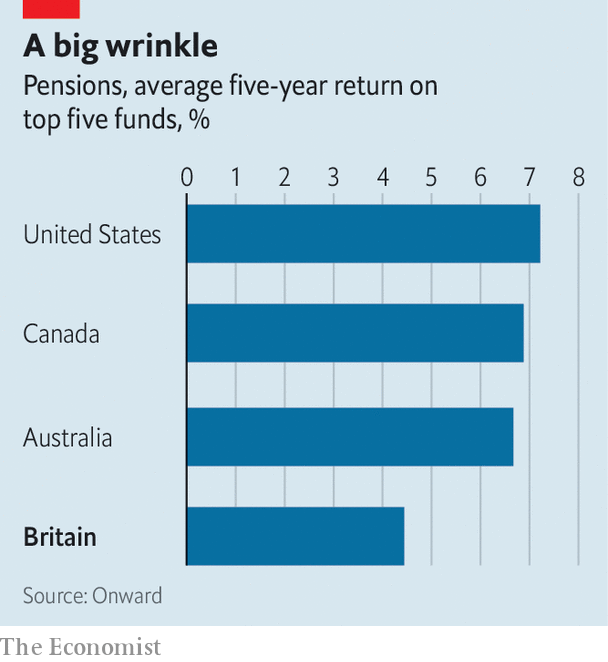

###### Old people and young firms

# The government tries to unlock growth capital for British firms 

##### A welcome push to get pension funds to invest in British startups 

 

> Nov 23rd 2023 

If tax cuts are manna to many Tories, pension reforms are duller fare. No surprise then that Jeremy Hunt’s announcement of a “comprehensive package” on pensions, which aims to boost growth capital for British firms and returns for savers, got fewer cheers from MPs than some other measures he announced in his autumn statement on November 22nd. Yet  in Britain have been allowed to fester too long. The chancellor’s interest in them is welcome. 

One issue preoccupying Mr Hunt is that startups in Britain struggle to access domestic growth capital. Retirement savings make up just 10% of Britain’s venture-capital pool, compared with 72% in America, according to Onward, a think-tank. British pension funds invest 15 times less in startups than their equivalents in Canada. Risk aversion among British fund managers stems partly from regulations dating back decades. Some eschew equities altogether. 

 


The second, related problem is that British savers get a bad deal compared with their counterparts in other countries (see chart). Many British pension funds are tiny; more than 25,000 defined-contribution schemes have fewer than 12 members. Schemes in America, Australia and Canada tend to be much bigger. This cottage industry persists partly thanks to weak regulations. A “large and highly interested ecosystem” of advisers and trustees also creates a bias against changing things, says William Wright of New Financial, a think-tank. As Mr Hunt notes, scale makes it easier to drive down costs for savers and diversify into growth equity, an asset class which charges higher fees but can lead to higher returns. 

The chancellor set out some initial pension-reform proposals in a speech in July. Nine large funds signed up to the “”, voluntarily committing to allocate 5% of their assets to unlisted equities. He has now fleshed out a plan. To accelerate consolidation, small funds will be forced to compare themselves with larger schemes and demonstrate whether they provide value for money. The Treasury will also consult on introducing a “lifetime pot”, meaning people will be able to move their pension between employers rather than building up multiple “small pots” as they switch jobs. 

Mr Hunt also wants to cajole funds into financing promising businesses. Several more large schemes have joined his compact. Local-government pension funds will be asked to allocate 10% of their assets to private equity. That alone could unlock around £30bn ($37bn) in new capital. The establishment of a “growth fund” within the British Business Bank, a development bank, will give pension funds another way to invest in young firms. 

How much of a difference will all this make? Nudging funds to invest a bit more in unlisted equities will not transform the investment environment in Britain overnight. Nor is it likely to turn around the country’s ailing stockmarket. But these various changes do . Rachel Reeves, the shadow chancellor, promises a similar package of reforms. Pensions may not bring MPs to their feet, but the fact they have snagged both main parties’ attention is a good thing. ■


