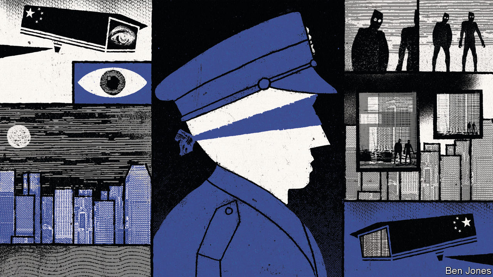
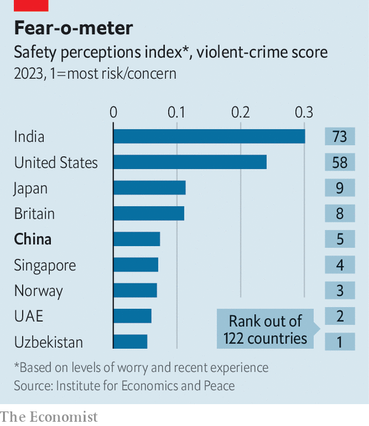

###### Fuzzy numbers, safer streets

# China says it has achieved a miraculously low-crime society 

##### The truth is more complicated 

 

> Nov 23rd 2023 

ON SEPTEMBER 22nd, in the north-eastern city of Yanji, a police officer discovered that his pistol had gone missing. Lucky for him, the Chinese police control the world’s largest network of surveillance cameras. Video footage showed that the gun had been stolen at a vegetable market. The thief’s movements were traced to a rural county some 500km away. Dozens of officers were sent to arrest him. Within 24 hours of the theft the gun was recovered, according to state media.

Such fearsome efficiency, say Chinese officials, has helped their country become one of the safest in the world. The recorded homicide rate per 100,000 people in China is about a tenth of the global average. Only 6,522 people were murdered in 2021, according to the state, down about 80% from two decades ago. During that same period, robberies fell by 97% and assaults by 40%.

 


There are good reasons to believe the government’s claims. In recent decades violent crime has declined in many countries. China is unlikely to be an exception. Civilians there cannot own guns. Even buying a knife can involve paperwork. Meanwhile, the public is watched by millions of surveillance cameras (see next story). Surveys suggest that the people of China feel safer from violent crime than those living elsewhere, including in most Western countries (see chart).

Yet analysts have long viewed China’s crime statistics with suspicion. The impressive data are cited by the Communist Party as justification for its rule. State media gleefully portray other countries, notably America, as dangerous and crime-ridden. So it is difficult to separate truth from propaganda. China’s numbers may loosely reflect reality, but they often seem too good to be true. And politics is clearly influencing the country’s approach to crime.

The situation surrounding homicide is indicative. In 2004 the ministry of public security, under the slogan “murder cases must be solved”, began pushing local authorities to quickly achieve at least an 85% success rate in such cases. The numbers suggest that the pressure worked. Within a year, over 40% of counties were claiming 100% success rates in solving new murders. Many cities, such as Beijing, now claim perfection year after year. 

Such results raise questions. A study in 2006, for example, showed that over 50% of recorded homicides in Beijing and Shenzhen, a city in southern China, were committed by someone who didn’t know the victim. That is fishy, says Børge Bakken, a specialist in Chinese criminology, because victims tend to be killed by family, friends or acquaintances. Wrongful convictions may be a problem. Suspected criminals who end up in court are found guilty 99% of the time. Police have also been accused of failing to register murder cases that are difficult to solve, so that they don’t show up in the official data. 

Many of the same issues pertain to less serious crimes. China’s police have neither the resources nor the incentives to deal with them. Officers are poorly paid, overworked and relatively few in number. (China has about 142 police per 100,000 people, by one estimate, compared with 251 in England and Wales.) Because they are assessed on what proportion of recorded crimes they solve, Chinese police often sweep tricky cases under the rug. A study published in 2021 by Liu Yuchen, a political scientist now at Peking University, found that officers regularly ignored street fights, petty burglaries and even robberies. They also tended to disregard crimes committed against migrant workers. 

In some cases economic pressure is the reason cases are overlooked. Mr Liu witnessed a fight between workers from two highway construction companies. Bricks were thrown, tools were swung. Five people had to go to hospital. The police saw it all, but the official in charge kept things out of the courts. He wanted construction to continue, because “all nearby counties have new highways now except us.”

Apart from simply ignoring them, there are several ways to keep cases off the books. Neighbourhood committees, which are run by the party, occasionally manage disputes. Their job is to snuff out trouble before it reaches higher levels of the bureaucracy. Sometimes victims are encouraged to informally seek compensation from perpetrators.

People who report domestic violence are usually directed to mediation bodies run by the All-China Women’s Federation, a state-backed organisation. That rarely leads to justice. The party is more interested in keeping families together for the sake of social stability. Abusers may get scolded, but formal punishment is uncommon. Judges are known to reject divorce requests even when violence is involved (divorced men are viewed by the state as potential troublemakers). The system discourages abuse victims from coming forward.

It is no secret that the state covers up crimes. In a case last year, a mother of eight was found chained to an outhouse in Jiangsu province. Video footage of the woman went viral. Local officials responded to the public’s outrage with a series of statements that amounted to “nothing to see here”. Eventually they were forced to admit that the mentally-ill victim had been sold into marriage and was unlawfully imprisoned. Three people, including the woman’s husband, were arrested. In a collection of speeches published in October, Xi Jinping, China’s leader, conceded that human trafficking is still a serious problem.

Another is fraud. This is one of the few areas where the official data are not so rosy. In the past two decades the number of fraud cases has spiked, such that over a third of the crimes committed in China now fall into that category. Online and telephone fraud are the most common. This type of activity can’t be detected by CCTV cameras. Some of it is carried out by Chinese nationals abroad, often in South-East Asia. In recent years the authorities have persuaded hundreds of thousands of suspects to return to China, according to state media. Police have threatened suspects’ families in order to convince them to co-operate with investigations.

Knowing what crimes are rising and falling would enable police to better combat them. But even the government seems to have only a fuzzy sense of what is happening. “I had thought that the police stations actually had accurate data that was different from the reported data,” says Suzanne Scoggins, a criminologist at Clark University in Massachusetts. She interviewed officers in cities across China. “Several of my best sources told me that simply wasn’t the case,” she says.

That fits with an unusually critical article published in 2019 by the Shandong Police College in eastern China. The author of the piece complained that the country’s crime statistics were “not detailed enough to reflect the true picture”. This made it difficult to run big data analyses that might help the police deploy resources better or come up with tactics and strategies.

For the party, it may be enough that the public feels safe. The crimes it cares most about are those of a political nature. People who criticise the government or accuse officials of malfeasance can be locked up for “picking quarrels and causing trouble”. That vague offence is also used to criminalise peaceful demonstrations. 

Such activity is never ignored. A year ago, when a group of young people gathered by a river in Beijing to protest against the government’s harsh “zero-covid” controls, hundreds of officers, including the chief of police, came out to shoo them away. The authorities then used surveillance tools to track down and punish some of those involved. It is a shame such effort and resources are not devoted to non-political crimes. ■


