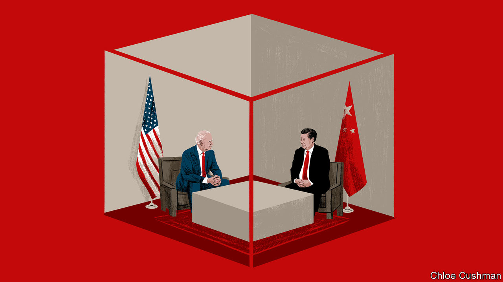

###### Chaguan

# Why Xi Jinping sounds friendlier to America 

##### A tactical move to boost China’s economic and diplomatic interests 

 

> Nov 23rd 2023 

When invited to sum up the state of China’s relations with America, a close observer in Beijing drops a surprising literary reference, comparing the countries to damned souls sent to Hell in “Huis Clos” (“No Exit”), a play by Jean-Paul Sartre. In the gloomy Frenchman’s masterwork, Hell turns out to be an antique-filled sitting room peopled by unlikeable strangers. These wretches come to realise that they must endure each other’s company, and mutual contempt, for all eternity. The afterlife needs no red-hot pokers to be a torment, gasps one of Sartre’s sinners: “Hell is—other people!” The reference to existential angst by the observer in Beijing is more than startling. It is meant to be encouraging. 

The case for optimism runs as follows. For two years Sino-American relations were dangerously dysfunctional. To protest, successively, against a visit to Taiwan by the then-speaker of the House of Representatives, Nancy Pelosi, and America’s shooting down of a Chinese spy balloon, China suspended high-level contacts for months. Both governments now accept that they are doomed to manage differences responsibly, as the world’s greatest economic and military powers, largest emitters of greenhouse gases and interdependent trading partners. That duty to co-exist is dictated by the judgment of history and by the expectations of other countries—even if leaders in Beijing and Washington have come to believe that their core value systems, and many of their most cherished ambitions, are incompatible.

Evidence to support optimism comes from a recent summit between the two countries’ presidents, Xi Jinping and Joe Biden, in an antique-filled mansion near San Francisco. At that meeting Mr Xi notably softened his tone towards America. The party chief has spent years declaring that the East is rising and the West is declining. In March of this year, Mr Xi told a meeting in Beijing that “Western countries led by the United States have contained and suppressed us in an all-round way.” In California he came close to conceding, for the first time, that China is engaged in an economic, technological and geopolitical contest with America, and has an obligation to agree on a set of rules and guardrails that might prevent that competition from veering into disaster. An official Chinese readout talks of the two powers “co-operating in areas of shared interest, and responsibly managing competitive aspects of the relationship”. That may seem arcane, but it is quite a concession. After all, Chinese envoys have spent the past few years declaring it illegitimate and intolerable for America to cast bilateral relations as a competition.

That grumbling has long reflected a bleak view of great-power competition. Rather than some sort of gentlemanly sparring, Chinese officials portray America’s intentions as closer to a gladiatorial fight to the death. Behind closed doors, they talk of their country’s right to hit back as it is being choked. They note that in the contest for ideological and geopolitical influence, America has strengthened alliances and partnerships with countries in China’s neighbourhood, from Japan and South Korea to the Philippines and Australia. In the eyes of Chinese officials, Mr Biden is stoking cold-war-style divisions.

But it has been a while since state media have bragged about the rising East and declining West. Mr Xi presides over a slowing economy and foreign direct investment flows were negative in the most recent quarter. In that context, Mr Xi has incentives to stabilise ties with rich countries, starting with America. That explains confidence-building moves in California, including China’s resumption of military-to-military communication and its restarting of law-enforcement co-operation to curb the export of chemicals used to make fentanyl, a synthetic opioid that kills so many Americans. As recently as September, China’s foreign ministry blamed those drug deaths on American “incompetence”.

Leading Chinese scholars think this is an uncertain kind of stability. America continues to tighten export controls on semiconductors and other technologies, to sail warships and fly military aircraft close to Chinese territory, and to generally treat China as “its primary competitor”, says Wu Xinbo of Fudan University. If China has shifted its foreign-policy posture to improve relations with America, the explanation lies in its financial and diplomatic interests, says Professor Wu. Warmer ties “send positive signals to the markets, which is good for the economy,” he says. Such diplomacy also reassures neighbouring countries important to China, such as Japan or Australia.

Imagining a future with Trump

Da Wei of Tsinghua University sees an evolution in his country’s thinking. China was “angry and disappointed” when it realised that the Biden administration was bent on maintaining Donald Trump’s get-tough policies. But Chinese officials came to accept that America was not going to change its fundamental strategy. This sense of realism has led to an “interesting new equilibrium”, observes Professor Da, even if China cannot formally accept America’s framework of a strategic competition with guardrails. “The two sides’ understanding of bilateral relations is much closer than it was two years ago,” he says.

Next year’s presidential election in America may test that stability. For those Chinese who see a national interest in constructive bilateral relations, “a Trump victory would be a disaster”, says Professor Da. Others believe Trump-induced chaos would help China prevail in the contest of political systems. Still, great turmoil in America would be disruptive for China: a lose-lose situation. “That kind of victory is not meaningful,” argues Professor Da.

With luck, Americans are equally focused on the risks of turmoil in China. The two countries are in competition, and it is high time that Chinese leaders admitted it. But each is too large to wish the other away. Theirs remains the most important bilateral relationship in the world. From that fate, there is no exit. ■


 (Nov 9th)


