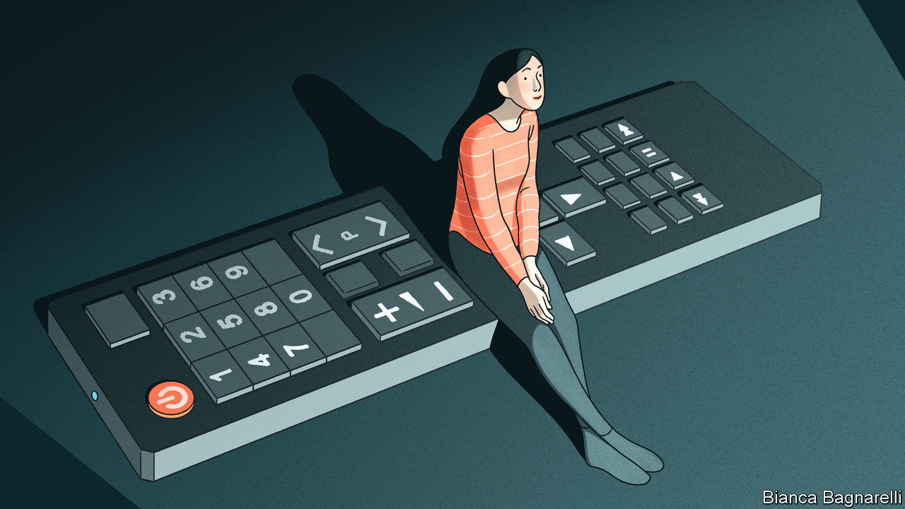

###### Watch the box

# The Economist’s pick of the best television shows of 2023 

##### Exceptional comedies, crime dramas, and psychological thrillers have come to the small screen this year 

 

> Nov 17th 2023 


The fourth and final season is the darkest and most gripping. Barry Berkman, a hitman, reinvented himself as an actor; now he has lost his cover and his freedom. The show—created by and starring Bill Hader, a comedian—interrogates Hollywood’s love of anti-heroes and offers a satisfying ending.


In the second season, the run-down sandwich shop that Carmy Berzatto (Jeremy Allen White) inherited following his brother’s death has been torn down and reimagined as an haute-cuisine restaurant. Yet “The Bear” feels true to its beginnings, just as Carmy seeks to retain the team behind the original eatery.


Amy Lau (Ali Wong), a woman with lots of money, a perfect home, a stay-at-home husband and an angelic daughter, blows up her life. In this dark and transfixing comedy-drama, a road-rage incident brings her into the orbit of Danny Cho (Steven Yeun), a second-rate contractor. Mutually assured destruction ensues. 


This charming Australian comedy arrived on American and British screens in 2023. It follows Ashley and Gordon, strangers who are brought together by an injured dog. It is written by and starring Harriet Dyer and Patrick Brammall, who are married in real life. The dialogue is superb.


Back for its sixth and final season, “The Crown” turns the spotlight on . Viewers already know the dismal ending to the romance between Princess Diana (Elizabeth Debicki) and Dodi Fayed (Khalid Abdalla), but the drama is tightly drawn and mesmerising on screen.


A gender-swapped  of 1988. By turns funny and unsettling, the mini-series revolves around twin sisters and gynaecologists, Elliot and Beverly Mantle (both played by Rachel Weisz), as they open their own birthing centre and conduct ethically dubious research. 


Kate Wyler (Keri Russell) becomes America’s ambassador to Britain shortly after a hostile power has blown up a British warship in the Persian Gulf. Witty, tense, glossily melodramatic and full of terrific performances, this show is remarkably bingeable. It is the sort of show Netflix was made for.


Of all the TV spin-offs and sequels of recent years, “Fargo”—based on the black-comedy film of 1996—has been the most surprising. The fifth season, which stars Jon Hamm and Juno Temple, once again enthralls viewers with unique crime capers set in America’s Midwest. 


A dramatisation of the Brink’s-Mat gold-bullion heist in London in 1983. (The haul was worth £26m, about $100m today.) In Neil Forsyth’s hands this becomes a panoramic tale of class, social mobility and police corruption. Hugh Bonneville, Dominic Cooper and Jack Lowden give excellent performances. 


Set in 2010, this show tells the stories of women who dared to , the mafia of Calabria. It has none of the insidious glamour that clings to the “Godfather” movies—and to many productions made since. This is noir that is uncompromisingly dark.


Catherine Cawood (Sarah Lancashire), a police sergeant, has long been haunted by the crimes of Tommy Lee Royce (James Norton), a rapist who attacked her daughter. Set in a Yorkshire town, this blistering drama tackles themes of injustice, poverty and organised crime.


Adapted from a , this show finished its debut season as HBO’s biggest hit since “Game of Thrones”. It tells a compelling story of survival in a pandemic-stricken world. Its high point was a love story in the third episode.


A casino waitress has an uncanny ability to tell when someone is fibbing. When the gangsters who run the casino turn on her, Charlie (Natasha Lyonne) flees and takes her lie-detector skills on the road. Another rollicking murder mystery from Rian Johnson, the writer and director of the “Knives Out” films.


Jesse Armstrong, the creator, gives the Roy family . In the final season the back-stabbing and blackmailing reach new heights; funerals and weddings alike are opportunities for vituperation. The series reaches a conclusion that somehow exceeds expectations. 


This show examines thorny questions of politics and morality in Taiwan. Witty and propulsive, it tells a hopeful story of one person standing up for another—and has  in the country to speak out about sexual harassment. ■


