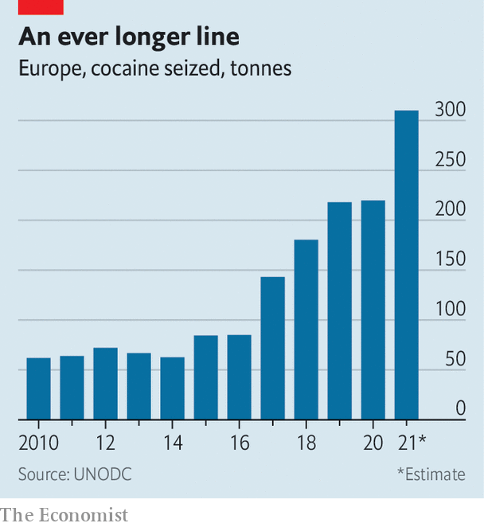

###### Blow up

# Brazil’s biggest drug gang has gone global 

##### The First Capital Command is now a mafia with links throughout Europe 

 

> Nov 23rd 2023 

Football matches are tense affairs in Brazil. That is doubly true when they take place in prisons. In August 1993 a game in a São Paulo jail ended in horrific fashion. Eight inmates attacked their opponents, killing at least two. Covered in blood, they proclaimed the birth of a new gang: the First Capital Command (PCC). Thirty years later the PCC is Latin America’s biggest gang, with estimates suggesting it has 40,000 lifetime members and another 60,000 “contractors”. That would make it one of the world’s largest crime groups. And on November 6th a leaked report by Portugal’s security services claimed the group has 1,000 associates in Lisbon, the capital. The PCC is going global. 

The gang’s network of allies began in South America. A decade ago the PCC formed an association with some of the world’s biggest cocaine-traffickers. Based in the Bolivian city of Santa Cruz, this “super gang” is dedicated to joint ventures in drugs and money-laundering. Local media thought it sounded like Mercosur, the regional trading bloc. They named it “Narcosur”. The PCC has separate relationships with Venezuela’s Tren de Aragua, a human-trafficking group, too.

 


But in recent years, the PCC has concentrated on building ties with Europe. In 2021 a record 303 tonnes of blow were seized in the European Union (see chart). The farther it is shipped, the bigger the margins. Previously the PCC bought coke wholesale in Bolivia for $1,500 per kilogram, got it onto a ship in a Brazilian port, and sold it on for $8,000 per kilogram. By setting up a base in Europe, members can sell that kilogram for over $30,000. 

Members of the PCC are thought to be present in half a dozen European countries, including Britain. The gang runs over 50% of Brazil’s drug exports to the continent, says Lincoln Gakiya, an organised-crime prosecutor from São Paulo. It mostly works with Italy’s ‘Ndrangheta, Europe’s biggest mafia. The two syndicates have partnered for years. ‘Ndrangheta brokers are regularly arrested in Brazil, where they make hefty deals. In May an investigation by Europol, the EU’s police agency, revealed that the ‘Ndrangheta was shipping the PCC guns from Pakistan. It collaborates with Albanian and Serbian drug gangs, too.

Another area the gang is expanding in is west Africa, a major transit zone for the white stuff. The PCC has become a central player pumping drugs through the region, according to a recent report by the Global Initiative against Transnational Organised Crime, a Swiss-based think-tank. It is also probably behind a reverse route, where Moroccan cannabis is smuggled to Brazil. 

According to Christian Azevedo, of Brazil’s federal police, in Nigeria PCC gangsters brazenly walk the streets of Lagos and Abuja. “They even control neighbourhoods there, the same way they do in São Paulo,” he says, citing intelligence from his Nigerian counterparts. The Nigerian connection has helped the gang push into southern Africa, too. South Africa is a key point for sending coke to emerging markets in India and China.

Criminal clout is not merely about powerful friends or geographic range. Territorial and social control are important as well. The PCC is no slouch there. “They exert a type of control that no other group has ever exerted, except Colombia’s FARC at their apex,” says Steven Dudley of InSight Crime, an investigative outlet. The gang is a parallel state in Brazil’s , governing the lives of tens of millions. In the 2000s it even ordered a reduction in urban violence, converting São Paulo from one of Brazil’s most dangerous cities to one of its safest. Even so, if its interests are threatened the group will employ extreme violence, notes Mr Gakiya. In 2019 he ordered the transfer of 22 PCC leaders to maximum-security jails. As a result, the gang put him on a kill list. He now lives under police protection. When being interviewed, he warned that the call might drop out: his armoured doors interrupt the signal. 

The final stage of a transition into a global mafia is the penetration of politics and the legal economy. The PCC is starting to do that, thinks Mr Gakiya. The attorney-general’s office in the state of São Paulo has investigated mayors and councillors. It found PCC involvement in everything from rubbish disposal and public transport to construction projects and hotels. ■

