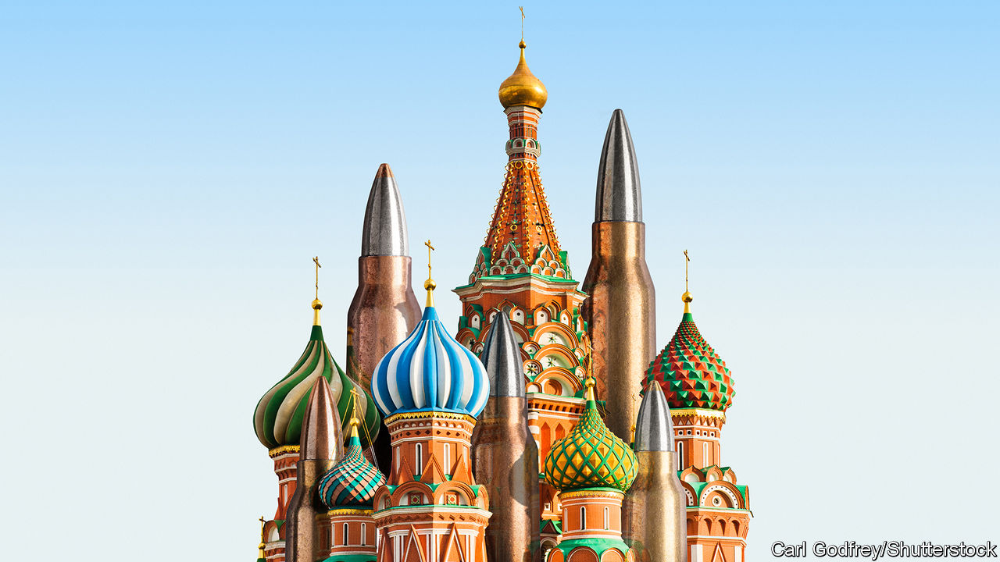
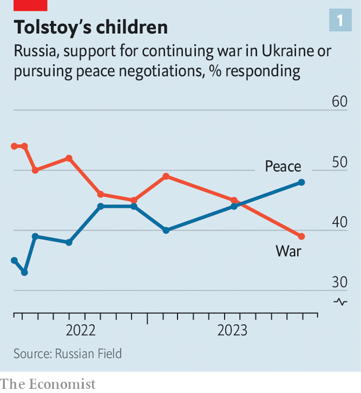
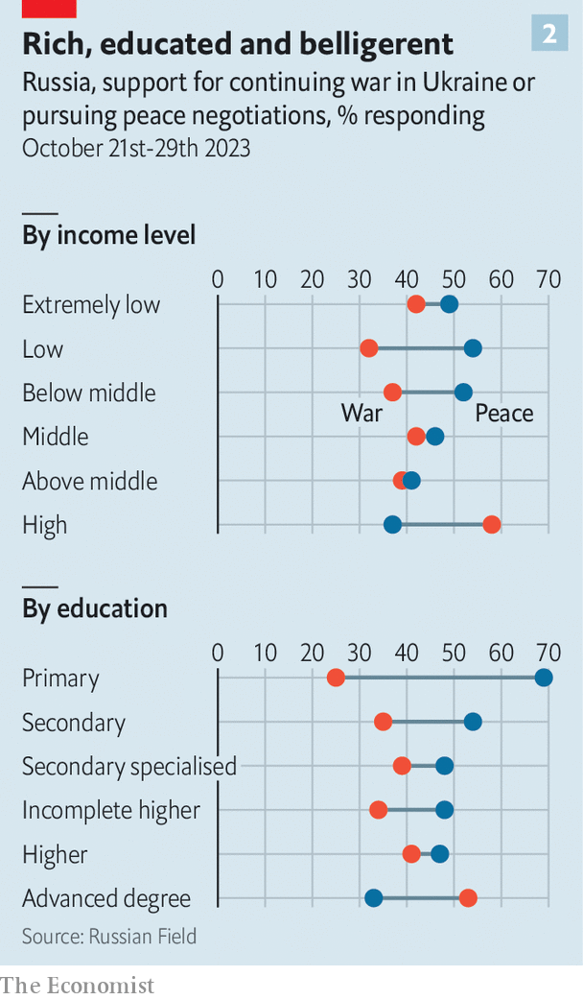

###### For the fatherland

# How Putin is reshaping Russia to keep his war-machine running 

##### He is creating a class of wealthy bureaucrats, who are the war’s biggest supporters 

 

> Nov 30th 2023 

WAR AND sanctions notwithstanding, in early November, the renovated Soviet-era “Exhibition of Achievements of the National Economy” re-opened in Moscow. The original, inaugurated in 1939 just weeks before Germany and Russia invaded Poland, papered over the famine and terror of the preceding years. Instead, displays extolled the wonders of Soviet science and the virtues of collectivisation; a special ice-cream hall doled out treats to the masses and a 25-metre statue of Stalin gazed down munificently. Millions died in the dictator’s “great break” with the past, and Russia’s economy and society were completely reshaped, but it was all depicted as unadulterated progress.


It is a similar story with today’s refurbishment, where a futuristic screen-lined tunnel regales visitors with the glories of the past 20 years, under the leadership of Vladimir Putin. A pavilion celebrating Russia’s regions features Donetsk, Kherson, Luhansk and Zaporizhia, four provinces the Russian army is currently attempting to seize from Ukraine. The only hint of the continuing bloodshed is a flower composed of bits of shrapnel. The initiation of the biggest war in Europe since 1945, the re-imposition of a police state within Russia and the categorical reversal of the reforming and Westernising trends of the early post-Soviet period are nowhere to be seen.

It is an especially far cry from the shock and confusion of the early days of the war, when the rouble plunged, hundreds of thousands fled the country and protests rocked Russia’s cities. Mr Putin has since succeeded in stabilising the economy, thanks to the high price of oil, and in squelching dissent, thanks to fierce repression. That has allowed him to retain the allegiance of the elite, who in turn are helping the country adapt. The new equilibrium is unstable, however, with the economy and military recruitment, in particular, threatening further upheaval.

Unsheepish sheep

On the face of things, most Russians have meekly accepted the war in Ukraine, which will soon be two years old. Two-thirds tell Russian Field, a pollster, that the country is moving in the right direction and over half say the war in Ukraine is going well. “I knew that society is totally conformist, but I still didn’t expect that incredible measure of psychological adaptation. People have just shut themselves off and tried to live their usual old lives,” Nalalya Zubarevich, an academic, said in a recent interview. 

Open protest is rare, for obvious reasons. On November 16th Alexandra Skochilenko, an artist and activist, was jailed for seven years for replacing price tags in a St Petersburg supermarket with anti-war messages. (“My great-grandfather did not fight in WW2 so that Russia could become a fascist state and attack Ukraine,” read one.) It is not just peaceniks who are persecuted: at least one ultra-nationalist dissenter, Igor Girkin, a retired soldier and blogger, has been jailed for complaining that Mr Putin is not fighting forcefully enough. 

 


But just because the majority of Russians have accepted the war does not mean that they are enthusiastic about it. A hastily concocted propaganda film about dastardly Ukrainian “fascists”, which cost $2m to make, was a spectacular flop, collecting just $150,000 at the box office. Despite their professed support for the war, the respondents to Russian Field’s polls are firmly against a further round of mobilisation, even if Mr Putin himself calls for it. In October, for the first time during the war, a majority of respondents expressed support for peace talks over continued fighting (see chart 1). Fully 74% say they would be happy for Mr Putin to sign a peace deal right away.

 


Perhaps unsurprisingly, the younger people are, and the more they get their news from social media rather than state-run television, the more sceptical about the war they are. More strikingly, however, the richer and more educated people are, the more supportive they are (see chart 2). As an anonymous Russian academic explains in a recent article in , an online publication, there is a big class of bureaucrats and businessmen who have attained their status through patronage and who will uphold the regime to protect it. “They number millions and they have fitted into the moral economy of military aggression,” the academic writes.

In part, such people are kept in line by fear, like everyone else. In the first months of the war a spate of mysterious deaths of businessmen and managers at state-owned firms helped to instil fealty. The chairman of the board of Lukoil, Russia’s biggest private oil firm, fell to his death from a hospital window in Moscow a few months after the board issued a statement calling for a ceasefire. Western sanctions against oligarchs have helped keep the monied class on board, too.

Look away

But civil servants and businessmen also have long experience of suppressing scruples and working the system. Many have transitioned smoothly from the Soviet bureaucracy. “They are driven not by ideology, but by loyalty to their corporation, be it the central bank or finance ministry,” says Mikhail Komin, who has been surveying Russian technocrats. They see the task of keeping the ship of state afloat as a professional challenge, not a moral quandary.

Maksut Shadaev, the 44-year-old minister for digital transformation, is a good example. He worked at private IT firms in the 1990s, before joining the government to help build a sleek, user-friendly web portal and mobile app that allows citizens to access such public services as making a doctor’s appointment and enrolling children in school. He is now using those same skills to build a system dubbed the “digital gulag”—a comprehensive register to help track men eligible for the draft.

By the same token, Russian businesses have helped stabilise the economy not out of any affection for the state, but because they excel at coping with big, unexpected and often arbitrary shifts in their circumstances. Andrei Yakovlev of Harvard University, who has conducted a survey of Russian entrepreneurs, says that having lived through several financial crises and done constant battle with predatory bureaucrats, they put a premium on preparing for the worst. The disappearance of Western imports and the closure of Western firms, meanwhile, has opened new niches for Russian companies. At the same time, the capital controls imposed by the central bank have left them with few options but to invest in Russia. The government has offered loans and even ordered bureaucrats not to harass them. 

It helps, of course, that vast quantities of petrodollars have been sloshing around the economy. In the first year of the war Russia earned $590bn in export revenues—most of it from oil and gas. According to calculations by Re: Russia, a network of experts, that is $160bn more than the annual average over the prior decade. In the second year, revenues should still be some $60bn above the average. Re: Russia believes that the war costs at least $100bn a year—so the extra income from oil covers most of the expense of waging it.

The government’s budget increased by 26% last year and will rise by another 16% next year. Defence spending will almost double next year, to 6% of GDP—the highest it has been since the collapse of the Soviet Union. It now accounts for a third of all government expenditure. Spending on health and education, meanwhile, is falling in real terms. As Anton Siluanov, the finance minister, recently declared, “The main emphasis is on ensuring our victory. The army, defence capability, armed forces, fighters—everything needed for the front, everything needed for victory is in the budget.”

Such lavish outlays will not be sustainable indefinitely. The central bank is struggling to restrain rising inflation, which reached 12% year on year in the third quarter of this year. It has raised interest rates to 15%. The authorities, meanwhile, are forcing exporters to convert their revenues to roubles to stave off further devaluation, which would exacerbate inflation. Some 43% of Russians expect their economic situation to worsen in the next year or two, while only 21% expect it to improve, according to Russian Field.

For the moment, however, there is a bonanza, especially in certain parts of the economy and certain segments of Russian society. “Unlike oil, guns drive industrial growth,” argue Alexandra Prokopenko and Pavel Luzin at the Carnegie Russia Eurasia Centre, a think-tank. Construction, consumption and services are growing in regions close to the war zone or with lots of munitions factories. In the far east there is heavy investment in infrastructure to expand trade with Asia, since ties to Europe have withered. 

Moscow and St Petersburg do not benefit much from the new order, but depressed industrial regions—Mr Putin’s heartland—are living better than they have for years. In Izhevsk, a poor city close to the Ural mountains which produces guns, missiles and equipment for electronic warfare, the average salary has gone up by 25% since the start of the war. An organic supermarket, VkusVill, and a pan-Asian restaurant, Royal Rolls, recently opened. In Rostov-on-Don, the headquarters of the military district encompassing the front, catering businesses are seeing a 77% increase in turnover. “A lot of men with good appetites have arrived there,” says Ms Zubarevich. 

Russia’s vast and poor hinterland has also benefited from the cash the authorities are dangling in order to secure more recruits to the army. Those who volunteer are paid around 195,000 roubles a month, four times the newly increased average salary in Izhevsk, and a one-off bonus on enlistment of 195,000 roubles. The families of those killed in battle receive generous payments, too. Vladislav Inozemtsev, a Russian economist at the Polish Institute of Advanced Studies in Warsaw, estimates that the family of a soldier who gets killed after five months’ service would receive about 15m roubles in total, including pay and compensation. It would take an average Russian man 30 years to earn as much. Life expectancy for a Russian man is only 65. Mr Putin’s regime is trying to turn getting killed into an economically rational choice, argues Mr Inozemtsev.

Nonetheless, Russia appears to have a manpower problem. The forced mobilisation announced a year ago—the first since the second world war—caused panic and anger. Enlistment commissions were set ablaze and hundreds of thousands of young men fled the country or hid within Russia. Those who were called up then remain at the front, despite promises that they would serve for only six months. That has spawned a protest movement led by their wives and mothers called  (Fucked off by the war). “We don’t give birth for our children to be killed,” complains an agitated mother in a video that has circulated widely on social media.

The police are searching energetically not only for draft-dodgers, but also for migrants from Central Asia, whom they seem to be press-ganging into military service. They recently raided warehouses belonging to Wildberries, Russia’s largest online retailer, bringing its service to a halt. There are often raids on student dormitories, too.

Meanwhile the Duma, Russia’s parliament, is preparing for more rounds of mobilisation. The maximum age subject to conscription has been raised from 27 to 30 years. The time former servicemen remain reservists has been extended by five years, to 60 in the case of junior officers. The law has been changed to require employers to turn in their staff for military service. As Andrei Kartopolov, chairman of the Duma’s defence committee, explained, “This law was written for a big war, for a general mobilisation. And you can already smell that big war in the air.”

But a shortage of manpower is not the army’s only problem. Aleksandr Golts, author of “Military Reform and Militarism in Russia”, argues that it is also short of junior officers, training capacity and equipment. The higher military spending is, in all likelihood, wildly inefficient. Russia’s arms industry is notoriously corrupt: kickbacks are estimated by some to double the cost of procurement. It is also starved of skilled labour. Yuri Borisov, the deputy prime minister, says it needs another 400,000 engineers, IT specialists and managers.

 


There is talk of increasing state control over the economy, to abet the war effort. Denis Manturov, the deputy prime minister who oversees military procurement, has said that state planning may have to be reintroduced in the defence industry. “We are talking about economic security in war conditions…Let’s go down the path of nationalisation of the main sectors of our economy,” Alexander Bastrykin, the head of the anti-corruption agency and a university classmate of Mr Putin’s, said recently. Eighteen big companies have been nationalised in 2023, many of them in the name of restoring looted property to the state. The prosecutor-general has reported to Mr Putin that the courts have heard 24,000 cases involving the loss of state property. 

State-owned firms are playing an ever bigger and more varied part in Russian life. Gazprom, Russia’s state-owned gas monopoly, for example, owns several media outlets. It has also manned, equipped and funded several military brigades. Rosneft, the state-owned oil giant, builds ships and oversees a research project on the Eurasian variants of the human genome. 

The bureaucrats who oversee these sprawling empires are often businessmen in their own right, with overlapping interests. Mr Manturov, for instance, sits on the board of Rostec, a state-owned defence conglomerate. The chairman of Rostec is Sergei Chemezov, a former KGB agent who served with Mr Putin in East Germany. Mr Chemevoz’s and Mr Manturov’s families jointly own ports, hotels, luxury properties and a vineyard, among other investments.

An increasingly common pattern is for the children of Mr Putin’s friends and associates to take prominent roles in industry and government. Dmitry Patrushev, the minister of agriculture, is the son of Nikolai Patrushev, the secretary of the national security council. Ekaterina Tikhonova, Mr Putin’s own daughter, chairs a business lobby group’s committee on import substitution. VKontakte, Russia’s biggest social-media platform, is partly owned by various state-owned companies and jointly run by the son of Mr Putin’s deputy chief-of-staff and by the great nephew of a rich businessman who is said to be one of Mr Putin’s closest confidants and an advocate of the invasion of Ukraine.

Russia’s decision to ban Facebook and Instagram at the start of the war boosted VKontakte’s users by 4m in just a few weeks. It now has a penetration rate of 75%, is assumed to be closely monitored by the security services and is instrumental in spreading pro-war messages. “This is Putin’s dream and an ideal model: everything in one place, run by the children under the supervision of the KGB,” says Kirill Rogov, the founder of Re: Russia.

Hero of a crime

To justify his reconstruction of the Russian economy and to explain away his lack of military successes, Mr Putin is reframing the war as one not with Ukraine, but with the West, in which Ukraine is simply “a battering ram” used to pummel Russia. New history textbooks explain to pupils that Russia has always been and will always be in a state of war with the West. This narrative allows Mr Putin to depict everyday activities as a triumph. “Enabling Russian companies to successfully tap the market is a victory…Building cutting-edge factories and kilometres of new roads is a victory…Scientific discoveries and new technologies—these are also victories,” he boasted in a speech on the anniversary of the invasion.

Such talk hints at the contradiction at the heart of Mr Putin’s approach to the war. He wants both to mobilise ever more manpower and money for the fight and at the same time to secure Russians’ acquiescence by disrupting their lives as little as possible. As ever more power and resources are redistributed within Russia, this contradiction will become even more glaring. His regime’s wobbliest moment yet came in June, when bickering between the army and Wagner, a mercenary group led by Yevgeny Prigozhin, a close friend of Mr Putin, escalated into outright mutiny. Although Mr Prigozhin quickly backed down and later died in a convenient plane crash, it was a reminder that it is not easy to balance the competing interests within Russia’s elite. As economic dislocation increases and resources get more scarce, those conflicts will only grow. ■


