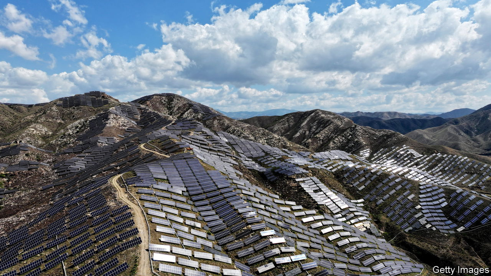
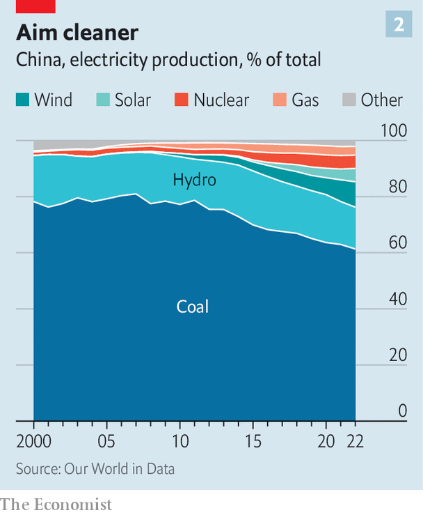
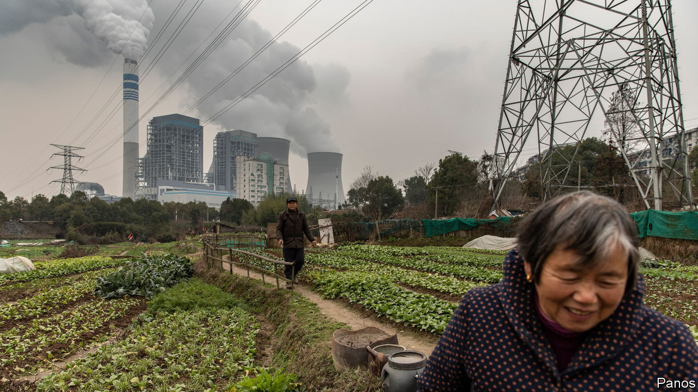

###### The big climate question

# Will China save the planet or destroy it? 

##### The country’s carbon emissions will soon peak. Then comes the hard part 

 

> Nov 27th 2023 

HOUGH HE LAY dying of brain cancer, Tu Changwang had one last thing to say. The respected Chinese meteorologist had noticed that the climate was warming. So in 1961 he warned in the , a Communist Party mouthpiece, that this might alter the conditions that sustain life. Yet he saw the warming as part of a cycle in solar activity that would probably go into reverse at some point. Tu did not suspect that the burning of fossil fuels was pumping carbon dioxide into the atmosphere and causing the climate to change. In that issue of the , a few pages before his paper, there was a photo of grinning coalminers. China was rushing to industrialise with the aim of catching up economically with the West.

 


Today China is an industrial powerhouse, home to over a quarter of the world’s manufacturing—more than America and Germany combined. But its progress has come at a cost in terms of emissions. Over the past three decades China has released more carbon dioxide into the atmosphere, in total, than any other country (see chart 1). It now emits over a quarter of the world’s greenhouse gases each year, according to Rhodium Group, an American research firm. That is about twice as much as America, which comes second (though on a per-person basis America is still worse).

Much, then, depends on China if the world is to keep global warming since the Industrial Revolution well below 2°C, as governments pledged at the UN’s annual climate summit in Paris in 2015. This year’s summit (called COP28) began on November 30th in Dubai. China has both good and bad news for those attending.

 


On the positive side, China’s emissions will soon stop rising. Some analysts think they will top out this year. There is little doubt that the peak will come before 2030, which is the goal China has set for itself. It is building  faster than any other country. It has also invested heavily in renewable energy (see chart 2), such that it now has around 750 gigawatts of wind and solar generating capacity, about a third of the world’s total. By the end of the decade the government aims to have 1,200GW of such capacity, more than the total power capacity of the European Union at the moment. China will probably well exceed that target.

But it is not just China’s embrace of renewable energy that is helping it curb emissions. Its production of carbon-intensive steel and cement has been dropping. After decades of building roads and railways, the government is splurging less on big infrastructure projects. A long expansion of the property sector has ended in a meltdown that has shaken the economy—but led to fewer emissions. Going forward, few analysts expect China’s GDP to grow as fast as it did at the end of the last century and the beginning of this one. Put another way, China’s dirtiest phase of development is probably behind it.

More important than the peak, though, is what happens next. China has pledged to eliminate net emissions of greenhouse gases (or to become “carbon neutral”) by 2060. This will be a much harder target to hit. Even after that massive injection of renewables, dirty coal still supplies well over half of China’s energy. That is down from around 70% in 2011, but the amount of coal China burns continues to increase, as demand for electricity rises. Last year China mined a record 4.5bn tonnes of the black rock and approved around two new coal-fired power plants for construction every week on average.

Many of these may never be built. Declining utilisation rates of existing coal plants undermine the case for further construction. But China is not moving away from coal as fast as environmentalists would like or analysts say is necessary to meet its 2060 target. Part of the problem is that the country has a lot of it. With little oil or gas, coal provides China a secure source of energy. Digging it up creates jobs. Building a coal plant, whether it is needed or not, is also a common way for local governments to boost economic growth.

China’s power grid was built with coal in mind. At plants that burn the stuff, humans decide when to ramp things up or down. But when it comes to solar and wind power, nature is the boss. So the grid needs to be made more flexible. When there is a surplus of energy in one spot, it must be able to store it or move it elsewhere. Otherwise China will not be able to accommodate lots of new wind turbines and solar panels in the future.

Gridlock

Most countries need to make similar changes to their grids. The challenge facing China, though, is unique, says David Fishman of the Lantau Group, an energy consultancy. The bulk of the country’s solar and wind resources are located in the west. But the power they generate is needed mostly in the east, where the country’s biggest cities are to be found. Transferring it over such long distances is tricky. Another problem is that provincial governments have a lot of say over how their portion of the grid operates. They don’t like depending on each other for energy. So, for example, a province might prefer to use its own coal plant rather than a cleaner energy source located elsewhere.

 


Those who are concerned about China’s progress also worry about , a powerful greenhouse gas. Some countries can cut their methane emissions in simple ways, such as by repairing leaky gas pipes. But most of the methane coming from China wafts out of coal mines or is produced by microbes in rice paddies. Fixing the problem is hard without closing mines or changing farming practices. So at the UN climate summit in 2021, China refused to join more than 100 other countries, including America, which pledged to reduce global methane emissions by at least 30% by 2030. Earlier this month, though, China did say that it would address the issue in its national climate plan for 2035 (which may not be published for another two years). 

In the face of these challenges, China’s leaders must be bold. But their climate ambitions may have already peaked, says Li Shuo, the incoming director of the China Climate Hub at the Asia Society Policy Institute in New York. He believes power cuts caused by surging coal prices and droughts, which disrupt hydropower, have spooked the government in recent years. Now officials worry that climate-friendly policies will undermine the country’s energy security (green types argue that some reforms, such as making the grid more flexible, would have the opposite effect). Mr Li expects China’s emissions to plateau rather than decline. 

China, though, has good reason to prioritise the climate. Some of its biggest cities, including Shanghai, lie on the coast and could be swallowed by rising seas. The arid north lacks drinking water. And extreme weather is already taking a toll. Last year deaths associated with heatwaves in China increased by 342% compared with the historical average, according to a study published by the , a medical journal. This summer floods damaged much of China’s wheat crop.

Meanwhile, China has become a leader in green-energy technology. The rest of the world depends largely on Chinese solar-panel and battery supply chains. This year China overtook Japan to become the world’s largest car exporter, thanks in part to Chinese dominance in electric vehicles.

Summits and peaks

So there is some hope that China will play a productive role at the climate summit in Dubai. With ambitions to lead the global south, it will not want to look as if it is neglecting an issue that is foremost on the mind of many officials in developing countries. Optimists also point to the meeting between Xie Zhenhua, China’s climate envoy, and John Kerry, his American counterpart, in November. They agreed on some small steps, such as collaborating on carbon-capture projects. 

Yet China has also made clear that it will not bow to pressure on climate change. Earlier this year Xi Jinping, its leader, reiterated his aim of reaching a carbon peak by 2030 and achieving carbon neutrality by 2060. “But the path, method, pace and intensity to achieve this goal should and must be determined by ourselves, and will never be influenced by others,” he said. ■


