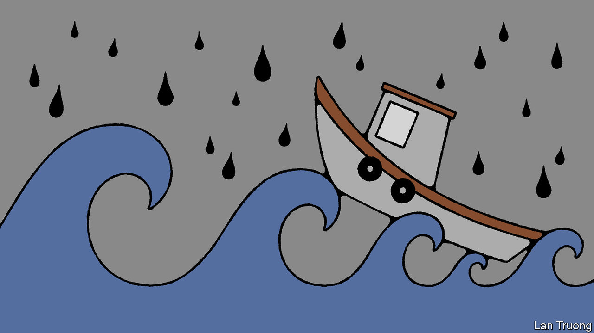

###### Banyan

# Rohingya refugees return to the sea 

##### Western donors should do a lot more for one of the world’s most miserable communities 

 

> Dec 7th 2023 

IN RECENT WEEKS wooden boats from Bangladesh have been turning up off Aceh, the Indonesian province on the tip of Sumatra, 1,000 nautical miles (1,852km) away. They are packed with Rohingya refugees, previously resident in the Kutupalong camp complex in south-eastern Bangladesh. A Muslim people from Rakhine state in Myanmar, the Rohingyas have long been persecuted by that country’s Buddhist elite. In 2017 about 750,000 fled into Bangladesh, carrying genocidal tales of arson, rape and murder. Today Kutupalong is the world’s biggest refugee camp, with nearly 1m residents. Yet having fled from Myanmar, many are now attempting to flee from Kutupalong—a measure of desperation in the face of dwindling food rations and mounting gang violence there. 

The exodus of 2017 won global sympathy. At a UN-backed aid conference that year donors pledged $344m for Rohingya refugees. But attention has long since moved on, and the aid is drying up. This year the World Food Programme (WFP) has cut rations for each Kutupalong inhabitant from a value of $12 a month to $10, then $8, citing a funding gap of $56m. Even before the cuts, two-fifths of camp children showed signs of stunted growth; now malnutrition is rising fast.

There are many kinds of problem at the camp. Its bamboo-and-canvas huts were designed as a short-term fix. Now some of its neighbourhoods have turned into slums. They are unhygienic and vulnerable to flooding. Two-fifths of camp residents have scabies.

Worse, a social crisis is brewing as security in Kutupalong is breaking down. Prostitution and child marriage are on the rise in the camp. Rival armed gangs terrorise the population with rapes and kidnappings. They have murdered dozens this year and target community leaders especially—at least 16 were killed in the first half of the year. Bangladesh’s Armed Police Battalion, in charge of security, are part of the problem, often extorting pay-offs from those seeking justice as well as from the gangs.

Last month Abdur Rahman, a 36-year-old with a wife and four children, had had enough: life in the camp was “hell”, he concluded. He scraped together $3,000 from relatives for a broker promising a boat to Aceh. On November 21st he and his family sneaked down to the shore to meet 300 others, mostly unmarried women looking to Indonesia or Malaysia for a future. But the next day an armed gang led by a rival broker seized them as they were boarding and demanded ransoms. On this occasion, the police rescued them. Back in the camp, Mr Rahman fears the brokers will seek revenge.

Whatever the risks, Mr Rahman still reckons taking to the waves in a leaky craft is better than staying put. More than 3,700 Rohingyas from Kutupalong are believed to have crossed the Andaman Sea this year, with 400 now thought to be adrift. Since early November, at least eight large and crammed boats have attempted the journey. Acehnese who once welcomed their fellow Muslims now force them back out to sea. The refugees will probably try to land elsewhere along the coast, or in Malaysia, across the Malacca Strait. But with every failed attempt, their options shrink. At least 225 are thought to have drowned this year, twice as many as in the same period in 2022. Many more are unaccounted for.

The crisis spreading across the Andaman Sea is just one example of how neglecting the Rohingyas’ plight carries broader costs. Bangladesh’s government is storing up trouble by forbidding Kutupalong’s residents from working outside the camps and by banning schools within them. The idea is to stop the refugees putting down roots. But blighted prospects for young Rohingyas play recruiting sergeant for violent gangs.

It is also a huge waste of human potential. For it is absurd to pretend that the Rohingyas will be able to return to their homes in Myanmar soon, if ever. Though the junta that seized power there three years ago insists that repatriations should begin, it will not promise the Rohingyas the statehood they crave. Meanwhile, Myanmar’s civil wars make return even less appealing. 

Rich countries should strive to persuade Bangladesh to allow the Rohingyas education and work. They should also be much more generous themselves in resettling Rohingyas—Australia has accepted only a few hundred, Europe fewer than 3,000. And they should urgently make up the WFP shortfall. It is tiny compared to their aid budgets, yet a major problem for one of the world’s most persecuted communities.■


