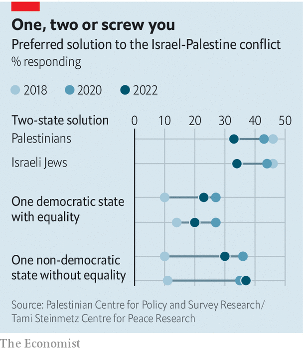
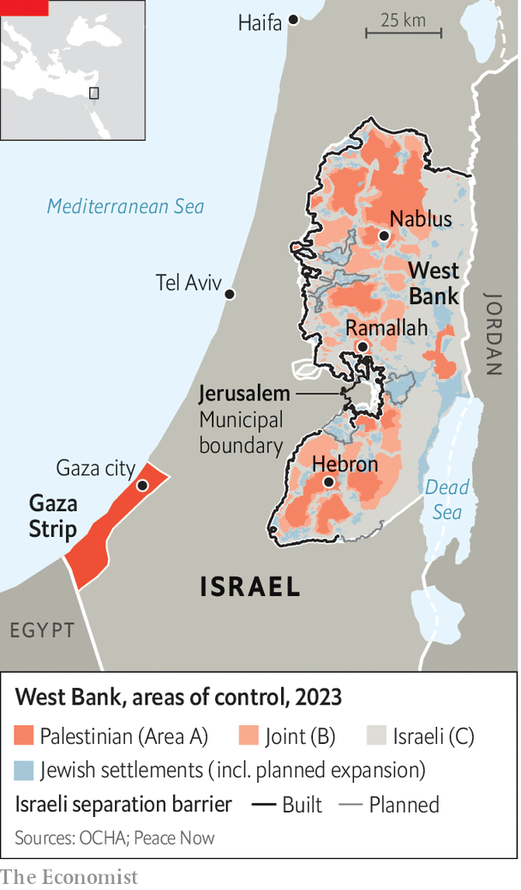
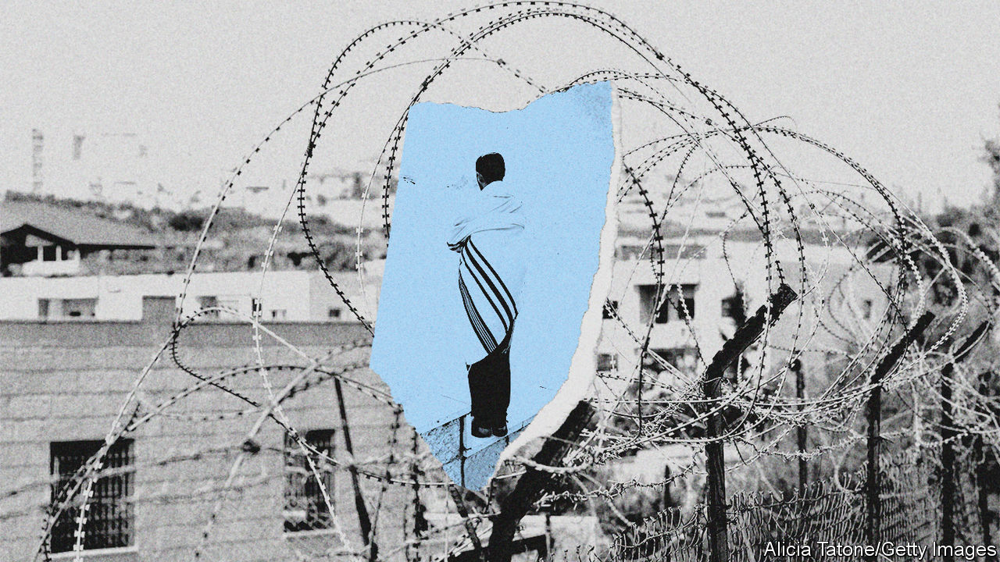

###### Solution or delusion?

# Despite the war in Gaza, talk of a two-state solution persists 

##### For there to be any hope, both Israelis and Palestinians need new leaders 

 

> Dec 7th 2023 

BRUTAL and distressing, for sure, but perhaps the war between Israel and Hamas could also be an opportunity. That was how America’s president saw it, at least. Though he backed Israel’s right to defend itself, he argued that the fighting should be a wake-up call for Israelis and Palestinians alike. “The moment is ripe for both sides to realise that the path that they are on is one that is not going to result in prosperity and security for their people,” he said in a televised interview.


The president, in this case, was a newly inaugurated Barack Obama almost 15 years ago. But it could just as well be Joe Biden today. History has a way of repeating itself in the Middle East. War in Gaza has once again led to talk of peace, which may seem far-fetched, given the massacre of more than 1,200 Israelis on October 7th and the subsequent killing of some 16,000 Palestinians during the Israeli assault on Gaza. The Holy Land has not seen this much bloodshed since Israel was founded in 1948. Peace has never seemed so far away.

Mr Biden hopes it will emerge nonetheless. “When this crisis is over, there has to be a vision of what comes next, and in our view it has to be a two-state solution,” he said in October. At a conference in Bahrain in November, one Arab official after another offered a similar message. “We need to go back to a two-state solution, to an Israeli and Palestinian state living side by side,” said Anwar Gargash, an adviser to the president of the United Arab Emirates (UAE).

Some see such talk as a fig leaf, intended to dispel misgivings about Western support for Israel and Arab inaction amid a horrifying war. After all, the 30-year peace process between Israelis and Palestinians is littered with failures. A revival of negotiations would be doomed from the start without, at the very least, three essential changes. First is new leadership. The political parties on either side of the current war in Gaza are the same ones that laboured to spoil the nascent peace process 30 years ago; they must go. Next is an effort to make the negotiations credible: both sides are ever more doubtful about the other’s sincerity. Last, both sides need incentives to make a deal. Palestinians need to feel that their state is viable, and Israelis need to feel that theirs will be secure.

The two-state solution has been around, in one form or another, for almost a century. The United Nations adopted a partition plan for Palestine in 1947 that would have created two states, one Arab and one Jewish, with international control of Jerusalem. Arab states rejected it, Israel declared independence, and its neighbours promptly invaded.

After decades of conflict, Israelis and Palestinians began talks at a peace conference in Madrid in 1991. Then came the Oslo accords in 1993, which set a five-year deadline to create a Palestinian state and in the meantime established the Palestinian Authority (PA), a government of sorts, albeit with limited powers and jurisdiction over only part of the occupied territories. A string of failures followed: the summits at Camp David and Taba, the Bush administration’s “road map for peace”, Mr Obama’s diplomacy. The last direct talks collapsed in 2014 and were never resuscitated.

Unattainable yet indestructible

All along, the outline of a two-state solution changed little. There would be a Palestinian state in Gaza and the West Bank—around 22% of the area of historic Palestine—with its capital in east Jerusalem. Israel would keep some settlements in the West Bank, in exchange for territorial swaps, and evacuate others. A token number of refugees would be allowed to return to Israel and a greater number to Palestine.

 


The idea was once popular, but many have lost faith. Even before October 7th, only a third or so of Palestinians and Israeli Jews supported a two-state solution, down from almost half just five years ago (see chart). “Every failed process has a price tag,” says Nimrod Novik, who was a foreign-policy adviser to Shimon Peres, an Israeli politician. “It reinforces the erroneous conclusion that it cannot be done.” Since October 7th support for peace negotiations of any kind has plunged in Israel.

Despite the disillusionment, there is no clear alternative. Polls show both Israelis and Palestinians divided about how to end the conflict. Some hope for a “one-state solution” that would see them live in a single country with equal rights. Others support apartheid or ethnic cleansing (they disagree, of course, on who the victims of such an approach should be). 

These are all non-starters. The events of October 7th blew up the status quo. Expulsion or discrimination are abhorrent. A one-state solution might sound reasonable, but it is practically unworkable: most Israelis and Palestinians reject the idea.

That leaves two states. The hitch is that this solution requires big sacrifices from both sides. Israelis would have to give up land, while Palestinians would have to give up on much of the land they have lost since 1948. Leaders on both sides would need to sell these concessions to a sceptical public. But neither side has such leaders.

Israel has Binyamin Netanyahu, who has spent his entire career trying to prevent the emergence of a Palestinian state. In a sop to Mr Obama, he did endorse a two-state solution in a speech in 2009 at Bar-Ilan University—though six years later he declared that the Middle East had changed and his speech was “irrelevant”. His Likud party has adopted resolutions opposing Palestinian statehood. Kan, Israel’s public broadcaster, reported in November that Mr Netanyahu met backbenchers from Likud to plead for his political survival. “I am the only one who can prevent a Palestinian state in Gaza and Judea and Samaria after the war,” he said, using the Hebrew name for the West Bank.

But Mr Netanyahu’s days are numbered. Most Israelis want him gone—fully 76% according to a poll published in November. Surveys suggest that, if an election were held, his Likud party would lose around half of the 32 seats it now holds in the 120-member Knesset.

The frontrunner to succeed Mr Netanyahu is Benny Gantz, a former army chief who reluctantly joined Mr Netanyahu’s war cabinet in October. His centre-right National Unity party has opened a wide lead in the polls. He is becoming a rarity in Israel’s fractious politics: a unifying figure.

Some of this is down to his vague position on the two-state solution. He has said little about it in public. His party’s official position is a woolly call for “separation from the Palestinians”, without any detail on how this might be achieved. Sources close to Mr Gantz say he has no interest in being more specific. To do so, they say, would play into the hands of Mr Netanyahu. Palestinian statehood is a wedge issue, and therefore Mr Gantz will try to avoid it in the interest of wooing voters away from the prime minister. 

“In Benny’s conversations with the Americans he says that we should stop using old words for new situations,” says an aide. In other words, he is open to discussing a form of the two-state solution but is wary of using the discredited term. In surveys carried out by his party, most Israelis are in favour of a two-state solution when it is described in other terms, such as “two separate entities”.

If Mr Gantz were to pursue some variation on the two-state solution, he would face political obstacles. His party includes hawkish lawmakers who would oppose such a push. “Gantz has some very, very right-wing people in there,” says Dan Ben-David of the Shoresh Institute, an Israeli think-tank. The same goes for some of his prospective coalition partners—and the Israeli public, which has swung to the right over the past few decades.

Palestinian politics look even more forbidding. A peace process is unthinkable with Hamas, which has spent three decades playing spoiler. It started a campaign of suicide-bombings to sabotage the Oslo accords, and then soured a generation of Israelis on the idea of peace with continued attacks during the Palestinians’ second , or uprising.

Mahmoud Abbas, the Palestinian president, supports a two-state solution, as does his nationalist Fatah party. But he is 88 years old and will soon start the 20th year of what should have been a four-year term. Few Palestinians (or Israelis, for that matter) think he has the legitimacy or acumen to lead a serious push for peace. “He’s in a delusional bubble, surrounded by three or four very powerful yes-men,” says an Israeli officer, an assessment shared by many of Mr Abbas’s former associates.

The White House has mused about Salam Fayyad, a technocratic ex-prime minister and former IMF official, coming back to his old job. Even Arab officials now say in private that they want a change in Palestinian leadership. The Saudis are pushing for Hussein al-Sheikh, Mr Abbas’s right-hand man, to succeed the president. The UAE hopes to see a role for Muhammad Dahlan, a former Fatah security chief who has spent the past decade in exile in Abu Dhabi. They would all be acceptable to Israel—but perhaps not to Palestinians. Polls put their popularity in the single digits.

Plausible but unavailable

Another option is Marwan Barghouti, a Fatah leader serving five life sentences in Israel for orchestrating attacks on Israeli civilians. (He refused to present a defence, denouncing the trial as illegitimate.) Some hope he could become a Palestinian Nelson Mandela, emerging from prison to unite a fractured movement and negotiate with Israel. He often polls as the most popular Palestinian leader—but that is mostly because he has spent decades out of the public eye, at a time when Fatah descended into corruption and senescence. Even if Israel allowed him out, it is unclear how capable a leader he would be.

American and Arab officials have pushed for Palestinian elections. At least in the West Bank, though, that could lead to victory for whatever remains of Hamas, seen by Palestinians as the only party willing to stand up to Israel. For Fatah to regain popularity, it would need to do two things. One is to curb its members’ rampant graft (asked to name the most pressing problem for the PA to tackle, more Palestinians mention corruption than occupation). The other is to show that a non-violent approach can yield results. “They have to make Hamas ineffective,” says Khalil Sayegh, a Palestinian academic from Gaza. “People have to see that Hamas is not really doing anything good.”

That requires concessions from Israel, which points to a second question: how to make negotiations credible. After decades of failure, both Israelis and Palestinians would be sceptical. For Israelis, though, those decades were nonetheless good ones: they coincided with an economic boom, a long stretch of relative peace and burgeoning relations with Arab states. For Palestinians, they brought only deepening despair. “The whole project of an independent Palestinian state is becoming part of the past,” says Ghassan Khatib, a former Palestinian minister. The onus would be on Israel to dispel that perception.

 


Mr Novik is part of Commanders for Israel’s Security, a group of retired security officials who advocate a two-state solution. He offers a “menu” of steps Israel could take to show renewed commitment. It could shrink Area C, the two-thirds of the West Bank under full Israeli control, and expand Area B, where the PA has authority over civil matters, but not security. (Area A, where the PA has full control, is even smaller: see map.) It could stop demolishing unlicensed homes in Area C, where it refuses to grant Palestinians construction permits (it usually issues ten or fewer each year). It could curtail army raids in Palestinian cities.

For Palestinians, though, these steps would be woefully insufficient. A slightly expanded Area B would hardly be a resounding achievement that Fatah could sell to a dubious public. “We’ve waited 30 years for a state,” says a diplomat. “We don’t want some construction permits.” The Oslo accords, after all, were undone by gradualism: the idea that both sides needed to build trust with symbolic moves before agreeing on more substantive steps.

Asked what would constitute a more serious gesture, several Palestinian analysts point to the settlements in the occupied West Bank, home to around 465,000 Israelis. It would not be enough to freeze new construction, they say; that has been tried before, including under Mr Obama. Israel should go further and dismantle some of the settlements it would have to relinquish in a peace deal. That would both build confidence and advance a final-status agreement. It also seems politically impossible in Israel, especially after October 7th, since it would be seen as rewarding a massacre.

After decades of foot-dragging, Israel is unlikely to make any big gestures without pressure from America. “Unless the Israeli system actually feels there’s a cost for going in this direction, I don’t see how you free up some space for different politics,” says Daniel Levy, a former Israeli negotiator. An Arab diplomat suggests this pressure, too, should initially be aimed at settlers: “America needs to get rough.”

On December 6th America announced that it would impose visa bans on violent settlers who attack Palestinians and their property. That is an unprecedented step—but it, too, is symbolic. Settlers motivated by ideology are unlikely to be dissuaded by a visa ban. Anyway, some of them cannot be banned: they are American citizens.

For an American squeeze on settlements to succeed, it would need to encompass the Israeli state, too. International law obliges the Israeli army to protect Palestinians in occupied territory, but it often stands by as settlers carry out attacks. If it continues to allow (and sometimes abet) such violence, America could threaten to cut military aid. That would be a clear signal, to the Palestinians and the Arab world, that America was serious about trying to play a less biased role. But such a threat is hard to imagine in an election year—or if Donald Trump wins the presidency in 2024. If Mr Biden secures a second term, though, such a move would be popular with the progressive wing of his party.

Along with threats, America and its partners would also have to offer incentives. For the Palestinians, these would probably be mainly financial. The most immediate question is how to rebuild a shattered Gaza, the bill for which will easily run into tens of billions of dollars. Wealthy Gulf states would be willing to contribute—but only if Gaza becomes part of a Palestinian state and their investments are unlikely to be blown up again.

 


At the same time, the Gulf states could help assuage Israel’s security concerns. When the Oslo process began, only one Arab state, Egypt, had diplomatic ties with Israel. Today six of them do, and Saudi Arabia appears willing to join the club. The prospect of normal relations with the Arab world seems real in a way it never did in decades past. Ending conflict not only with the Palestinians but also with the entire region should be a powerful inducement.

At a meeting in Qatar earlier this month, the Gulf states talked about a plan for post-war Gaza. They resolved to work with Jordan, Egypt and Western powers to form an international coalition to push for a two-state solution. Arab states would demand that the PA choose new leaders, while America would press Israel.

But even if the Gulf states recognise Israel, Iranian-backed militant groups that have weighed in on Hamas’s side, such as Hizbullah in Lebanon or the Houthis in Yemen, would not do the same. “We would have to get Iran on board,” says a diplomat from the Gulf. Asked if that was realistic, he demurred. Hostility toward Israel has been a core tenet of the Islamic Republic’s ideology for decades. The creation of a rump Palestinian state may not turn them into Zionists overnight.

Familiar but uncertain

The risk, then, is that history repeats itself again. A new crop of leaders might pay lip service to a two-state solution. Israel might soften its hostility toward the PA and offer a few concessions. Gulf states would pledge money and recognition. But the deal on offer would be, fundamentally, the same as before—a deal that a far more optimistic generation of Israelis and Palestinians rejected.

In recent years intellectuals on both sides have begun calling for more creative thinking. One idea is of a confederation in which there would be both a Jewish and a Palestinian entity. Citizens of one part would be entitled to live and work in the other. The idea is to diminish the importance of exactly how such a small parcel of land is carved up and to give each side greater interest in the stability of the other.

There are even more obstacles to this idea than to the standard two-state blueprint, but there is a virtue in novel concepts. “Israel benefits from the unseriousness of an international approach which simply says, go back to two-state negotiations,” says Mr Levy. Those negotiations too often become an end rather than a means, even though by now there is little left to negotiate: it has all been discussed ad infinitum. The events of the past few months show the status quo is untenable. Change is inevitable. The only question is what form it will take. ■

