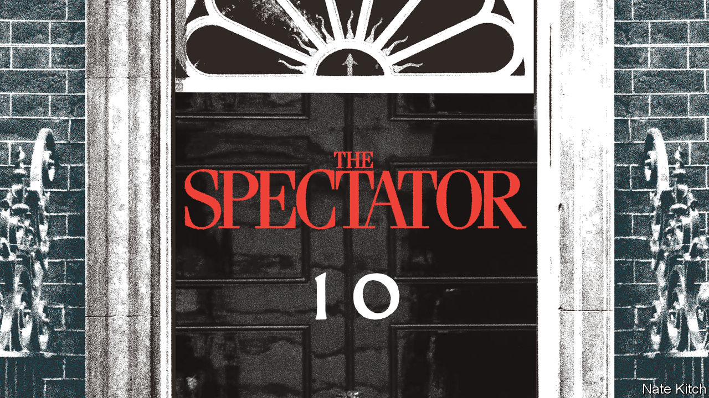

###### Bagehot

# Inside the Spectocracy 

##### A good way to run a magazine is a bad way to run a country 

 

> Dec 7th 2023 

A readers’ lunch at the, the world’s oldest weekly magazine, is not for the faint of heart or light of wallet. It starts with an aperitif of Lanson Le Black Reserve (a reasonable £55 per bottle). Next comes a magnum of Laurent Perrier Grand Siécle Grande Cuvée No. 23 (a less reasonable £400). Round it off with a Graillot &amp; Perez Encinas Bierzo (a mere £26). Those with the means to drop £150 can enjoy a boozy meal in the’s boardroom, surrounded by the 195-year-old back catalogue of the magazine that counts a few chancellors, many cabinet ministers and a Conservative  among its alumni. 

People are willing to pay a premium for a slice of Tory life. A recent struggle over the ownership of the and its stablemates, the and , proved just that. Lloyds, a bank, put the outlets into receivership after a long-running row with the Barclay brothers, hotel magnates and Channel Island overlords who bought the titles in 2004, over a £1.2bn debt. 

A consortium led by Jeff Zucker, a former CNN editor, and backed by Gulf royalty, paid off the whole Barclay debt, with a view to taking control via a debt-for-equity swap. Conservative mps, usually cheerleaders of foreign investment, were appalled that a foreign power was putting up the cash. Now the Conservative government has put the deal on hold. 

Their interest is understandable. The past, present and future of the Conservative Party runs through the. More specifically, it runs through the editor’s office. At one end sits the desk of Nigel Lawson, who went on to become Margaret Thatcher’s most influential chancellor. In front of the window, looking onto St James’s Park, stands a chaise longue on which Boris Johnson once enjoyed a post-lunch “erotic reverie”. 

On the wall, a cartoon shows Dominic Cummings, Mr Johnson’s former chief adviser, looming over the ex-prime minister. Even he worked briefly at the magazine. Unfortunately, he left abruptly after he published a controversial cartoon of Prophet Muhammad. Happily, Mr Cummings’s wife, Mary Wakefield, is still there as an editor. 

The Spectocracy is not only a quirk of history, but a quirk of the present. Its former political editor, James Forsyth, now sits in Downing Street as Rishi Sunak’s political secretary, having left the magazine in late 2022. The duo have known each other since school. Given the polls, Mr Sunak and Mr Forsyth may not stay in Downing Street long. But the Spectocracy will survive them. Kemi Badenoch, a former digital director at the magazine and now the business secretary, is among the favourites to take over if Mr Sunak quits politics. 

For the, its influence is incidental. “We’re a cocktail party, not a political party,” in the words of one former editor. It is proudly irresponsible, mixing Westminster coverage with giggling reactionaryism. For much of its history it was famed as much for its drinking as its journalism. Kingsley Amis, a contributor, once described the main problem with the office as “Not getting arseholed whenever I go there.” The magazine still keeps two bottles of Pol Roger in the fridge at any one time. Mr Johnson built his career boasting about drinking too much and falling asleep in the office. If it was a sinister plot to place its alumni in power, it was a risky one. 

Instead, the  resembles another deeply English cultural institution. In the 1980s comedy, “Withnail and I”, two out-of-work, booze-soaked English actors find themselves trapped in a falling-down cottage in Penrith. Wet, hungry, they flag down a neighbour to moan: “We’ve gone on holiday by mistake.” Take the magazine at its word and a similar affliction haunts the: it ended up running a country by mistake.

Links between the Conservative Party and the Tory-supporting press are well-scrutinised. Tim Bale, a historian of the Conservative Party, came up with the idea of “party in the media”: his term for the columnists and reporters who see the world through Tory spectacles, and who view the party’s wants and needs as inseparable from those of the nation. It is true enough for the the  and the , who are usually supine.

When it comes to the and the Conservatives, Mr Bale’s formulation is reversed: the media is in the party. Results vary when a journalistic mindset is applied to government. Good polemics make poor policy. Mr Johnson first floated the idea of an eu referendum in 2003. Likewise, bold plans of Tory ministers, such as repeated plans to unleash house-building, usually end up as little more than op-eds on gov.uk rather than law. 

Eclecticism is positive in a magazine, but not so in a politician. The swings between liberalism and Conservatism, by turns thoughtful and thuggish. Similar behaviour dogs the government. In the past six months, Mr Sunak has been the technocrat, keen to patch things up with the eu; the protector of White Van Man, scourge of environmentalism and Brussels basher; and a fiscal conservative who pushed through big tax cuts, based on make-believe spending forecasts. Even the ’s reticence about its relations with the Conservatives feels familiar. The magazine has an anti-establishment streak, while clearly part of it. The government, equally, behaves like an opposition in office, railing against decisions it made itself. 

We want the finest wines available to humanity

While the personnel and the politics of the and the Conservative Party overlap, their fortunes do not. The party is heading for oblivion; the is in fine health. Circulation is at an all-time high, while the Conservatives—coddled by an uncritical media—are set for their worst performance since at least 1997, unless something dramatic happens. Opposition is a happy state for a magazine, if not a political party. Particularly with plenty of champagne in supply. ■


