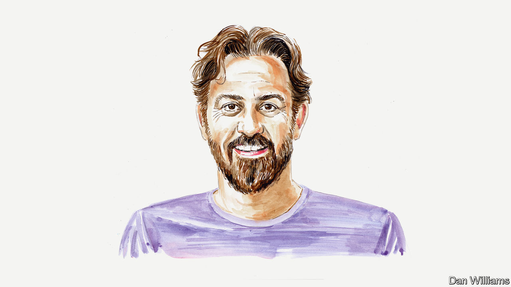

###### Internet safety

# End-to-end encryption protects everyone, says the head of WhatsApp 

##### Will Cathcart warns that “client-side scanning” could mark the end of private communication online 

 

> Dec 6th 2023 

END-TO-END ENCRYPTION is the process of scrambling messages, images and calls so they can only be seen or listened to by the intended recipient. WhatsApp played an important role in democratising access to it and many others have since followed, including Facebook Messenger and Instagram Direct Messages, which are in the process of expanding their use of end-to-end encryption.

First invented before the computer age, this technology is now relied upon by billions of people to keep their communications, and themselves, safe. End-to-end encryption protects journalists and their sources, conversations between doctors and patients, and everyone’s personal exchanges from the ever-growing online threats posed by hackers, spyware companies, imposter apps, malware and hostile foreign governments. Although it still cannot guard against every possible threat, end-to-end encryption is the best defence we have.

Democracies should recognise the benefits of greater security and push companies to expand encryption services. Instead, the European Union is yet to decide whether encryption should be preserved or broken. Over the past year officials in some democracies, including Britain, have claimed to support encryption while also advancing arguments that it must include ways to scan everyone’s messages or trace their origin. These arguments are wrong and dangerous, and the stakes have never been higher.

Central to the debate in Europe is a technology called “client-side scanning”. This would involve companies scanning all messages for illegal content before they are sent and reporting those that raise red flags to the authorities. Proponents claim the scanning could be done on the phone itself without human intervention, through algorithms, as if that makes it less dangerous. Their plan is not technically possible. Even if it was, it would amount to surveillance on a scale never seen before.

A physical analogy makes this clear. If WhatsApp is like your virtual living room, where you talk to friends and loved ones, then mandating client-side scanning is the equivalent of proposing that all housebuilders install microphones and video cameras to forever monitor for illicit behaviour, with an algorithm deciding which citizens to report to the police. No democracy would allow this, much less make it a requirement.

Fourteen of the world’s leading voices in computer science and security, including cryptographers whose breakthroughs helped create the modern internet, have sounded the alarm. In a paper released in 2021 they wrote that client-side scanning “neither guarantees efficacious crime prevention nor prevents surveillance. Indeed, the effect is the opposite.”

After a years-long debate in Britain over this technology, government experts finally conceded that it is incapable of scanning encrypted messages for signs of illegal material without compromising users’ privacy. Independent human-rights experts agree. A UN Human Rights Council report warns that imposing client-side scanning would raise “a host of serious problems with potentially dire consequences” for human rights.

Requiring client-side scanning would certainly be the end of private communication online. What might start in Europe would not end there. Once the ability to scan all private messages is built and deployed it would be available as an unprecedented tool for mass surveillance and repression. Authoritarian regimes would love the cover from liberal democracies to use the same technology to track political dissent and muzzle vulnerable communities.

Protecting private communication is urgent now and essential for our future. We need leaders to see through the erroneous argument that encryption means a choice between privacy and safety. WhatsApp provides a safe means of communication, guaranteed by end-to-end encryption, but we still take action against the worst abuse. We blur incoming images from phone numbers that users don’t know. We enable people to make reports directly to us from any chat. And we use the limited information we know about WhatsApp groups to ban accounts suspected of sharing material that exploits children.

These efforts add up. Public data from America’s National Centre for Missing and Exploited Children shows that globally WhatsApp made over 1m reports in 2022—more than Apple, Snapchat, TikTok and X (formerly Twitter) combined. The information we act upon, from user reports to information like group name and profile photos, helps keep people safe without WhatsApp reading personal messages. And it is exactly this type of information that is most important for online investigations. Europol reported recently that of the 11 types of information relevant to a digital investigation, “content” ranked just seventh; the most important was “connection logs”, which indicate date, time and IP address. These cannot be obfuscated because they are required for messages to reach their destination. They’re the online-messaging equivalent of addresses on letters.

If we work from a common understanding of technology and values, there are reasonable debates that governments, companies and individuals can and should have. But policymakers should take urgent steps to make sure law enforcement receives the right training to interpret metadata and other technical information that is available through valid legal processes. Governments should ban commercial spyware that works around established privacy laws (America is already considering such a move).

There’s much that companies, civil society and governments can do together to advance child safety. But what democracies must not do is weaken the security billions of people rely on for their most sensitive conversations. Removing our ability to have a private conversation online would send us down a dark path. Accepting that there must be limits on surveillance and focusing instead on greater online safety and privacy is the right choice now and for the future.■


