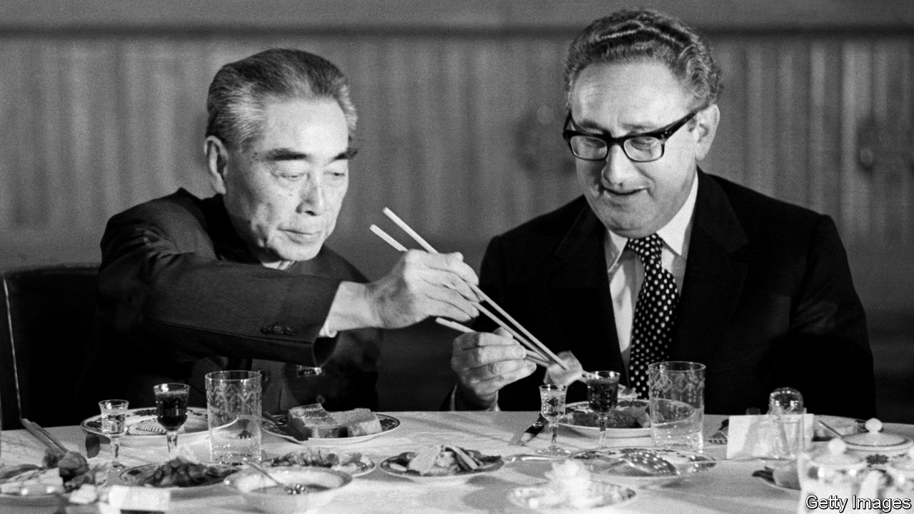

###### Goodbye to an old friend

# Henry Kissinger, a statesman beyond reproach, in China at least 

##### Why there is little talk of war crimes among the Chinese 

 

> Dec 7th 2023 

IN MUCH OF the world the  on November 29th elicited pained debate. Was the former American diplomat a towering statesman—or a war criminal? Much ink has been spilt making the case either way. But in China, there is no argument. 

A day after Mr Kissinger’s death the country’s official news agency, Xinhua, said he was “best known in China and all over the world for the wisdom of diplomacy to seek common ground while reserving differences”. Neither Xinhua nor any other state-media outlet made much of his peccadilloes, much less his alleged war crimes.

China’s supreme leader, Xi Jinping, sent his condolences to President Joe Biden, calling Mr Kissinger “a world-renowned strategist“. Prominent Chinese scholars praised Mr Kissinger for his use of “realism to the extreme in a virtuous and rational way” and his ability “to transcend differences in his dealings with other countries without strong political and ideological biases”. 

On Weibo, a popular social-media platform, discussion of Mr Kissinger’s death drew over 700m views. There was little mention of his ruthlessness, but much admiration for his interest in China. Mr Kissinger made dozens of trips to the country, including one in July, not long after turning 100. On that visit he spent hours in meetings with Mr Xi. He also met other Chinese officials who, at the time, were refusing to see top members of the Biden administration.

Mr Kissinger has been revered in China since the early 1970s when, as national security adviser to Richard Nixon, he orchestrated the president’s historic trip to the country. The preparations took place in secret. Feigning illness while on an official visit to Pakistan, Mr Kissinger stole away to Beijing for secret meetings with Zhou Enlai, then China’s prime minister (pictured together). This daring statecraft laid the groundwork for the normalisation of Sino-American relations years later.

Nixon is also admired in China, where the Watergate scandal is seen as a footnote to his story. Mr Kissinger’s legacy gets similar treatment. In other countries, not least America, he has been accused of setting the stage for a coup in Chile, blessing genocidal campaigns by Pakistan and Indonesia, and mercilessly expanding the war in Vietnam to Cambodia and Laos. But few Chinese are aware of this criticism, let alone the vitriol hurled at Mr Kissinger by people such as the late Christopher Hitchens, a British journalist who once called him “a reeking piece of ordure”.

There is something ironic, and telling, about China’s love of Mr Kissinger. His foreign policy was defined by efforts to contain America’s rival at the time, the Soviet Union. He treated smaller countries like pawns. China often criticises America for such actions, accusing it of “cold-war thinking”. But Mr Kissinger’s tactics were part of a broader strategy that aimed to balance the powers—and which held that big countries mattered most. In his pragmatic view of things, principles often took a back seat to national interests. That is a type of thinking China understands well. 

Mr Kissinger had his own interests in China. After leaving government in 1977 he founded a lucrative consulting firm that often opened doors for Western executives in the country. He remained engaged in Sino-American affairs until the end. His influence in Washington had waned, but when Mr Xi came for a summit with Mr Biden in November, Chinese diplomats wanted Mr Kissinger to play a role. But he was too frail. 

The visit to China in July would be Mr Kissinger’s last. Perhaps sensing that this was the final act in the diplomat’s long relationship with his country, Mr Xi told him: “We’ll never forget our old friend.”■


