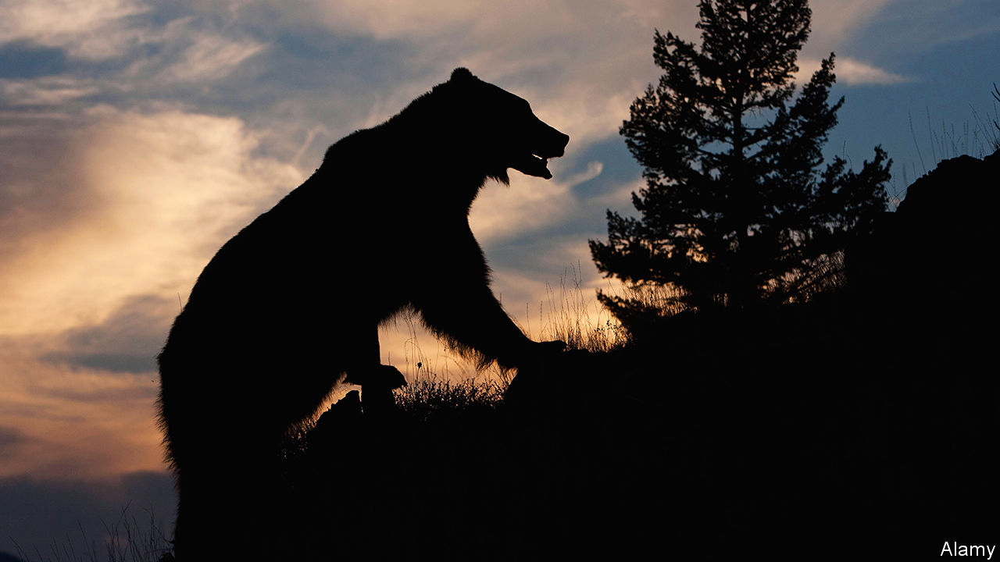
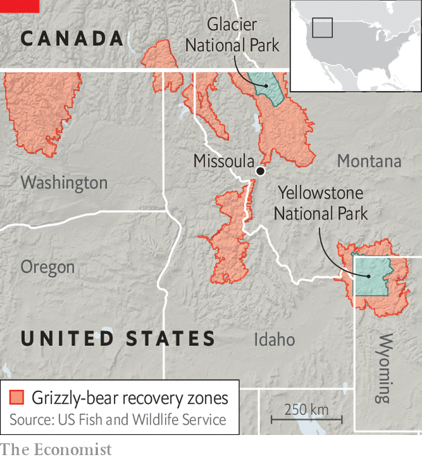
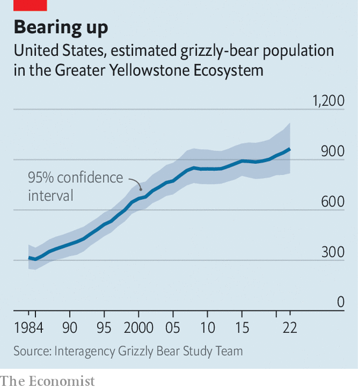

###### Call of the wild

# How the culture wars came for grizzly bears 

##### Fights over the Endangered Species Act test the frontiers between science and politics 

 

> Dec 5th 2023 

THE UNIVERSITY of Montana is used to the idea of grizzly bears. This towering predator is the college mascot, and the campus in Missoula is plastered with grizzly memorabilia. Purple paw prints (lethal claws included) are painted on the pavements. Banners on lampposts tell students to “Rise and roar”. Students can frequent Grizzly Grocery, Grizzly Espresso and—if they are of age—Grizzly Liquor. But recently communities around the university have been confronted with something a bit beyond college spirit: actual grizzly bears. 

This spring one such bear lumbered down from the Rattlesnake mountain range and into a forested exurb of Missoula. “We saw the tracks,” says Chris Servheen, a biologist who led the grizzly-bear recovery effort for the US Fish and Wildlife Service until 2016. Mr Servheen drives your correspondent in his truck along the route that the bear took. “He walked right through here,” he says. Pine trees and larches line the foothills. Water rushes in a creek nearby. “They’re here,” he adds. “They’re right up in the mountains.”

Missoula is not alone. The number of bears in Montana has risen steadily while they have been protected under the Endangered Species Act (ESA), America’s landmark wildlife-conservation law, which celebrates its 50th anniversary in 2023. But their recovery has brought mixed feelings: pride, that a species once close to extinction in the lower 48 states is again thriving; anger, from those who feel that the bears threaten their way of life; and fear, because run-ins with the predators do not always end well for bears or for people. The bears’ success has also reignited one of the longest-running battles in the American West: Republican states’ ideological war against federal environmental regulations. 

 


Grizzlies once roamed across a broad swathe of North America, from Alaska down to central Mexico. Their numbers plummeted as Europeans settled the continent, until they were reduced to roughly 2% of their historical range in the lower 48 (see map). “They put grizzly bears on the state flag in California,” says Mr Servheen, “and then they proceeded to kill every last one of them.” 

Grizzlies became a novelty. For decades tourists at Yellowstone National Park gathered to watch them eat rubbish. After the last dump was closed in 1970, and the grizzlies lost this reliable food source, their numbers dwindled to as few as 136. The Fish and Wildlife Service placed them on the endangered-species list in 1975. 

 


Scientists reckon that in 1984 there were around 300 grizzlies in the Greater Yellowstone Ecosystem (GYE), the conservation area at the border of Wyoming, Idaho and Montana that surrounds Yellowstone National Park. In 2022 there were roughly 1,000 (see chart). The number of bears in the Northern Continental Divide Ecosystem (NCDE), around Glacier National Park in north-west Montana, has risen by about 50% since 2004, to more than 1,100. The bears in the NCDE have expanded their range by an average of 2.9% a year between 2004 and 2022.

As the bears multiply and spread out, they are running into people. But the growing risk of human-bear conflicts is not only due to the bear boom. Montana’s human population grew by nearly 12% in the decade to 2022, almost twice the national rate. That of Gallatin County, which includes part of the GYE, grew by a whopping 35% in the same period. Greg Gianforte, the state’s Republican governor, attributes some of the growth to the popularity of the hit television show “Yellowstone” (a ranching drama) and the allure of wild places and remote work during the covid-19 pandemic. “People move to the most beautiful places,” he says. “I personally think Montana is the most beautiful place.”

Mr Gianforte is a central character in this drama. In 2021 he petitioned the Fish and Wildlife Service to remove the NCDE grizzlies from the endangered-species list, arguing that the bears have fully recovered. Wyoming and Idaho sent similar petitions about the GYE bears and the entire population of grizzlies in the lower 48, respectively. The latter petition was denied. But the agency could decide as early as February whether the bears in the other two ecosystems still need federal protections. 

Good news bears

The ESA aims to protect species so well that they can recover. That grizzlies are thriving enough to be taken off the list should be welcome news for a law with a mixed record. To mark its 50th birthday, federal officials crowed that 99% of listed species have resisted extinction. But very few have been able to leave the list. A study from the Property and Environment Research Centre, a conservative think-tank in Bozeman, Montana, calculates that only 3% of species ever listed have recovered.

During an interview at his office in Helena, Mr Gianforte admits that his campaign to get the bear delisted is not just about population numbers. A huge stuffed grizzly stands by the entrance to the room, and seems to stare inquisitively at your correspondent as if it knows its species is the topic of conversation. “It’s a tenth-amendment issue,” says the governor, referring to states’ rights. “There is nothing in our constitution that talks about wildlife anywhere. And yet the federal government has taken a very strong role.”

The mistrust flows both ways. Federal authorities have been sceptical that those states will manage the bears well, says Holly Doremus, an environmental-law professor at the University of California in Berkeley. She argues that partisanship has seeped into wildlife management. 

This year Martha Williams, the head of the Fish and Wildlife Service and ex-director of Montana’s wildlife-management agency, urged the Treasure State to amend a law championed by Republican legislators that allows Montanans to kill a grizzly if it is threatening livestock, which is a federal crime. She also warned that several  passed in 2021 could make delisting less likely. Montana officials have tried to shore up their case by proposing to ban grizzly hunting—a great fear of local tribes, which view the bear as sacred—for at least five years after their delisting.

One sticking-point will be whether the Fish and Wildlife Service believes that the connection of hitherto isolated grizzly populations will be possible without federal protections. Scientists have long hoped that NCDE bears would venture far enough south to introduce some genetic diversity to the GYE population. The bears are tantalisingly close. Officials in Montana reckon just 100km (62 miles) separates the northern grizzlies from their Yellowstone kin. 

The impending decision will not end this debate. Past grizzly delistings have been challenged in the courts. The feds are also deciding whether grizzlies should be returned to Washington state. Beyond bears, Ms Doremus reckons the ESA will stay in the spotlight. If Republicans retake the White House and the Senate in 2024, she expects them to try to quietly gut the law by carving out exemptions for energy-infrastructure projects. The ESA is often used by environmentalists and NIMBY groups to . 

In some ways, the debate over bears boils down to control. The feds think they should preside over the protection of lands and species important to the country. States resent federal environmental regulations as government overreach. Montanans who deal with grizzlies walking through their backyards wonder why Washington should decide how they protect their family and property. Yet Americans across the country feel the bear belongs to them, too. When a family takes a trip to Yellowstone in the hope of seeing a grizzly (ideally from afar), they are ready to marvel at the fact that there are still sufficiently wild parts of America in which such impressive predators can thrive. 

While politicos in Washington and Helena squabble, most Montanans are trying to learn to live with bears. A survey from the University of Montana suggests that 85% of them believe grizzlies are part of what makes their state special, and three-quarters think the state should try to maintain a self-sustaining grizzly population. Perhaps the culture wars—whatever the specific issue—are less salient to Americans than to those seeking political office. 

Be bear aware

This desire to coexist with bears, rather than violently dominate them, has spurred Missoula to attempt a grand experiment. The city will soon require some residents to have bear-proof rubbish bins to deter black bears and grizzlies from entering neighbourhoods to look for food. Wildlife officials are trying to teach locals, tribes, scores of new Montanans and clueless Airbnbers what to do if they encounter a bear. If Missoula’s experiment succeeds, it would be a rare conservation bright spot in a world inundated by news of biodiversity loss. Rather than a symbol of the past, like the grizzly on California’s state flag, Montana’s bears would be testimony to what people can do for nature, not just to it.■


