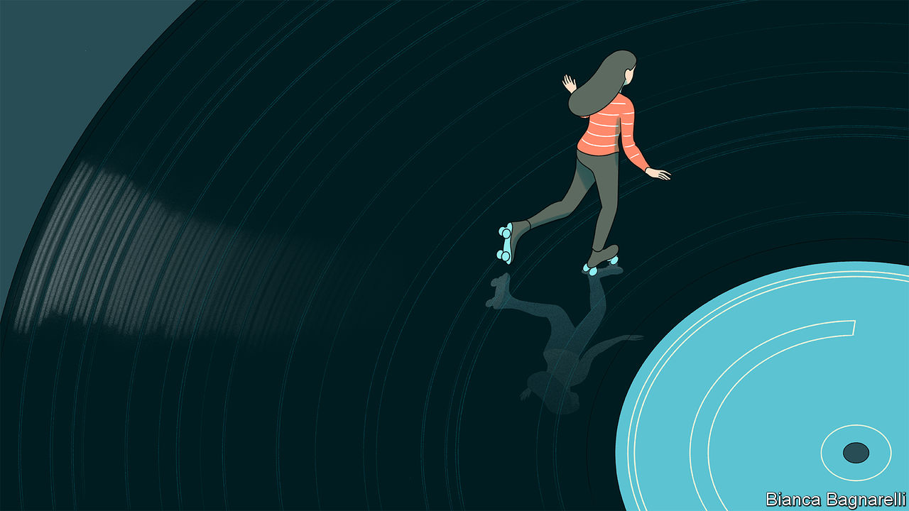

###### Good to hear

# The best albums of 2023, as chosen by The Economist 

##### Throwback sounds such as folk, punk and soul dominate our list this year 

 

> Dec 8th 2023 

By Susanne Sundfor

With this album Susanne Sundfor proves that she is one of pop’s most brilliant performers. Her voice is so magnetic and emotive it would enchant audiences whatever tune she sings. Already a star in Norway, she deserves wider fame.


By Lankum

A  is producing lots of stirring music, but none quite so stark as that on Lankum’s fourth album. “Go Dig My Grave” might be the most uncompromising opening track of any album this year. (You are not likely to hear the band’s music in an advert for Irish tourism.)

By Amaarae

This album, by a Ghanian-American singer, is fizzy and sweet. The combination of Afrobeats, pop and R&amp;B gives “Fountain Baby” an inventive, wonderfully contemporary sound.

 By Cleo Sol

Cleo Sol, a British singer-songwriter, released two albums in September, both excellent: “Heaven”, a tour of the mellow soul of the 1970s, and “Gold”, which is the better of the two, offering songs more varied in tone.

By Olivia Rodrigo

The former Disney star surfs the wave of nostalgia for the pop-punk of the 1990s with a snappy, snarky second album. You can hear her love of  in some of the delivery; “Guts” also connects with an audience of young women seeking a voice that echoes their lives.

By Young Fathers

An album both accessible and experimental, by a multi-ethnic trio from Scotland. “Heavy Heavy” sounds as though it comes from everywhere and nowhere. One minute you get a glam-rock beat evocative of the 1970s, the next ululating vocals in Zimbabwe’s Shona language.

 By Róisín Murphy

The release of “Hit Parade” was overshadowed by the culture wars, after Róisín Murphy offered her opinions on puberty blockers. But behind the headlines lies a coolly confident album of dance-pop, full of infectious, summery melodies.

 By Shana Cleveland

This album limns a poor, rural part of California that does not get much attention in pop. The music is beautiful, evoking genres popular in the 1960s, such as baroque pop and psychedelic folk. Ms Cleveland’s voice is soft and affectless.

By Civic

Civic offers a raucous take on garage punk. The band belongs to an Australian lineage whose forebears include Radio Birdman, The Saints and The Scientists. This album is both a throwback and wildly exciting.

By The Armed

On their fifth studio album, this hardcore-punk collective completed their transformation from shouty thrashers to experimental-pop group. “Perfect Saviours” shows off their melodic sensibilities.

 By The Hold Steady

The band’s late-career revival continued with their ninth album. Craig Finn no longer sings about youngsters ending up in the emergency room after taking too many drugs. On “The Price of Progress” he tells of older people losing control of their lives in less dramatic ways.

By Boygenius

The rare “supergroup” that is bigger than the sum of its parts. No indie fan would be startled by their debut album, but what was new about it was the way it became a rallying point for young queer people of all stripes. Crucially, the songs were superb.

By Danny Brown and JPEGMafia

This album defies description: a barrage of words from Danny Brown, a rapper, is accompanied by frenetic production from JPEGMafia. Here hip-hop is not party music but an exploration of how far the genre can be pushed. 

By Margo Price

At the beginning of her career Margo Price sang hardscrabble, often autobiographical, country. Her style has since evolved into a winning amalgam of modern Americana and classic rock. “Strays”, which incorporates synthesisers and drum machines, is a triumph.

By Eddie Chacon

It had long seemed as though Eddie Chacon would only be known as one half of Charles &amp; Eddie, the duo behind “Would I Lie to You?”, a hit in 1992. But a solo career that began in 2020 has now yielded a second short, glorious album of retro soul, both jazzy and introspective. ■

