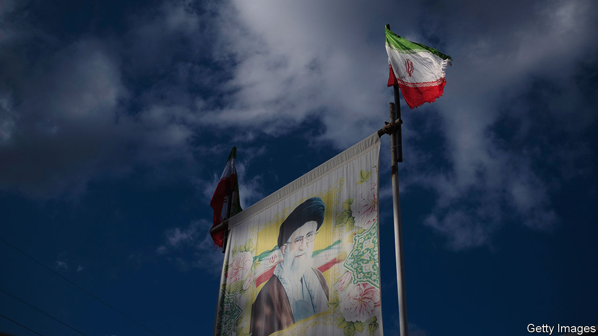

###### Wobbly in Tehran

# Iran’s regime is weaker than it looks, and therefore more pliable 

##### America should deter it from escalating the Gaza war, but also engage with it 

 

> Dec 14th 2023 

Twelve months ago Iran was reeling from  sparked by the death in custody of a young woman who had been arrested for showing too much hair. Its theocratic regime was increasingly isolated, as Arab states forged  with its enemy, Israel. The economy was a mess, adding to popular anger at Iran’s ageing supreme leader and inept president. The Islamic Republic had not seemed so vulnerable in decades.

In many ways, its position looks stronger today. Since October 7th  have been fighting Israel and attacking American troops in Syria and Iraq. Yet the regime has managed to preserve its recent  with Saudi Arabia, and the Saudi rapprochement with Israel is on hold, at least for now. Iran has deepened its ties with Russia by selling it drones. And even though Iran is drawing closer to being a , enriching more and more uranium to 60% purity, America has relaxed its enforcement of oil sanctions. Iran now pumps more than 3.4m barrels a day, a five-year high.

Yet look harder, and  are plain. Although its client militias have joined the battle to defend Hamas in Gaza, their efforts have been half-hearted. Iran has been boxed in by America, which has sent two aircraft-carrier groups to the Middle East. This seems to have deterred Iran from ordering Hizbullah, its Lebanese proxy, to escalate the war over Gaza. It knows that anything more than token attacks on Israel would risk a devastating response. Hamas leaders grumble about Tehran’s wishy-washy support. “Either they lose their face, or they lose their arm,” says Enrique Mora, the EU’s Iran envoy. “They decided to lose face.”

Iran’s economy is worse than it looks, too. The country is pumping more oil, but the proceeds from selling it are often stuck abroad. The rial is 25% weaker than a year ago. Inflation remains above 40%. Russia cannot offer much investment, if any, and China will not do so while Iran is under American sanctions. Ali Khamenei, the supreme leader, is 84 years old. His succession will be fraught: the would-be candidates are unpopular, incompetent or both. “You’d think they’re confident,” one Iranian analyst says of the regime. “But they’re deeply nervous.”

This reality should inform American policy. Some want President Joe Biden to try to revive the abandoned nuclear deal in 2024. But Iran will not strike a grand bargain with a president who might soon be replaced by Donald Trump. Instead, America should continue to focus on de-escalation. That means continuing to show strength. It should maintain military pressure on Iran and its proxies, and stand up an international coalition to deter Yemen’s Houthis from further attacks on commercial ships in the Red Sea (talks about one are said to be under way).

Meanwhile, America should resume indirect talks with Iran. It should focus on regional stability, pushing for a deal that would see Hizbullah move its forces north of the Litani river in Lebanon, thus averting a bigger war with Israel. That could be a starting-point for broader negotiations. Mr Biden should avoid returning to his predecessor’s failed policy of “maximum pressure” and leave open the door to a deal that limits both Iran’s nuclear programme and its regional meddling.

Iran has a choice to make. The militias it sponsors in other countries now threaten its own interests. They have jeopardised efforts at de-escalation. They have also cost it $6bn in the form of frozen oil revenue that was about to be released after a prisoner swap with America just weeks before October 7th. America has even threatened to attack Iran directly if it does not restrain Hizbullah. Instead of keeping conflict away from Iran’s borders, as they were meant to, its proxies now risk bringing it closer.

Iranians are restive. A tricky transition looms. The regime, as ever, cares most about its own stability, which would be best served by tempering its revolutionary zeal abroad. That this would be a relief for its neighbours, too, goes without saying. ■

