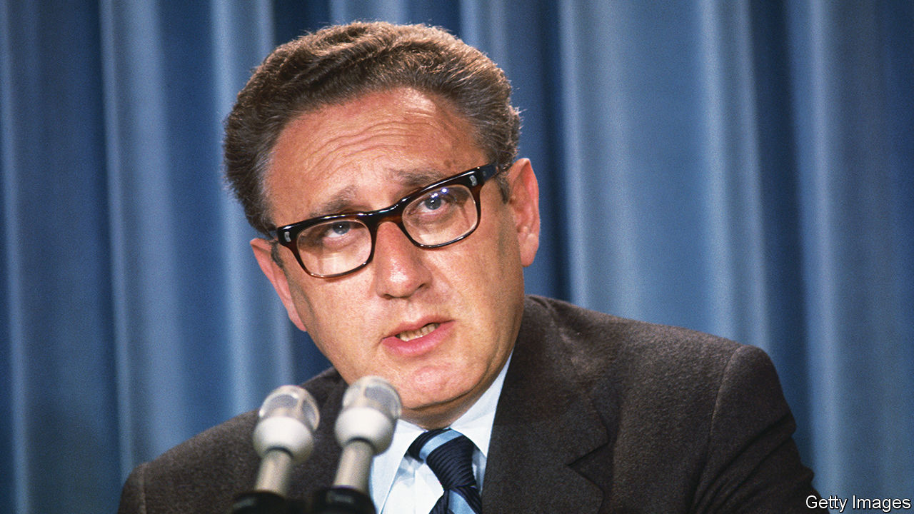

###### On funding research, the United Arab Emirates, Kissinger, Argentina, Joe Biden, cocaine

# Letters to the editor 

##### A selection of correspondence 

 

> Dec 14th 2023 


Investing in research

Perhaps there are more fundamental reasons for the slowing pace of R&amp;D than the bureaucratic barriers you identified (“”, November 18th). Over the past half-century, the proportion of R&amp;D funded by governments has fallen sharply relative to private-sector funding. Corporations struggle to capture the full value of investments in early-stage research and tend to focus on short-term wins. At the same time governments, which economic theory tells us should be filling the gap in early-stage research, have shifted their focus towards later technology readiness.

The trend is accelerating. According to data from the American Defence Department, recent spending in early phases of R&amp;D was a quarter of the total at the turn of the century. In the budget request for fiscal year 2024 it dropped to 13%. Australia’s defence agency recently considered its own version of America’s Defence Advanced Research Projects Agency. It changed course, opting instead for a “capabilities accelerator” charged primarily with speeding adoption of dual-use and other later-stage technologies. 

George Henneke

Visiting senior defence economist 

Australian Strategic Policy Institute 


As you say, the first step is to try new things in funding science. How about a more entrepreneurial approach that cuts the bureaucracy and red tape? If the British government treated the multitude of small charities supporting nascent cancer-research projects as early “angel” investors it could join in with larger later-stage funding for the most promising research. Small charities like Pancreatic Cancer UK have an important role in seeding new, risky and ambitious research for pressing challenges in treating the less survivable cancers: brain, pancreatic, liver, stomach, oesophageal and lung. They seek outcomes, not profit.

Promising projects funded by PCUK, like an exciting new low-cost breath test being developed by a team at Imperial College, can dramatically improve outcomes through early detection. We urgently need to fund and accelerate such work with an entrepreneurial, rapid-response approach. Breakthroughs in research for the deadliest cancers coming from projects seeded by small charities can change these outcomes. We must act now. 

Alice Gast

Former president of Imperial College London

There is an alternative to the funding models for scientific research that you discussed. Prediction markets use betting to aggregate expertise and incentivise participants to get it right. They could be used as a mechanism to fund some types of research in a more inclusive and performance-driven way. Where the primary aim of research is a well-specified prediction, climate forecasting for example, using the proven ability of markets to synthesise diverse information could be more effective than traditional grant proposals and peer review.

Mark Roulston


 


Women in the UAE

Another area where the United Arab Emirates has made progress recently is in eliminating many of the multiple forms of discrimination against women embedded in the country’s laws (“”, November 25th). As recently as 2016, the World Bank’s “Women, Business and the Law” report placed the UAE in broadly the same category as Iran, Jordan, Qatar and Saudi Arabia as among the worst places in the world for women in terms of property rights, workplace protections, access to institutions and other areas. 

A close examination of the 2023 report shows the remarkable progress made by the UAE in modernising its legislation to make the country a more congenial place for women’s economic participation, such as providing them with protections from various forms of violence. This is to be commended. The economic empowerment of women is vital for growth and prosperity. Numerous studies have shown the benefits of higher female labour-force participation, for instance. 

But the UAE’s recent experience also shows that it is possible to reconcile Islam with modernity, including better treatment of women. This is a vital lesson for countries in the region.

Augusto López-Claros

Executive director

Global Governance Forum


 


Kissinger’s legacy

While the peacekeepers are indeed blessed, those who perished by conventional ordinance, death squads and various genocidal acts would find cold comfort that nuclear holocaust was not the cause of their demise. Is it therefore left to us, the living, to be grateful to Henry Kissinger (“”, December 2nd). Kissinger’s shame is that he could only conceive of international stability in terms of preventing wars between great powers, while failing to understand that the victims of his diplomatic collateral damage suffered the very same fate, on the very same personal level, that he himself escaped.

Dan Goldzband


 


Dancing with dollarisation

Two crucial aspects remain insufficiently addressed regarding Javier Milei’s policy of dollarisation for Argentina (“”, November 25th). First, economists generally agree that a country’s progress is positively linked to robust institutions. Although a nation may cede sovereignty in monetary policy, this alone does not strengthen fiscal, commercial and legal frameworks. Handing sovereignty over key developmental policies to third parties does not guarantee sustainable progress.

The second reason is that a society’s culture cannot change overnight. Argentina is not Ecuador. Carlos Gavito, an Argentine tango dancer, showcased the “Forever Tango” spectacle on Broadway. He toured 90 countries and mastered several languages, but he understood that when the stage lights come on, a tango performance is a duet performed “by Argentines”. 

Without a credible plan to strengthen its institutions, including the central bank, sustainable progress in Argentina is unattainable. Argentines understand that when the lights come on, this particular tango won’t be danced with the Federal Reserve. 

Matías Acevedo F.

Former executive director at the Inter American Development Bank


 


Too late to ditch Biden?

Donald Trump’s potential return to the White House indeed poses a danger to American democracy and the world (“”, November 18th). It is maddening to watch the Democratic Party’s leadership stand behind Joe Biden while his approval rating approaches that of Jimmy Carter in 1979. Poll after poll suggests that, at best, a rematch between Mr Biden and Mr Trump would be a toss-up. The stakes are far too high to leave the outcome of this election to chance.

A saner course of action for Democrats would be to persuade Mr Biden to graciously step aside (he could then claim the mantle of selfless protector of democracy, rather than risk being remembered as a tone-deaf politician who put his own interests before his country’s). A robust Democratic primary could produce a relatively young, competent candidate, who would have better odds of defeating Mr Trump.

NICHOLAS BUXTON


 


Cocaine bust

It is interesting to note that your article on Brazilian drug gangs felt it necessary to explain that Lisbon was the capital of Portugal, but didn’t feel that the slang word “blow” required clarification (“”, November 25th). I fear I may be out of touch with the lifestyle of the average  reader now.

Mike Ward


