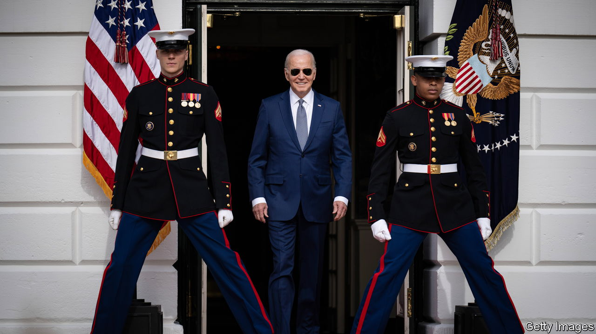

###### Biden-gnomics

# Regulatory changes hint at what might be in store in a second term 

##### A few unheralded tweaks could have outsized effects 

 

> Dec 14th 2023 

Quite a lot has been written, including by , on what Donald Trump’s plans are for government, should he be elected again in 2024. Though he is the sitting president, rather less has been said of President Joe Biden’s plans for another four years. One reason is that the Senate looks like an uphill battle for Democrats next year, so if Mr Biden were to win he would probably have to rely on executive orders and the regulatory state to push America’s green transition forward.

Look closely and you can see some of the groundwork being done for this eventuality. On December 2nd the Environmental Protection Agency (EPA) announced new, tougher regulations on methane emissions. The rule was announced at COP28 in Dubai and positions America with 154 other governments who pledge to reduce methane emissions by at least 30% by 2030. The new rule will require oil and natural-gas operators to greatly reduce emissions. The EPA says this new rule should reduce projected emissions in the sector over the next 15 years by nearly 80%.

Underpinning the change is a new calculation of the social cost of carbon. This purports to price the damage from one extra ton of CO2. This number matters a lot. A low dollar amount makes it hard to justify strict new rules. A high one means such restrictions could pass cost-benefit tests and make it past a legal challenge.

The newest update increases the social cost of carbon to $190 per metric ton for 2020, quadrupling the Obama-era estimate. This means regulations on carbon implemented today will be assumed to have a higher value in the future (lowering the discount rate for social costs from 3% to 2%). “Biden is saying that there is more economic value to cutting greenhouse gases than we thought,” explains James Connaughton, an environmental adviser in the George W. Bush administration.

“There is always some ‘politicking in the wonkery’,” says Alex Armlovich at the Niskanen Centre, a think-tank. But, he says, “lowering the rate of social discount for existential or irreversible policy choices is supported by many philosophers and a surprisingly wide variety of economists.” The administration last year also created a system, known as natural-capital accounting, that measures and . Natural capital is jargon for the assets, such as forests, that nature provides.

Natural assets have always been important, but “we were just pretending that they were free,” says Solomon Hsiang of the White House’s Office of Science and Technology. “We’ve sort of been doing make-believe economics in the past where we thought these things didn’t matter, and now everyone in the field of economics recognises that they matter tremendously.” This too could be a prelude.

Were a second-term President Biden to find himself in a bind with Congress, he could use his authorities under the Clean Air Act and other existing laws to push climate policy forward, says Nathaniel Keohane of the Centre for Climate and Energy Solutions. Yet the Supreme Court has its eyes on a pair of cases that could overturn , the precedent that gives regulatory agencies lots of leeway to make rules. It is possible that by the time he is sworn in again, Mr Biden will find the rules about rulemaking have changed. ■


