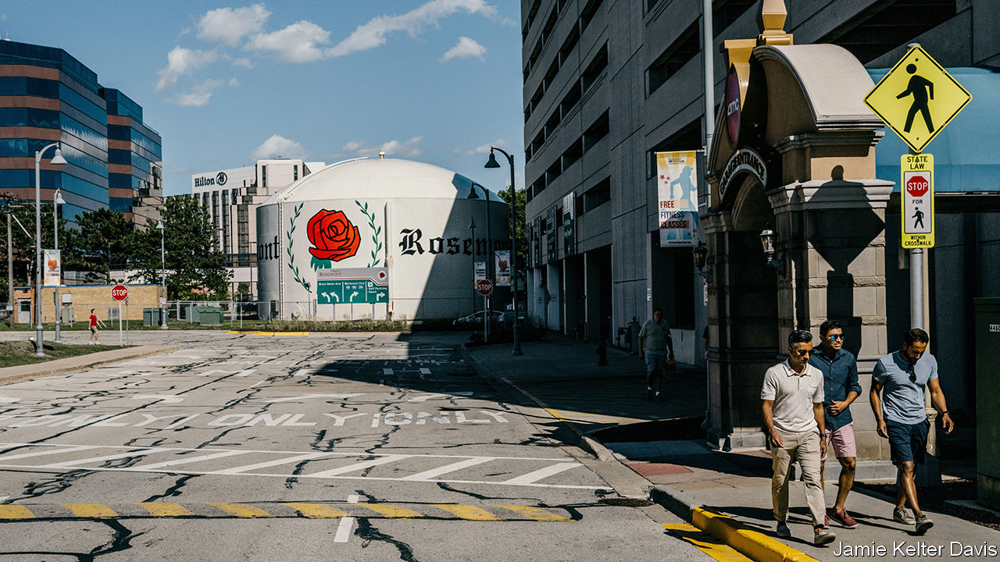
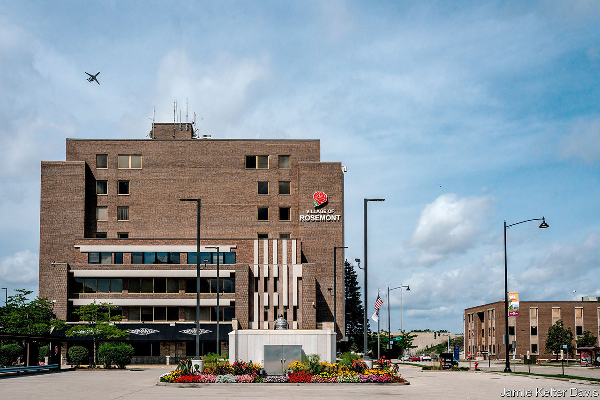
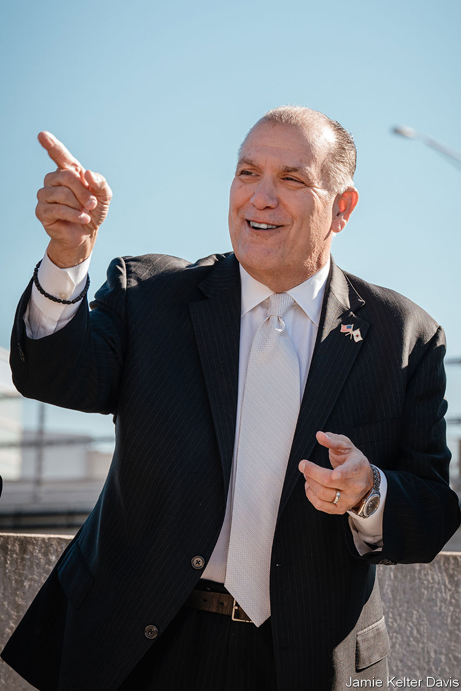
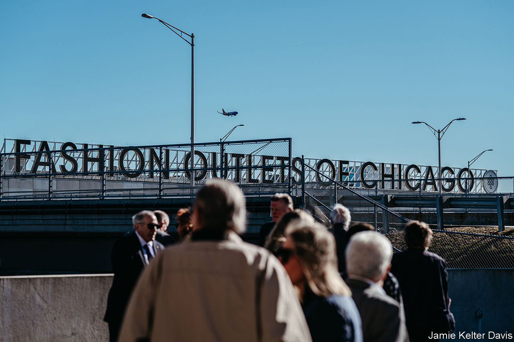

###### Rosemont, Illinois

# Inside the last true political machine in America 

##### What a town is like when one family runs everything 

 

> Dec 20th 2023 

Egyptian pharaohs left the pyramids. Donald E. Stephens left a Museum of Hummels. These are porcelain dolls, based initially on paintings by Maria Hummel, a German nun. Stephens was, until his death in 2007, the mayor of Rosemont, Illinois. His collection of Hummels, which is on display in a strip mall, is apparently the world’s largest. It includes rare figurines of soldiers at Checkpoint Charlie in Berlin. The museum is a monument to kitsch, and to a dynasty.

Politics in Rosemont is a family affair. Stephens and his son, Brad (pictured below), have run the city for almost 70 years. It is perhaps America’s last true political machine. It reminds your correspondent, who has spent years reporting in Africa, of Gabon, a petrostate that was ruled by the same family for 56 years. The parallels between these two very different places reveal much about power, not as a civics textbook describes it, but as canny, charming men actually wield it.

 


The village of Rosemont was founded in 1956 on land that was then (according to the official history) a rubbish dump on the edge of Chicago. Stephens, then a 27-year-old businessman, was among a group of people who decided to incorporate as a city, literally picking the name out of a hat. The city came into its own after it traded a strip of land with Chicago to allow the expansion of O’Hare airport. 

Proximity to the airport brought highways, a train connection and thousands of travellers. Though Rosemont covers less than two square miles, it now has a huge convention centre, an ice hockey and basketball arena, a theatre and, just outside its formal territory, a casino. It also has office blocks, car-rental outlets and more hotel rooms than residents. With a population of 4,000, it has an annual budget of $200m.

Today, Rosemont is run by Bradley Stephens, Donald’s son, who took over by acclamation on his father’s death. In his first election for mayor, in 2009, he won 91% of the vote—988 votes in total. In every election since, he has been unopposed. He looks and acts like his dad, though his private life is less colourful, with just one wife to his father’s six. 

Below Brad are a host of other Stephenses. Christopher Stephens, Brad’s nephew, runs the convention centre. Brad Stephens II, Brad’s son, manages a city-owned mall. Until late 2020 Donald Stephens III, another grandson of the original Donald, ran the tiny police and fire department. The director of the city’s parks, Karen Stephens, is the wife of another nephew. Other relatives are spread throughout the city government and the businesses it owns. 

Most live in a gated community that is a picture of old-fashioned suburbia. Modest post-war homes line wide streets that are agreeably quiet, bar the noise of landing planes. Teenagers roam on bicycles. In October almost every house had elaborate Halloween decorations on its lawns. Many had American flags out front, or the pro-police version with a thin blue line. Rainbow flags with liberal homilies, common in Chicago, were nowhere to be seen.

Brad Stephens receives $290,000 a year, slightly more than Eric Adams gets to run New York, and draws another salary as an Illinois state representative. His nephew Christopher gets $335,000 for running the convention centre. Donald Stephens III pulled in $215,000 to manage 80 cops, slightly less than the head of the Chicago police gets to manage 13,000. 

 


 


Then there are contracts. Bomark, a firm owned by the mayor’s brother Mark, provides cleaning and parking-management services. It is paid $4.5m a year, according to the Village’s accounts. In the past, contracts have gone to businesses owned by the mayor’s sister, by a wife of the former mayor and by family friends. Tendering is seldom competitive. As a home-rule “city”, the Village insists that under Illinois law it is not required to seek competitive bids.

The family business has attracted scrutiny. As mayor, Donald Stephens was twice charged with federal crimes and twice acquitted. For decades, rumours linked the late Stephens with Chicago’s Italian mafia. In 2001 a plan to open a casino in the city was quashed by the Illinois Gaming Board, over alleged mob ties. 

 


The current mayor, Brad Stephens, has never been accused of a crime. In an interview in his office, he defends nepotism, arguing that family members will work harder because they understand their privilege. “I will hold them to higher standards than other employees,” he says. Talking about his nephew, Chris, who manages the convention centre, he says, “He understands that his grandpa’s name is on the building, and we need to make sure that it is well run.” His spokesman says that salaries are set by the village board, and that employees are “fairly compensated”.

From Windy City to rainforest

It is a sentiment that Gabon’s most prominent family would endorse. A former French colony in central Africa, it was run by Omar Bongo from 1967 until his death in 2009. His son Ali, a former funk singer, then ran the country until he was ousted in a coup on August 30th. Citizens of Rosemont are unlikely to wake up and see soldiers on television announcing that they have seized power. But both places depend on an accident of geography for their fortunes. In Rosemont’s case, proximity to the world’s fourth-busiest airport. In Gabon’s case, oil, which supplies nearly two-fifths of GDP. 


With just 2.4m people and $5bn a year of oil exports, Gabon is on paper one of the richest places in Africa. But that money is controlled by the state, which for decades meant the Bongos. In a patronage system, politicians turn the government into a vote-buying machine, explains Nic Cheeseman of the University of Birmingham, an Africa specialist. Elections are held, and opposition candidates stand. But if you vote for one, you may find that your neighbourhood no longer gets its share of public services, or that your friends and family lose their government jobs. 

 


Chicago was once famous for having such a “machine” under Mayor Richard J. Daley. (Professor Cheeseman once advised your correspondent to study it to understand Kenyan democracy.) Every election, voters would be reminded of favours. Even criminal charges could be “fixed”. The Chicago machine eventually broke down when lawsuits curbed patronage hiring. 

The Rosemont machine is still going strong. A bylaw reserves many jobs for residents. Some 236 city staff live locally—one for every seven households. Thus, the mayor, who knows everyone, directly controls the employment of a large share of his voters, few of whom will ever move. When houses in the gated estate are sold, current residents fall over themselves to buy them, so they can pass on jobs to their children.

Though in the Illinois state house he is a Republican, in Rosemont Brad Stephens has his own political party, the Rosemont Voters League. According to Frank Siciliano, a former Rosemont police commander, it is impossible to work for the city without joining it. When he once fell behind on his dues, “I actually got a letter, a note in my mailbox in the station,” he says, from his commander telling him to pay up. “Throughout my career I would be told several times: ‘You gotta know how to play politics,’” he recalls. The city contends that Mr Siciliano is a bitter ex-employee, and that employees “give freely and openly”. 

How long can family control last? When Donald Stephens donated his collection of Hummels, he decreed that they would be displayed for 99 years after his death—he expected his legacy to last that long. His son sees no reason for change. “The employees buy in,” he says. “They drink the Kool-Aid.” He describes himself as being like the manager of a little league baseball team—he has to know every member. “It’s a big family, you know what, we all cover each other’s backs.” Pressed on when he might leave office, Mr Stephens prefers to talk about new businesses.

Your correspondent interviewed President Ali Bongo in 2016, and came away with a similar impression of stability. Yet a couple of months later, Mr Bongo lost an election, or so his opponents say. He was saved by an implausibly colossal turnout in his home district. Crowds cried fraud and rioted. 

In 2018 Mr Bongo suffered a stroke, and soon businesses began to complain that the taxes they paid no longer bought protection from shakedowns. The economy, always at the mercy of the oil price, declined. The machine began to fall apart well before soldiers appeared at Mr Bongo’s door to arrest him.

What could come for the Stephenses? For now, perhaps nothing. Rumoured FBI investigations into the town’s leadership have hardly gone further than they did with his father. The money continues to flow and the voters keep turning out. 

However, the Rosemont model hardly fosters dynamism. The median income is 20% lower than in the wider Chicago region. In the wake of the pandemic, Rosemont’s large offices with their endless car parks are quiet. And though conventions are once again filling up the town at weekends with people dressed as  characters, the city is deeply in debt. In 2023, it will spend $38m on servicing it. Many city-owned businesses are highly leveraged, too. Men with guns and sunglasses pose no threat to the Rosemont machine, but one day men with calculators might. ■


