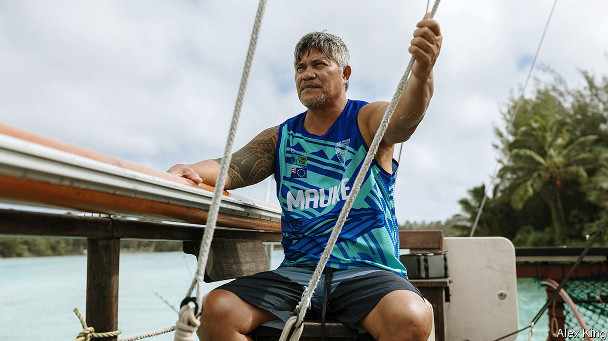
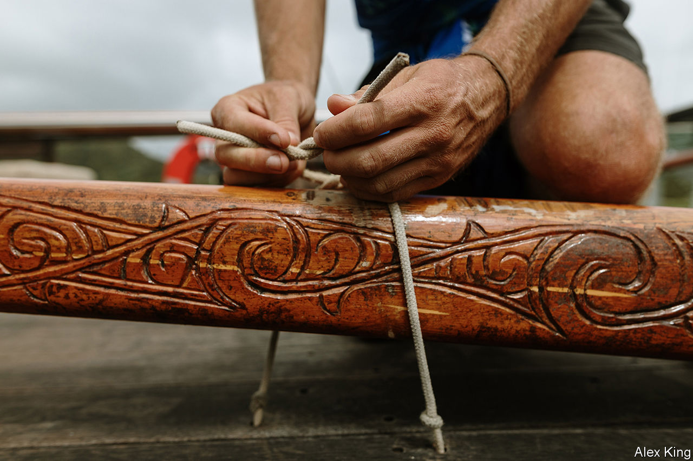
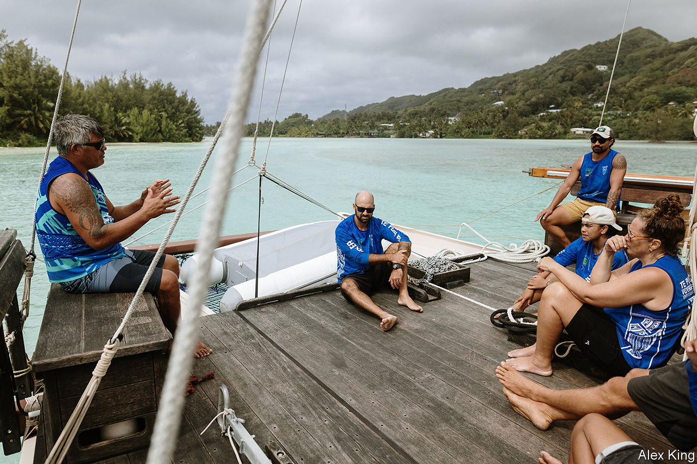
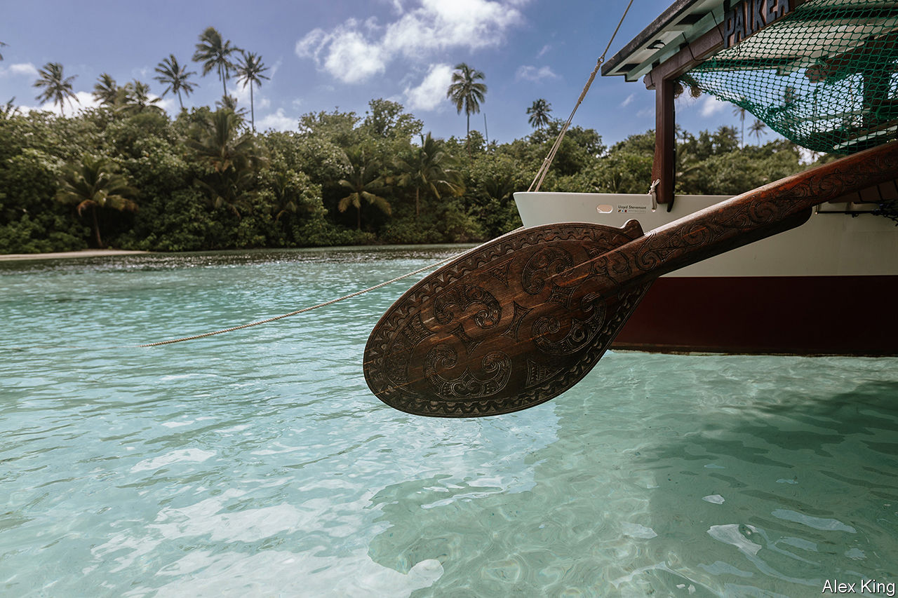

###### Pacific pathfinders

# The best sailors in the world 

##### Why the vaka, vehicle for the extraordinary story of the peopling of Oceania, is enjoying a revival 

 

> Dec 20th 2023 

“No alcohol, no smoking, no drugs, no sex: the vaka is a marae!” The instructions for the crew of  are clear. A  is the name given to a communal sacred space in Polynesian or Maori culture. Though usually a place ashore, this 40-foot replica of a traditional Polynesian double-hulled sailing canoe, known as a ,  or , feels hallowed enough as this author takes the first night-watch, drifting hove-to away from the breaking reef off tiny Mitiaro, one of the Cook Islands’ remoter territories.

The eight-strong crew have just returned full-bellied from a feast thrown by the 130 islanders that consisted of a whole roast pig, fowl, taro and fish; plus prayers, speechifying, Maori songs in pure harmonies and laughter. The farewell from the quay still rings in the watch’s ears as a carpet of stars reels overhead. A humpback whale with her calf blows by the boat. And a rumble comes from the deckhut of one of the Pacific Ocean’s most revered navigators, Peia Patai (pictured).

A couple of hours later Peia commands the crew to make sail for Atiu, over the horizon to the south-west. Seeing his chosen star rising, he tells the helmsman to steer for it. Soon  is lolloping over the swell. Peia sits at the port stern quarter, looking up at the sky and over at the cross-swells, giving occasional orders to the helmsman wrestling with the huge wooden steering paddle. At dawn the island appears. The ritual of welcome, feasting and feting will surely begin again.

, run by the Te Puna Marama Voyaging Foundation on Rarotonga, largest of the Cook Islands, is part of a revival in sailing skills and traditional navigation. The revival began in Hawaii in the 1970s but has since gathered pace across Micronesia, Melanesia and Polynesia. The story of the settlement by long-distance voyagers of island Oceania is unparalleled. They had no compass, sextant or chronometer. Rather, they relied on a deep understanding of sea swells, on clouds, on the flights of birds and, above all, on the star-compass, the nightly turning of the firmament.

 


 


Much of the knowledge was closely guarded and often hereditary. But in the Cook Islands, as elsewhere, it was nearly all lost. With the advent of European and American traders, missionaries and rulers, long-distance exchange ceased or, increasingly, took place on modern vessels and on Western terms. Today the arrival of named after a whale-riding demigod, symbolises the ancestral means by which the islanders came to be where they are. She is greeted with joy.

Captain James Cook was the first European to call at Atiu, in 1777. Many, including this author, were taught at school that it was European explorers who opened up the Pacific. In reality the arrival of the Europeans came just when the last—and most impressive—settlement in human history was coming to an end: the peopling of the remote islands of the Pacific. The settlement happened across much of an ocean that encompasses a third of the Earth’s surface. Those who undertook it had embraced entirely new maritime technologies and survival skills enabling long-distance voyaging, dependable navigation and the means of successful colonisation when they made landfall. The navigation relied, above all, on a deep, learned knowledge of how and where the sun, stars, moon and planets rise and set. And so, as K.R. Howe, a historian, writes, as well as marking the conclusion of our terrestrial settlement, Polynesians’ expansion marked the beginning of our extraterrestrial journey too.

The peopling of the remote islands of the Pacific began around 1500bc and seems to have happened in two wild bursts. Along the way Hawaii was discovered and settled after 900ad and New Zealand around 1200, from jumping-off points in east-central Polynesia. By then Polynesians had even made it to the Americas.


By the time the Europeans showed up the Polynesian expansion was largely over. It was plain to Cook that the peoples of much of Oceania were, in terms of looks, language and myths, “the same nation”. Cook yearned to know more about their provenance, though not as much as Pacific islanders do today. Curiosity and pride about roots encompasses the revival in the craft that enabled their existences.

Three broad island regions of Oceania are defined as Micronesia to the north-west, Melanesia to the west and Polynesia east of that. Thanks to archaeology, linguistic research and dna analysis, the shared origins of all three groups have come more sharply into focus. Islanders descend largely from Austronesian-speaking voyagers whose linguistic roots trace back to Taiwan. Over millennia, ancestors pushed through South-East Asia. But a restless streak kept them moving south-east. They eventually jumped off into Oceania from the Philippines (for Micronesia) and from the easternmost tip of Papua New Guinea for the Solomon Islands, Vanuatu and Fiji (Melanesia). Most of this movement was over by 1000bc, but it resumed a millennium later across what became Polynesia.

Since Cook’s time, the history of the settlement of Polynesia has been a subject of tantalising (if often wrong-headed) inquiry. Foundation myths and oral legends throw some light. Self-replicating in their general form, the legends travelled with the voyagers. From island to island gods such as Maui, who fished new land out of the sea, were recruited and repurposed to cap the founding myths of new settlements. In those myths, the settlements’ founding navigators, chiefs and shamans enjoy high status. Oral traditions support the supposition that Polynesians embarked on  as family bands of two dozen to 200-odd individuals, traversing hundreds or thousands of miles of open ocean to inhabit new island groups.

Yet legends help little in confirming the timing and sequencing of settlement. Archaeological and linguistic analysis agrees that the expansion probably began in Samoa, 2,800km (1,750 miles) north of New Zealand, and ended in Easter Island, 7,000km east. But it disagrees on whether it started around 900ad and lasted a short few centuries, or whether it began much earlier and lasted longer. A genetic analysis of modern-day Polynesians, published in  magazine in 2021, settled many doubts about sequencing and duration.

The researchers inferred a genetic story from, in effect, looking down the wrong end of a telescope: every time a voyaging group left an already populated island for a new, uninhabited one, the genetic diversity on successive voyages would shrink even as the settlement range expanded. They were right. Their analysis suggested that the first  set off from Samoa in about 800ad, arriving first at the high and fertile island of Rarotonga. From there voyagers hopped in all directions, reaching Easter Island around 1210.


The story of intentional voyaging seems so extraordinary that for years many did not believe it. The theory of “accidental drift” argues that the remote Oceanic islands must have been populated by inshore fishermen or travelling warriors carried away in storms. The theory does not hold water.  carried whole families. They shipped a portable landscape of pigs, fowl and dogs along with breadfruit, coconut and the pandanus tree (for sails, rope and cloth). Such species were vital to life on impoverished island biomes. It is hard to imagine they were brought by chance.

Computer simulations of ocean currents blew another hole in the theory of accidental drift; genetic analysis underscoring the purposefulness of settlement sank it. Yet the naysayers set in train a remarkable group of sailors, scholars and cultural leaders determined to show that their ancestors knew what they were doing and to revive old navigational techniques.

It was almost too late. Across Polynesia the acquired navigational techniques had largely died out. But in the 1960s a New Zealand doctor and long-distance sailor, David Lewis, found the practices living on among a tiny handful of old navigators in the extensive Caroline Islands in Micronesia. One navigator, Tevake, arrived for a voyage among the islands on Lewis’s boat with “15 people, including sleepy children, wailing babies and a new bride recently purchased with feather money”. On deck squalls and a veering wind paralysed Lewis’s sense of direction. By contrast Tevaka stood with his feet wide apart, setting the course in relation to a cross-swell which Lewis had not even noticed. (Navigators, famously, would lean their testicles on the moving boat to divine the cross-swells.)

We must take the current

In 1976 another navigator known to Lewis from the same islands, Mau Piailug, joined the , commissioned by the Hawaii-based Polynesian Voyaging Society, and guided her on a trip from Hawaii to Tahiti, over 4,000km apart. Four years later, his student, Nainoa Thompson, the first Hawaiian navigator in six centuries, accomplished the same. Mau Piailug spotted Peia’s promise; Mr Thompson was his chief teacher; and in 2011 Peia was initiated as a master navigator.

 


 


Though some claim it was, navigation was probably never an exclusively male preserve. Peia points out that in Micronesia, even if men sailed more than women did on inter-island voyages, women held the knowledge as an insurance against menfolk being lost at sea. And consider, says Sean Mallon, curator of voyaging at New Zealand’s national museum, the country’s Maori name, Aotearoa: “long, white cloud”. New Zealand is said to have been discovered by Kupe, a legendary Polynesian navigator. But, in the story, it is his wife who declares, sensing land beneath it: “A cloud, a cloud, a white cloud—a long, white cloud!” Today, new generations of women navigators are on the rise. 

The  revival is striking. A generation ago old navigational knowledge in the Pacific hung by a thread. Just a few navigators such as Mr Thompson and Peia helped keep that thread from snapping. Certainly much traditional knowledge is lost, but much has been relearned or—it hardly matters—reinvented.

More importantly, the revival has fostered a cultural renaissance around a Pacific spirit better able to face shared challenges, climate change above all. In an age where, elsewhere, unscrupulous leaders seek potency by emphasising the separateness of identities, the  are helping reimagine a Pacific identity defined, as Nicholas Thomas, an anthropologist, puts it, by our capacity to connect. That’s a star worth steering by. ■


