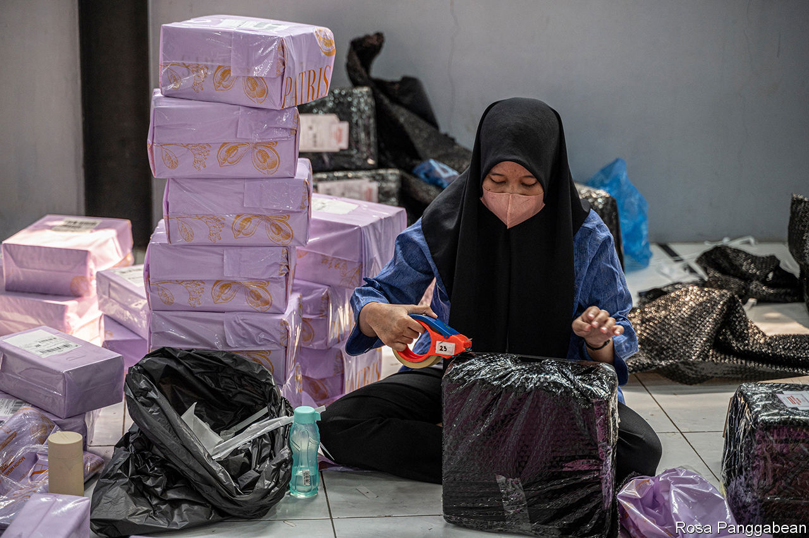
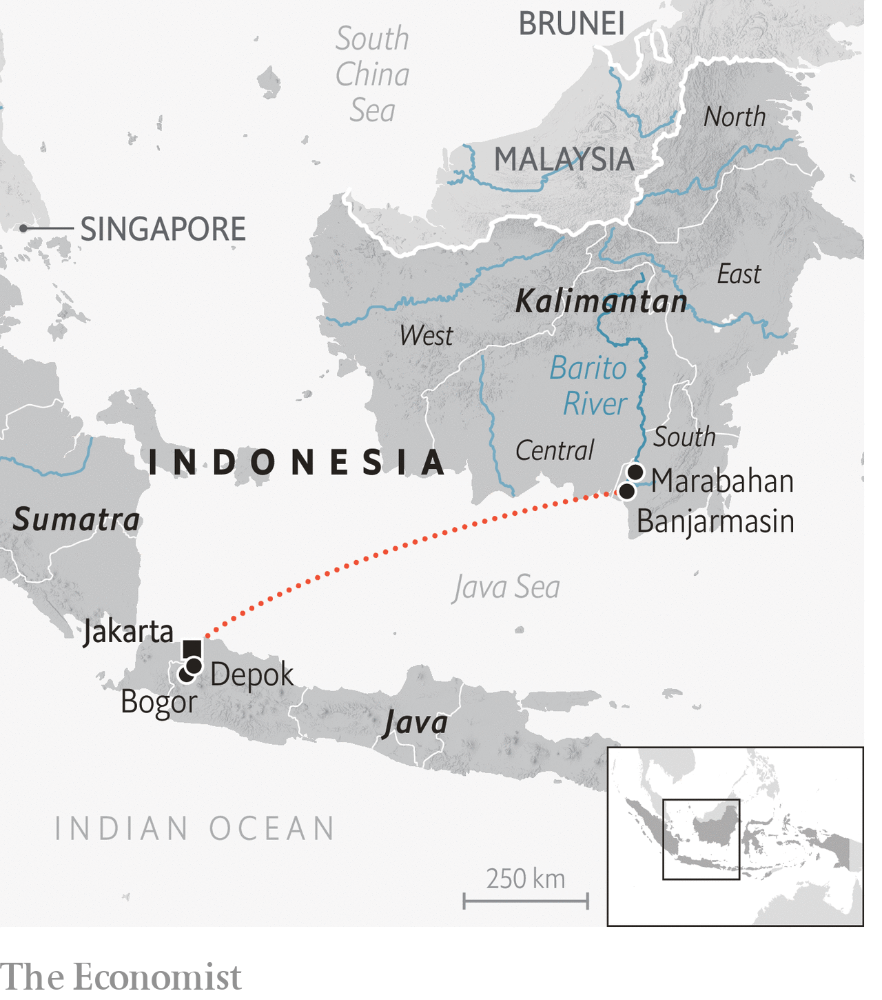
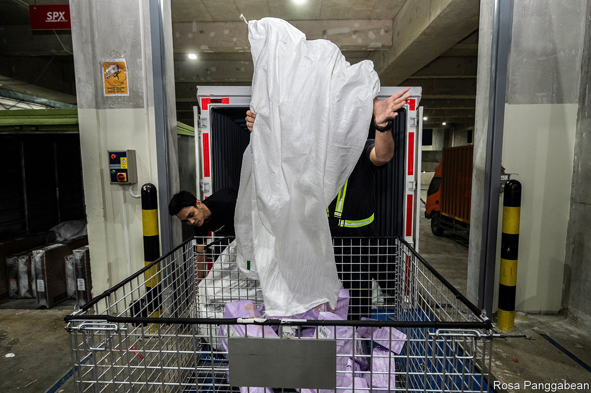
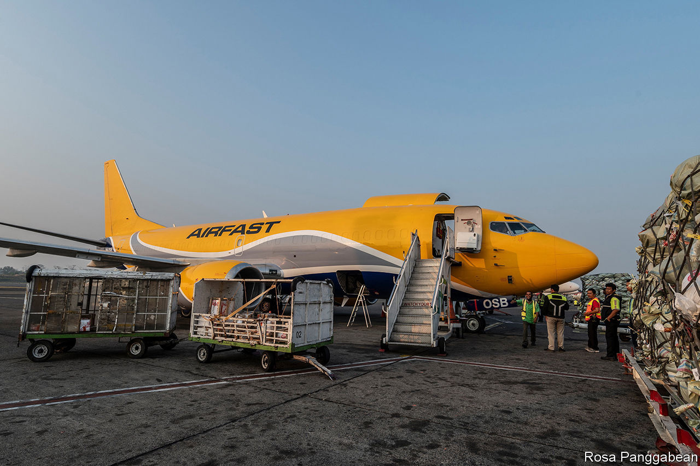
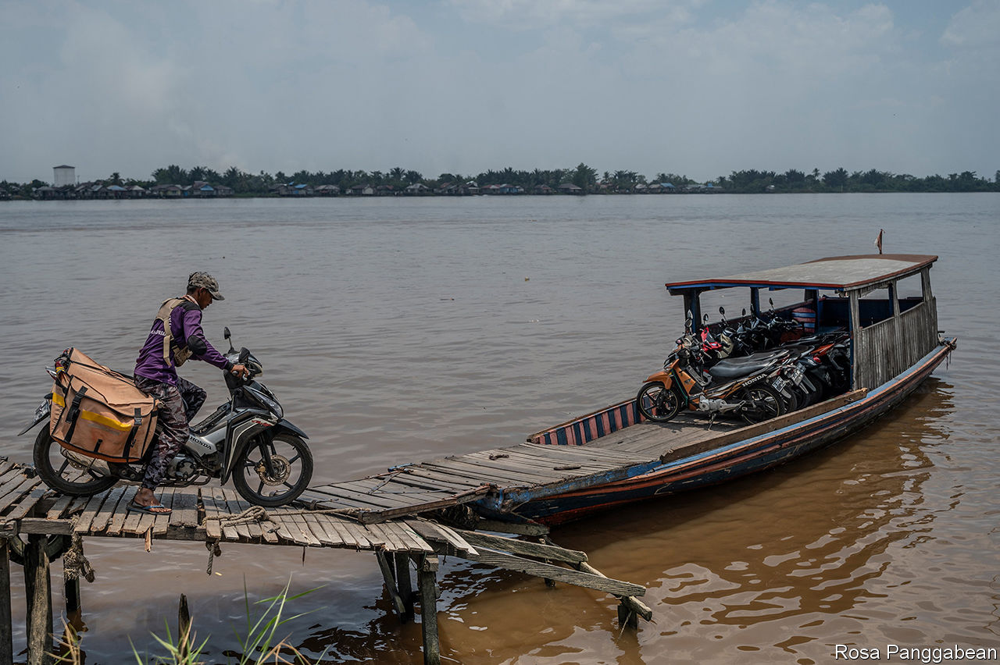
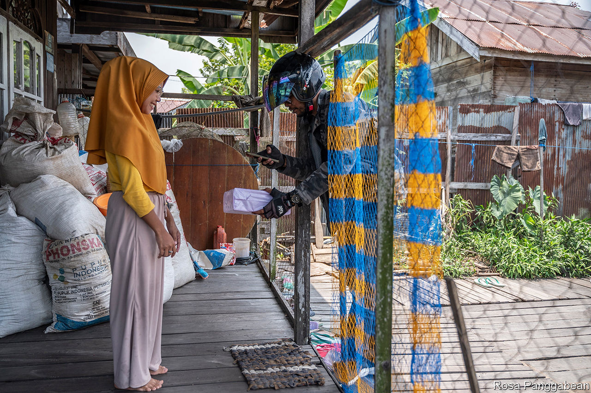

###### Following Fatimah’s sandals

# What the journey of a pair of shoes reveals about capitalism 

##### And how Indonesia, the world’s largest Muslim country, is changing 

 

> Dec 20th 2023 

In a remote village in Borneo, Fatimah wonders what shoes to wear to her cousin’s wedding. For as long as she can remember, buying footwear meant an hour-long, wooden boat ride to a market. That changed a few years ago, when mobile phones arrived. Now, almost every day, she scrolls through Shopee, a shopping app. It connects her—and the 130m Indonesians who use it every month—with merchants thousands of kilometres away, and causes packages to appear, as if by magic, at her door. 

Of course, it is not magic. Behind the luminous icon on Fatimah’s phone is a vast network of makers, packers, truckers and shippers, who don’t know Fatimah or each other but seamlessly collaborate to bring her what she wants. And they do it across the world’s biggest archipelago, a country of 13,000 islands and hundreds of languages, wider than the continental United States and far harder to get around: Indonesia.

 


E-commerce helps bind together a nation of skyscrapers and jungles, miniskirts and hijabs, software engineers and tribes who still hunt with bows and arrows. So the journey of a pair of shoes from factory to Fatimah reveals a lot about how the planet’s most populous Muslim country is changing.  decided to follow those shoes. 

The story starts with a wish. The shoes Fatimah wants are white and camel, open-toe sandals. They sit patiently in her online shopping cart. But at $25, they are more than she can afford. Her husband sells , a meatball made mostly of flour and peanut sauce, at the market. He gives Fatimah $3 a day to run the household. Whatever is left, she saves as pocket money. Ping! The app notifies her that the sandals are on sale for $12. Fatimah grabs the deal. 

 


Her click sets off a process 1,000km away in Bogor, a city outside Jakarta, the capital. The shoes are made by Patris, a family firm that started selling online in 2020, during the covid-19 pandemic. Three years later Ricco Antonius and Maria Putri Anastasia, the married owners, employ 50 staff (up from zero) and shift hundreds, perhaps thousands of pairs a day. Most of their customers are women under 40, like Fatimah. 

On a Thursday afternoon your correspondent climbs a flight of stairs to a two-storey warehouse: on the top floor, shelves of shoes are stacked. The bottom floor hums with young women checking, boxing and wrapping footwear. 


Initially, Patris didn’t know how to sell online, says Ricco. Now, it is all about live-streaming. Ten young women, working in shifts 24/7, flaunt sandals and slippers, mules and platforms, low and high heels, open-toe and closed-toe pumps, black and brocade shoes with fleecy, pillowy or puffy soles. They sit in brightly lit booths answering customers’ questions, and gently persuading them to tap “buy”. “Everyone has their own style, some of us are enthusiastic and bubbly, others are calm and slow,” says Siti Zahra Amelia, one of the sales staff. Most customers who watch her live-streams are young women. But occasionally, men ask Miss Siti for advice on what to buy their wives.

Fatimah’s order arrives digitally and instantly. Fulfilling it will take rather longer, however. In the past decade, Indonesia’s physical infrastructure has improved hugely. The president, Joko Widodo (known as Jokowi), sees pouring concrete as a path to prosperity. In the past decade the country has built more than 300,000km of roads, over 1,500 ports and 25 new airports, spending almost $180bn on infrastructure. Delivering goods is thus easier than it was, but still mind-bogglingly complex. 

E-commerce firms everywhere fret over how to handle the first and last miles of deliveries. In Indonesia, the middle mile is also a challenge, says Handhika Jahja, the head of Shopee Indonesia. Parts of the country still have no proper roads, postcodes or addresses. Local couriers must know how to find the house three doors down from the blue mosque or by turning left at the big tree. They must ride their motorbikes onto sampans, balance on narrow, rickety boardwalks and sometimes wade through swampland on foot. Still, as investment pours into e-commerce in South-East Asia’s biggest market, Indonesia is a testing ground for the rest of the region, says Mr Handhika.


Fatimah’s shoes are first loaded onto a van, which takes them to a hub in Bogor. From there, they go by truck to a multistorey car park the size of a football stadium in Depok, a city south of Jakarta. This hub comes alive at night, from 10pm to 5am. Young men in fluorescent vests toss packages of everything from nappies to noodles into blue crates bound for different corners of the country. 

Herman, the truck driver for the next leg of the journey, is impatient. It is 10pm and your correspondent’s questions are delaying the first of three trips he must make during his shift. Jakarta’s traffic is bad, and Herman worries about arriving in Kapuk, a suburb on the outskirts, in time. Eventually he races off into the night. In the early hours of Friday, Fatimah’s shoes arrive at Jakarta’s Halim airport.

Forest fires are burning across Kalimantan (the Indonesian part of Borneo), filling the air with smoke and reducing visibility for pilots. Yudhianto Prihantoro, who has to fly Fatimah’s shoes 900km from Jakarta to Banjarmasin, the capital of South Kalimantan, fears he may not be able to land his cargo plane. Around 85% of Shopee’s packages heading from Java, Indonesia’s main island, to Kalimantan travel by ship, which takes an extra three days, but some go by plane.

Yudhianto, a former air-force pilot, has flown cargo planes to remote airports for years. He has steered around clueless locals who wander across the runway. He has had a pilot’s-eye view of Indonesia’s breakneck development. One airport, at Wamena in West Papua, used to be a ramshackle affair of corrugated iron and wooden poles; now it has high ceilings, bright lights and a slick, steel skeleton, he says. Alas, this hasn’t stopped fighting in the province between the Indonesian military and separatist rebels, who kidnapped a pilot in February and burned his plane.

 


 


Yudhianto lands safely in South Kalimantan. It is Friday afternoon. The air is thick with a haze that smells smoky and tastes metallic. In just one month, 33 forest fires have raged across the island, which is about as big as Texas. The hot, dry El Niño weather pattern has made it harder than usual to control fires from traditional slash-and-burn land-clearing for palm oil, pulp and paper plantations. But locals say this year’s haze isn’t as bad as it was in 2015, when they had to turn lights on during the day to see anything.

Despite the slashing and burning, Kalimantan is still mostly covered in thick jungle. So the main highways are rivers, which connect most of its towns and villages. Shopee first built its sorting hub in Banjarmasin (“the city of 1,000 rivers”) in 2021, processing fewer than 10,000 parcels a day. Now it handles 60,000. Labourers roll crates of floorboards, kitchen appliances, clothes and smartphones into vans.

One, with a purple air freshener in the shape of a penguin, is driven by Muhammad Faizal, a 23-year-old Banjarese. His ancestors have plied the rivers of South Kalimantan for centuries. Around the time the Saxons invaded Britain, Banjarese sailed 7,000km across the Indian Ocean to what is now Madagascar. 

Faizal isn’t travelling quite as far. Most days, he drives packages from Banjarmasin to Marabahan, 70km to the north. He looks forward to catching up with his friends who work as local couriers. A few speak Bakumpai, a local Dayak language. Not many speak Banjar, Faizal’s mother tongue. Most speak Javanese, as their families were part of a transmigration programme run first by Dutch colonists and then by the Indonesian government, to relocate people from more populous islands, such as Java, to more remote areas like South Kalimantan. 

This sparked all kinds of trouble. Between 1996 and 2001 thousands of Dayaks and Muslim migrants from the island of Madura massacred each other. Some beheaded their enemies and even ate their organs. The area is considerably more peaceful today, but remains tense. When Faizal cracks a joke that is received with a blank look, he quickly makes the switch to Indonesian, a language that everyone speaks.

By Saturday morning, on day three of the journey, Fatimah’s shoes rumble across a new bridge on the Alalak river, connecting Banjarmasin to the rest of Kalimantan. Jokowi opened it in 2021. In the province of East Kalimantan next door, he is building Indonesia’s new capital city in the jungle. Shopee constantly has to update its delivery routes to include new roads, bridges and ports.

At night, the roads in these parts are often only lit by fireflies. Superstitious locals find them spooky. Once, Faizal was driving home from a wedding with leftover cakes and sticky rice in his van, through an area believed to be full of spirits. His van broke down. “I had enough petrol, I was in the right gear, my engine was running. But the car refused to start,” he recalls. Mindful of a local tradition, he offered his cakes and sticky rice to the bushes. “Grandfather, have some food and please don’t disturb me,” he whispered. His van started again, he says. 

After an hour and a half winding past rice paddies, Fatimah’s sandals reach Marabahan, a sleepy riverside town. Juliansyah, one of Faizal’s friends, loads them, with 27 other parcels, into the saddlebags of his motorcycle. He sets off past single-storey houses spread across the plain. After almost two years in the job, he knows his customers well. Many are young mothers who order nappies, bottles and baby food, and often invite him in for tea. Knowing how to cut short such chats politely is an essential skill. 

The brown waters of the Barito River come into view. Juliansyah pulls into a wooden hut that shelters people waiting for the  (a small, wooden ferry). A boatman rides the motorbikes on board, one after another, along a narrow wooden walkway, expertly stacking them by the bow. Little mosques with silver turrets dot the river bank, alongside wooden houses on stilts with red and blue roofs.

 


 


The ferry rattles off, dodging bigger boats carrying coal and wood, and wobbling in their wake. Reaching the other bank, Juliansyah flicks away the sweat on his forehead, starts up his motorbike and winds down a narrow dirt path lined with drying laundry. He stops, flipping down his kickstand. He is nearly there. He jogs past a shed full of seeds and comes to a house with buckets and brooms stacked on sacks of fertiliser on the porch, and a dozen pairs of sandals out front.

After three, sweaty, sleep-deprived days, the journey is over. Fatimah pushes aside the blue and yellow netting that serves as her door and invites us in. Images of the “nine saints” who brought Islam to Indonesia in the 15th and 16th centuries adorn the walls of her front room. She tears open the purple wrapping paper and holds up her new sandals for inspection. Then she rushes off to fetch the blue and white dress she plans to wear with them to her cousin’s wedding. 

She is delighted, and enthuses about the wonders of online shopping. She rushes around the house grabbing everything she has previously bought on Shopee to display for her unannounced guests: lip gloss, moisturiser and her baby’s milk bottle.

In some ways this is a story of globalisation’s triumph. Without the spread of smartphones, e-commerce would barely exist in Indonesia. And Shopee is a truly international firm: it operates in eight countries. Its parent company is headquartered in Singapore and is part-owned by Tencent, a Chinese tech giant. 

But the story is more complicated than that (a phrase Indonesia-watchers use a lot). The country simultaneously embraces globalisation and resists it. Jokowi has protectionist instincts and is wary of China. In October, his government banned TikTok Shop, Shopee’s main rival, which is affiliated with TikTok, a Chinese social-media giant. It also banned the sale of imported goods worth less than $100 on all e-commerce platforms, hoping that this would boost local businesses like Patris.

The people in Fatimah’s village are only dimly aware of policy decisions made in the distant capital. But they appreciate the stunning variety of goods that e-commerce makes available in remote places, some of which bring real joy. And they see, in the spread of technology, new opportunities to earn a living.

Near Fatimah’s house lives Rizki Nur Annisa, a young woman who makes fish crackers. For generations her family would dry the fish, turn them into crispy snacks and take them by boat to the local market. When the pandemic hit, they could not leave home. But Rizki knew what to do. She logged on to Shopee and sold the crackers online. ■


