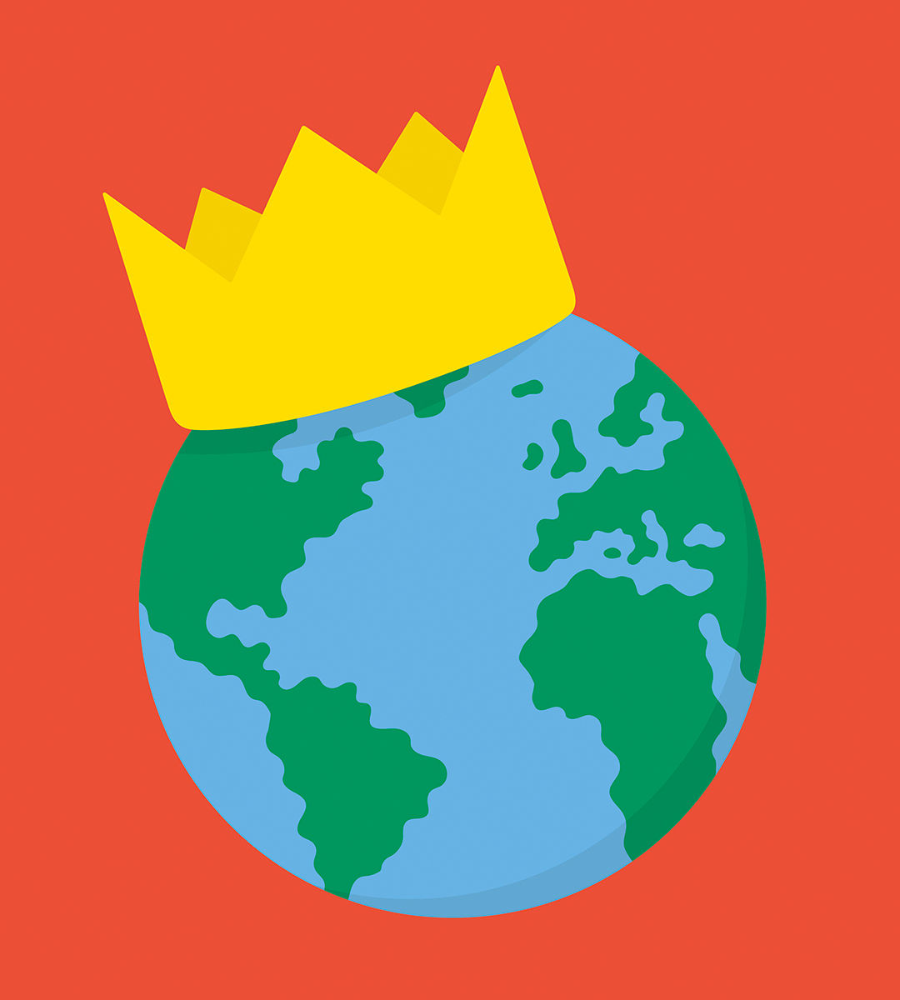

###### The centre can hold

# The Economist’s country of the year for 2023 

##### It is possible to enact painful economic reforms and still get re-elected 

 

> Dec 20th 2023 

Historians will not look back on 2023 as a happy year for humanity. Wars blazed, autocratic regimes swaggered and in many countries strongmen flouted laws and curbed liberty. This is the grim backdrop to our annual “country of the year” award. If our prize was for the resilience of ordinary people in the face of horror, there would be an abundance of candidates, from the Palestinians and Israelis in their bitter  to the Sudanese fleeing as their country . 

Yet since we started naming countries of the year in 2013, we have sought to recognise something different: the place that has improved the most. The search for a bright spot in a bleak world led some of our staff to despair and propose , the fictional pink  of a Hollywood blockbuster. But in real life, there are two sets of countries that deserve recognition in 2023. 

The first includes places that have stood up to bullying by autocratic neighbours. One cannot say that life in  improved, but the country valiantly continued its struggle against Vladimir Putin’s war machine, despite wobbling by its Western supporters. resisted Russian intimidation. joined the nato alliance and will follow soon. In Asia a number of countries held their nerve in the face of Chinese aggression, often in collaboration with America. The  defended its maritime boundaries, and the law of the sea, against much bigger Chinese ships. In August and  put aside their historical grievances to deepen their co-operation. The island state of , with a population of 11,000, has just signed a treaty with that insures its population against climate change and includes a security guarantee to prevent it from falling under China’s thumb.

Our second group of countries defended democracy or liberal values at home. Fragile, war-scarred  managed a peaceful transfer of power. So did , which maintained its reputation for respecting human rights and a free press. In some mid-sized countries, such as  and , hope flickered as the opposition pushed hard to eject autocratic regimes, but those regimes held on at elections skewed in their favour.

Three countries stand out for turning back to moderation after a walk on the wild side.  swore in a centre-left president, Luiz Inácio Lula da Silva, after four years of mendacious populism under Jair Bolsonaro, who spread divisive conspiracy theories, coddled trigger-happy cops, supported rainforest-torching farmers, refused to accept electoral defeat and encouraged his devotees to attempt an insurrection. The new administration quickly restored normality—and reduced the pace of deforestation in the Amazon by nearly 50%. Brazil’s impressive record was marred, however, by Lula’s habit of cosying up to Mr Putin and Venezuela’s despot, Nicolás Maduro. As a result, Brazil misses out on the award. 

had a remarkable 2023: its economy withstood the shock of the war next door; it continued to host nearly 1m Ukrainian refugees; and to deter Russia it raised its defence spending to above 3% of gdp, giving its stingy nato peers an example to emulate. The country’s biggest problem has been the dominance of the populist-nationalist Law and Justice (pis) party, which has run the government for the past eight years, eroding the independence of the courts, stuffing state media with lackeys and nurturing crony capitalism. In October voters dumped PiS in favour of an array of opposition parties. It is early days for a new coalition government, led by Donald Tusk, a veteran centrist, but if it does a good job of mending the damage PiS did to democratic institutions, Poland will be a strong candidate for our prize next year. 

That leaves our winner, . Ten years ago it was crippled by a debt crisis and ridiculed on Wall Street. Incomes had plunged, the social contract was fraying and extremist parties of the left and right were rampant. The government grew so desperate that it cuddled up to China and later sold its main port, Piraeus, to a Chinese firm. Today Greece is far from perfect. A rail crash in February exposed corruption and shoddy infrastructure; a wire-tapping scandal and the mistreatment of migrants suggested civil liberties can be improved. 

But after years of painful restructuring,  topped our annual ranking of rich-world economies in 2023. Its centre-right government was re-elected in June. Its foreign policy is pro-America, pro-EU and wary of Russia. Greece shows that from the verge of collapse it is possible to enact tough, sensible economic reforms, rebuild the social contract, exhibit restrained patriotism—and still win elections. With half the world due to vote in 2024, democrats everywhere should pay heed. ■

